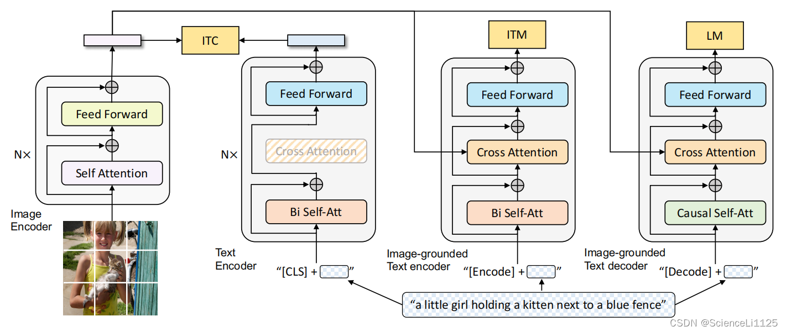

# BLIP

BLIP（Bootstrapping Language-Image Pre-training）因為同時結合了 **對比學習 (ITC)**、**匹配學習 (ITM)** 和 **語言建模 (LM)**，所以能應用到許多 **跨模態任務**。常見應用任務可以分成三大類：

---

## 可用於的任務有

### 🔹 1. 圖文對齊 / 檢索任務

* **Image-to-Text Retrieval**：給定一張圖片，檢索最相關的文字描述。
* **Text-to-Image Retrieval**：給定一段文字，檢索最相關的圖片。
  👉 依賴 **ITC（Image-Text Contrastive Learning）**，和 CLIP 類似。

---

### 🔹 2. 圖文理解任務

* **Image-Text Matching (ITM)**：判斷一張圖片和一段文字是否語義匹配。
* **VQA (Visual Question Answering)**：輸入圖片 + 問題 → 模型生成答案。
* **NLVR (Natural Language Visual Reasoning)**：判斷文字描述是否正確描述圖片內容。
  👉 依賴 **ITM + Image-grounded Text Encoder**。

---

### 🔹 3. 圖文生成任務

* **Image Captioning**：輸入圖片，生成自然語言描述。
* **Visual Storytelling**：根據圖片生成更長的故事化文本。
* **Image-grounded Dialogue**：輸入圖片 + 對話上下文，生成下一輪對話。
  👉 依賴 **LM（Language Modeling with Image grounding）**。

---

### ✨ 延伸應用

* **Zero-shot 任務**：因為 BLIP 在大規模圖文數據上預訓練，可在下游任務直接使用，幾乎不需要微調。
* **Few-shot / Prompt-based 任務**：透過 prompt，可以在小樣本下快速適應（類似 GPT-3 的方式）。

---

📌 **總結一句話**：
BLIP 能處理 **檢索、理解、生成** 三大類跨模態任務：
👉 檢索（ITC）、理解（ITM）、生成（LM）。

---

### BLIP 跟 CLIP 的能力比較
| 能力                    | CLIP  | BLIP                    |
| --------------------- | ----- | ----------------------- |
| **檢索 (Retrieval)**    | ✅ 強   | ✅ 強（還能做 ITM 微調）         |
| **Zero-shot 分類**      | ✅ 很強  | ✅ 可做，但非主要目標             |
| **圖像描述 (Captioning)** | ❌ 不支援 | ✅ 支援                    |
| **VQA (視覺問答)**        | ❌ 不支援 | ✅ 支援                    |
| **對話生成**              | ❌     | ✅（透過 LM）                |
| **數據清理能力**            | ❌     | ✅ Caption bootstrapping |

## 數學運算講解

### Image Encoder

太棒了，我們把 **BLIP 的 Image Encoder（其本體就是 ViT/Transformer Encoder）** 用「真實配置但可手算」的多頭注意力逐步跑一遍：**Patch Embedding → 加 
$$CLS] 與位置編碼 → (Pre-LN) 多頭自注意力 → 殘差 → (Pre-LN) MLP(GELU) → 殘差**。
為了能把每一步都算出數字，我採用小維度但**保留多頭注意力與 LayerNorm/GELU/殘差**的真實流程。

---

#### 0) 設定（可手算版本 ≈ 真實流程的小型化）

* 影像（灰階）4×4：

$$
\begin{bmatrix}
1&2&3&4\\
5&6&7&8\\
9&10&11&12\\
13&14&15&16
\end{bmatrix}
$$

* Patch 大小：2×2 → 共 4 個 patch，展平成長度 4：

$$
P_1=[1,2,5,6],\;P_2=[3,4,7,8],\;P_3=[9,10,13,14],\;P_4=[11,12,15,16]
$$

* 模型維度 $d_{\text{model}}=4$，**多頭注意力** $h=2$，每頭維度 $d_k=d_v=2$。
* **Pre-LayerNorm 架構**（ViT/BLIP 常用）：進 Attention 與 MLP 前都先做 LayerNorm。
* 為了可手算，權重矩陣用小數；流程與真實模型一致（真實模型的權重會學得更複雜）。

---

#### 1) Patch Embedding（Conv/Linear 投影）

把每個 patch（長度 4）乘上投影 $W_p\!\in\!\mathbb{R}^{4\times4}$ 得到 4維向量。

$$
W_p=\begin{bmatrix}
0.10&0&0&0.05\\
0&0.10&0&0.05\\
0&0&0.10&0.05\\
0.05&0.05&0.05&0.10
\end{bmatrix},\quad b_p=\mathbf{0}
$$

$$
\begin{aligned}
E_1&=P_1W_p=[0.4,\,0.5,\,0.8,\,1.0]\\
E_2&=P_2W_p=[0.7,\,0.8,\,1.1,\,1.5]\\
E_3&=P_3W_p=[1.6,\,1.7,\,2.0,\,3.0]\\
E_4&=P_4W_p=[1.9,\,2.0,\,2.3,\,3.5]
\end{aligned}
$$

---

#### 2) 加上 
$$CLS] 與位置編碼

$$
\text{CLS}=[0.1,0.2,0.3,0.4],\quad
\text{pos}_{\text{CLS}}=[0.01,0.02,0.03,0.04]
$$

$$
\text{pos}_1=[0.1,0,0,0],\;
\text{pos}_2=[0,0.1,0,0],\;
\text{pos}_3=[0,0,0.1,0],\;
\text{pos}_4=[0.05,0.05,0.05,0.05]
$$

序列（長度 5：CLS+4 個 patch）：

$$
X=
\begin{bmatrix}
0.11&0.22&0.33&0.44\\
0.50&0.50&0.80&1.00\\
0.70&0.90&1.10&1.50\\
1.60&1.70&2.10&3.00\\
1.95&2.05&2.35&3.55
\end{bmatrix}
$$

---

#### 3) (Pre-LN) 多頭自注意力 MHA

##### 3.1 LayerNorm（逐 token）

對每個 token 各自做 LN（$\gamma=1,\beta=0,\epsilon=10^{-5}$）：

$$
X_{\text{LN}}=
\begin{bmatrix}
-1.3412&-0.4471&0.4471&1.3412\\
-0.9427&-0.9427&0.4714&1.4141\\
-1.1831&-0.5071&0.1690&1.5212\\
-0.9053&-0.7243&0.0000&1.6296\\
-0.8230&-0.6663&-0.1960&1.6853
\end{bmatrix}
$$

##### 3.2 兩個頭的 $Q,K,V$ 投影

（真實 ViT 會用一個大矩陣再切頭；這裡直接給每頭的矩陣）

* **Head-1**（$W_Q^1,W_K^1,W_V^1\in\mathbb{R}^{4\times2}$）：

$$
\begin{aligned}
W_Q^1&=\begin{bmatrix}0.2&0\\0&0.2\\0.3&0\\0&0.3\end{bmatrix},\;
W_K^1=\begin{bmatrix}0.1&0\\0&0.1\\0.2&0\\0&0.2\end{bmatrix},\\
W_V^1&=\begin{bmatrix}0.4&0\\0&0.4\\0.1&0\\0&0.1\end{bmatrix}
\end{aligned}
$$

$$
Q^1=X_{\text{LN}}W_Q^1=
\begin{bmatrix}
-0.1341&0.3129\\
-0.0471&0.2357\\
-0.1859&0.3549\\
-0.1811&0.3440\\
-0.2234&0.3723
\end{bmatrix}
$$

$$
K^1=X_{\text{LN}}W_K^1=
\begin{bmatrix}
-0.0447&0.2235\\
\;\;0.0000&0.1885\\
-0.0845&0.2535\\
-0.0905&0.2535\\
-0.1215&0.2704
\end{bmatrix},\quad
V^1=X_{\text{LN}}W_V^1=
\begin{bmatrix}
-0.4918&-0.0447\\
-0.3299&-0.2357\\
-0.4564&-0.0507\\
-0.3621&-0.1267\\
-0.3488&-0.0980
\end{bmatrix}
$$

* **Head-2**：

$$
\begin{aligned}
W_Q^2&=\begin{bmatrix}0.1&0\\0&0.1\\0&0.2\\0.2&0\end{bmatrix},\;
W_K^2=\begin{bmatrix}0.05&0\\0&0.05\\0&0.1\\0.1&0\end{bmatrix},\\
W_V^2&=\begin{bmatrix}0.2&0\\0&0.2\\0.3&0\\0&0.3\end{bmatrix}
\end{aligned}
$$

$$
Q^2=
\begin{bmatrix}
-0.1341&0.3129\\
-0.0471&0.2357\\
-0.1859&0.3549\\
-0.1811&0.3440\\
-0.2234&0.3723
\end{bmatrix},\;
K^2=
\begin{bmatrix}
0.0671&0.0224\\
0.0943&0.0000\\
0.0930&-0.0085\\
0.1177&-0.0362\\
0.1274&-0.0529
\end{bmatrix},\;
V^2=
\begin{bmatrix}
-0.1341&0.3129\\
-0.0471&0.2357\\
-0.1859&0.3549\\
-0.1811&0.3440\\
-0.2234&0.3723
\end{bmatrix}
$$

##### 3.3 注意力分數、Softmax、每頭輸出

縮放因子 $1/\sqrt{d_k}=1/\sqrt{2}$。

* **Head-1 分數與權重**（顯示 5×5 全部）：

$$
S^1=\frac{Q^1{K^1}^{\!\top}}{\sqrt{2}}=
\begin{bmatrix}
0.0537&0.0417&0.0641&0.0647&0.0714\\
0.0387&0.0314&0.0451&0.0453&0.0491\\
0.0620&0.0473&0.0747&0.0755&0.0838\\
0.0601&0.0459&0.0725&0.0733&0.0813\\
0.0659&0.0496&0.0801&0.0810&0.0904
\end{bmatrix}
$$

$$
A^1=\text{softmax}(S^1)\approx
\begin{bmatrix}
0.1989&0.1965&0.2010&0.2011&0.2025\\
0.1994&0.1979&0.2006&0.2007&0.2014\\
0.1986&0.1958&0.2012&0.2014&0.2030\\
0.1987&0.1959&0.2012&0.2013&0.2030\\
0.1985&0.1953&0.2013&0.2015&0.2034
\end{bmatrix}
$$

$$
\text{HeadOut}^1=A^1V^1\approx
\begin{bmatrix}
-0.3978&-0.1107\\
-0.3978&-0.1109\\
-0.3978&-0.1106\\
-0.3978&-0.1106\\
-0.3978&-0.1106
\end{bmatrix}
$$

* **Head-2 分數與權重**：

$$
S^2=\frac{Q^2{K^2}^{\!\top}}{\sqrt{2}}=
\begin{bmatrix}
0.0071&0.0089&0.0085&0.0100&0.0104\\
0.0089&0.0126&0.0124&0.0157&0.0170\\
0.0085&0.0124&0.0123&0.0159&0.0174\\
0.0100&0.0157&0.0159&0.0214&0.0239\\
0.0104&0.0170&0.0174&0.0239&0.0269
\end{bmatrix}
$$

$$
A^2\approx
\begin{bmatrix}
0.1996&0.2000&0.1999&0.2002&0.2003\\
0.1991&0.1998&0.1998&0.2005&0.2007\\
0.1990&0.1998&0.1998&0.2005&0.2008\\
0.1985&0.1997&0.1997&0.2008&0.2013\\
0.1983&0.1996&0.1996&0.2010&0.2016
\end{bmatrix}
$$

$$
\text{HeadOut}^2=A^2V^2\approx
\begin{bmatrix}
-0.1544&\;\;0.3240\\
-0.1544&\;\;0.3240\\
-0.1544&\;\;0.3241\\
-0.1545&\;\;0.3241\\
-0.1545&\;\;0.3241
\end{bmatrix}
$$

##### 3.4 拼接各頭並做輸出投影、殘差

拼接 $[\text{HeadOut}^1\|\text{HeadOut}^2]\in\mathbb{R}^{5\times4}$，再乘輸出投影 $W_O\in\mathbb{R}^{4\times4}$：

$$
W_O=\begin{bmatrix}
0.6&0&0.2&0\\
0&0.6&0&0.2\\
0.2&0&0.6&0\\
0&0.2&0&0.6
\end{bmatrix}
$$

得到 Attention 輸出 $Z_{\text{attn}} = [\text{Head}_1\|\text{Head}_2]W_O$：

$$
Z_{\text{attn}}\approx
\begin{bmatrix}
-0.2696&-0.0016&-0.1722&\;\;0.1723\\
-0.2696&-0.0017&-0.1722&\;\;0.1722\\
-0.2696&-0.0016&-0.1722&\;\;0.1723\\
-0.2696&-0.0016&-0.1723&\;\;0.1723\\
-0.2696&-0.0015&-0.1723&\;\;0.1724
\end{bmatrix}
$$

**殘差加回原輸入 $X$：**

$$
O^{(1)} = X + Z_{\text{attn}} \approx
\begin{bmatrix}
-0.1596&0.2184&0.1578&0.6123\\
\;\;0.2304&0.4983&0.6278&1.1722\\
\;\;0.4304&0.8984&0.9278&1.6723\\
\;\;1.3304&1.6984&1.9277&3.1723\\
\;\;1.6804&2.0485&2.1777&3.7224
\end{bmatrix}
$$

---

#### 4) (Pre-LN) 前饋網路 MLP（GELU）

##### 4.1 LayerNorm

$$
U=\text{LN}(O^{(1)})\approx
\begin{bmatrix}
-1.3367&0.0406&-0.1800&1.4761\\
-1.1707&-0.3902&-0.0128&1.5737\\
-1.2411&-0.1885&-0.1225&1.5521\\
-1.0144&-0.4824&-0.1510&1.6478\\
-0.9308&-0.4594&-0.2939&1.6841
\end{bmatrix}
$$

##### 4.2 兩層 MLP

$$
\text{FFN}(x)=W_2\,\text{GELU}(W_1x)+b_2\quad(\text{殘差於之後相加})
$$

取（可手算的）：

$$
W_1=
\begin{bmatrix}
0.5&0&0&0&0.1&0&0&0\\
0&0.5&0&0&0&0.1&0&0\\
0&0&0.5&0&0&0&0.1&0\\
0&0&0&0.5&0&0&0&0.1
\end{bmatrix}_{4\times8},
\quad
W_2=
\begin{bmatrix}
0.4&0&0.1&0\\
0&0.4&0&0.1\\
0.1&0&0.4&0\\
0&0.1&0&0.4\\
0.2&0&0&0\\
0&0.2&0&0\\
0&0&0.2&0\\
0&0&0&0.2
\end{bmatrix}_{8\times4}
$$

以 **GELU**（tanh 近似）計算：

$$
H=\text{GELU}(U W_1),\qquad
\text{FF}=H W_2
$$

得到

$$
\text{FF}\approx
\begin{bmatrix}
-0.0835&0.0613&-0.0353&0.2447\\
-0.0763&0.0249&-0.0177&0.2563\\
-0.0805&0.0413&-0.0295&0.2555\\
-0.0750&0.0218&-0.0312&0.2708\\
-0.0748&0.0253&-0.0438&0.2792
\end{bmatrix}
$$

##### 4.3 殘差相加（Block 輸出）

$$
O^{(2)} = O^{(1)} + \text{FF} \approx
\boxed{
\begin{bmatrix}
-0.2431&0.2797&0.1225&0.8570\\
\;\;0.1541&0.5232&0.6100&1.4285\\
\;\;0.3499&0.9398&0.8983&1.9278\\
\;\;1.2554&1.7202&1.8965&3.4432\\
\;\;1.6056&2.0738&2.1340&4.0015
\end{bmatrix}}
$$

---

#### 5) 影像全局表徵（CLS 向量）

經過 **一層** Image Encoder 後，**CLS token**（第 1 行）即為整張影像的全局表徵（真實模型會堆疊多層）：

$$
\boxed{\text{Image Embedding}_{\text{CLS}} \approx [-0.2431,\;0.2797,\;0.1225,\;0.8570]}
$$

---

##### 小結（與真實 BLIP/ViT 的對齊）

* 已完整跑過 **Pre-LN → 多頭注意力（2頭）→ 殘差 → Pre-LN → MLP(GELU) → 殘差** 的一個 Encoder block。
* 真實 BLIP 的 Image Encoder 會用更大維度（如 $d_{\text{model}}=768$）、更多頭（如 12/16 頭）、GELU、LayerNorm、學得的 $W_Q,W_K,W_V,W_O,W_1,W_2$，並**重複 N 次**。
* 上面每一步（矩陣形狀、縮放 $1/\sqrt{d_k}$、softmax、殘差與 LN）都與實際一致，只是用小矩陣讓你能**逐行手算與驗證**。

如果你要，我可以用同樣「帶數值逐步運算」把右側的 **Image-grounded Text Encoder（Cross-Attention）** 與 **Image-grounded Text Decoder（LM）** 也完整跑一遍，讓整張圖（ITC/ITM/LM 三個頭）全部串起來。
