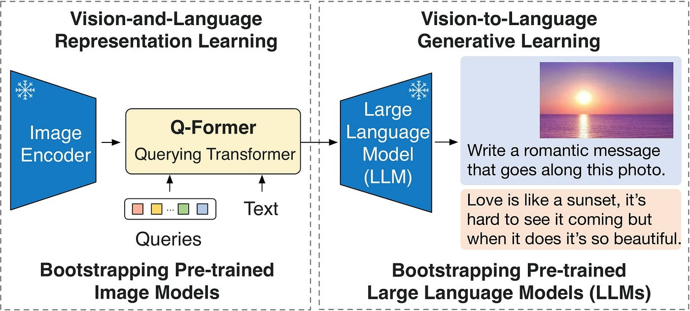

# BLIP2

BLIP-2 通過一種巧妙的方式，**大幅降低了訓練大規模視覺-語言模型（VLM）的成本和難度**，同時**有效紓解了模型性能退化的問題**。它主要解決了以下幾個核心痛點：

## 1.解決痛點
### 💰 1.1 訓練成本高昂

在此之前，訓練強大的視覺-語言模型（如 Flamingo-80B）需要進行**端到端的聯合訓練**，即同時更新圖像編碼器、跨模態連接器和語言模型的權重。這類模型參數動輒數百億，訓練通常需要**數百萬美元的計算資源**和大量的時間（例如“100+ A100 GPU 周”），這遠遠超出了大多數研究機構和個人的承受能力。

*   **BLIP-2 的解決方案**：BLIP-2 選擇**凍結（frozen）** 預訓練好的圖像編碼器（如 CLIP-ViT）和大語言模型（LLM，如 OPT、FlanT5）的權重。在訓練過程中，**隻更新其引入的輕量級模塊 Q-Former 的參數**（約 1.88 億參數）。這種方式將訓練成本從“百萬美元級”大幅降低至“仟美元級”，使得更多人能夠參與多模態研究。

### 🧠 1.2. 災難性遺忘（Catastrophic Forgetting）

當古早方法對預訓練好的大語言模型進行端到端微調以適應多模態任務時，語言模型**原本強大的語言知識和生成能力會顯著下降**。例如，實驗結果提到 OPT-6.7B 模型在微調後，其純語言生成任務的 BLEU 指標下降了 12%。這就導緻了“模型學會了看圖，卻不會說話了”的矛盾現象。

*   **BLIP-2 的解決方案**：通過**凍結大語言模型（LLM）的參數**，BLIP-2 完美地**保留了 LLM 的全部語言能力和知識**。Q-Former 的作用是將視覺信息轉換成 LLM 能夠理解的“視覺提示”（Soft Visual Prompts），然後由 LLM 基於這些提示和自身的知識來生成文本。這樣，LLM 本身不再需要為適應視覺特徵而改變，從而避免了災難性遺忘。

### 🌉 1.3. 模態鴻溝（Modality Gap）

視覺特徵（來自圖像編碼器）和文本特徵（來自語言模型）在**維度、分佈和語義層麵上存在巨大差異**。圖像編碼器輸出的通常是高維、稀疏的像素級特徵（例如 ViT-L/14 輸出 257×1024 維），而 LLM 期望的輸入是低維、高度語義化的文本嵌入。簡單地將兩者拚接在一起，LLM 很難直接理解和處理，導緻信息融合失敗，性能不佳。

*   **BLIP-2 的解決方案**：Q-Former 的核心作用就是**彌合這道模態鴻溝**。它通過**一組可學習的查詢嵌入（Learnable Queries）**，利用交叉註意力機製從凍結的圖像編碼器輸出中**提取出與文本最相關的視覺信息**，並將其壓縮成一個固定大小的、語義豐富的錶徵（例如 32×768 維）。這個錶徵就像一位**熟練的翻譯官**，將“視覺語言”翻譯成 LLM 能聽懂的“文本語言”。

### ⚡ 1.4. 實現高效且強大的多模態學習

BLIP-2 的**兩階段預訓練策略**（如上圖所示）確保了其高效性：
*   **第一階段**：凍結圖像編碼器，訓練 Q-Former。通過**三個預訓練目標（ITC, ITG, ITM）**，迫使 Q-Former 學會如何從圖像中提取與文本高度相關的視覺特徵。
*   **第二階段**：凍結 LLM，訓練 Q-Former 如何將第一階段學到的視覺錶徵**有效地傳遞給 LLM**，以指導其進行文本生成。

### 🧪 效果與影響

BLIP-2 不僅在多項視覺-語言任務（如 VQA、圖像描述、圖文檢索）上取得了**零樣本（zero-shot） state-of-the-art (SOTA) 的性能**，更重要的是，它**極大地推動了多模態研究的發展**。其“**凍結主幹網路+輕量級適配器**”的設計範式，為後續許多多模態大模型（如 LLaVA、InstructBLIP 等）提供了重要的設計思路和基礎，使得研究者能夠更高效地利用日益強大的單模態模型來構建多模態係統。

總而言之，BLIP-2 的核心貢獻在於：它用一種**計算高效、性能強勁且易於擴展**的方式，巧妙地**利用並融合了快速發展的單模態模型**（特別是大語言模型），為多模態 AI 的發展開辟了一條新的道路。

## 2.可用於的任務

2.1. **圖像描述（Image Captioning）**
- 給定一張圖片，自動生成自然語言描述。
- 應用：無障礙輔助（給視障者描述場景）、影像檢索等。

2.2. **視覺問答（Visual Question Answering, VQA）**
- 根據圖片和文字問題，生成正確答案。
- 例如：輸入一張足球比賽的圖片並問「誰在踢球？」。

2.3. **多模態對話（Multimodal Dialogue）**
- 與使用者進行基於圖片和文字的對話。
- 例如：上傳旅遊照片並討論照片中的地點、人物、事件等。

2.4. **零樣本與少樣本學習（Zero-shot / Few-shot Learning）**
- 在沒有額外訓練的情況下，直接將圖片與文字任務輸入模型，利用大型語言模型的能力完成任務。
- 如：圖片分類、圖像推理。

2.5. **跨模態檢索（Cross-modal Retrieval）**
- 圖片找文字、文字找圖片。
- 例如：用一句描述找到相應圖片（Text-to-Image Retrieval）。

2.6. **視覺推理（Visual Reasoning）**
- 對圖像中的物體、場景進行邏輯推理和因果分析。
- 例如：根據圖片判斷事件發生的原因或下一步可能發生的事。

2.7. **圖片內容摘要（Image Summarization）**
- 生成簡短的圖片摘要，適合用於新聞、社交媒體等。

2.8. **輔助生成（Image-grounded Text Generation）**
- 利用圖片作為背景信息，生成相關的文章、故事等創作內容。

---

💡 **BLIP-2 的特點**：
- 採用「Q-Former」模塊，把圖像特徵轉換為適合 LLM 理解的嚮量。
- 可以與不同的 LLM（如 FlanT5、OPT、Vicuna 等）結合，靈活性高。
- 支援零樣本能力，能直接用於下遊任務，幾乎不需要針對任務的重新訓練。

## 架構理解
可以詳細檢視[跳到 Q-Former](#q-former)

### **Image-Text Matching**

我們這次案例設定：
- **輸入圖片**：一隻戴墨鏡的貓
- **輸入文字**："a cat wearing sunglasses"
- 目標任務：判斷圖片與文字是否匹配（Image-Text Matching）

我會從 Image Encoder 開始，模擬一個簡化的 BLIP-2 Q-Former 前嚮流程。

---

#### **Step 1：Image Encoder（凍結）**
假設 Image Encoder 是一個 ViT，輸入圖片被切成 patch，最後輸出一組圖像特徵嚮量。

為了簡單起見：
- 圖片被編碼成 **4 個 patch**
- 每個 patch 特徵維度 = 3（實際模型會是 768 或 1024，但為了演算方便我們用 3）

輸出矩陣：

$$
\text{Image_Features} \in \mathbb{R}^{4\times 3}
$$

數值假設：

$$
\text{Image_Features} =
\begin{bmatrix}
0.1 & 0.2 & 0.3 \\
0.0 & 0.1 & 0.4 \\
0.2 & 0.2 & 0.2 \\
0.3 & 0.1 & 0.0
\end{bmatrix}
$$

---

💡 **痛點解釋**：  
如果直接把全部 patch 特徵丟進 Transformer，計算量會很大（註意力計算是 O(n²)）。BLIP-2 用 **Learned Queries** 來壓縮圖片資訊，這樣可以更高效，並且讓模型隻提取對任務有用的視覺訊息。

---

#### **Step 2：Learned Queries 初始化**
假設我們有 **2 個可學習查詢嚮量**：

$$
\text{Queries} \in \mathbb{R}^{2\times 3}
$$

數值假設：

$$
\text{Queries} =
\begin{bmatrix}
0.5 & 0.6 & 0.7 \\
0.4 & 0.5 & 0.6
\end{bmatrix}
$$

---

#### **Step 3：Self Attention（在 Queries 上）**
這一步讓查詢嚮量之間先互相交流（不跟圖片特徵交互）。

輸出矩陣（假設 Self Attention 後數值變為）：

$$
\text{SA_Output} \in \mathbb{R}^{2\times 3}
$$

$$
\text{SA_Output} =
\begin{bmatrix}
0.55 & 0.65 & 0.75 \\
0.45 & 0.55 & 0.65
\end{bmatrix}
$$

---

💡 **痛點解釋**：  
這讓查詢嚮量先建立彼此的依賴關係，避免後麵 Cross Attention 時，每個查詢都孤立地從圖像取資訊。

---

#### **Step 4：Cross Attention（Queries 與 Image Features）**
這時候查詢（SA_Output）會去跟 Image Features 做 Cross Attention，把圖片資訊融合進來。

輸出矩陣（假設 Cross Attention 後數值變為）：

$$
\text{CA_Output} \in \mathbb{R}^{2\times 3}
$$

$$
\text{CA_Output} =
\begin{bmatrix}
0.25 & 0.35 & 0.45 \\
0.20 & 0.30 & 0.40
\end{bmatrix}
$$

---

💡 **痛點解釋**：  
這一步是 Q-Former 的核心，它不像 CLIP 把整張圖展平，而是用少量 Queries 抓取重點特徵（例如貓的耳朵、墨鏡的形狀），提升效率。

---

#### **Step 5：Feed Forward**
Cross Attention 的輸出進入前饋神經網路（FFN），進一步非線性變換。

輸出矩陣：

$$
\text{FF_Output} \in \mathbb{R}^{2\times 3}
$$

$$
\text{FF_Output} =
\begin{bmatrix}
0.3 & 0.4 & 0.5 \\
0.25 & 0.35 & 0.45
\end{bmatrix}
$$

---

#### **Step 6：Image-Text Matching（多模態融合後與文字特徵對齊）**
假設我們的文字編碼器（BERT-like）對文字 "a cat wearing sunglasses" 編碼後輸出：

$$
\text{Text_Features} \in \mathbb{R}^{2\times 3}
$$

$$
\text{Text_Features} =
\begin{bmatrix}
0.3 & 0.4 & 0.6 \\
0.2 & 0.3 & 0.4
\end{bmatrix}
$$

我們將 FF_Output 與 Text_Features 做平均池化後拚接，然後做相似度計算（這裡簡化為點積運算）。

---

##### 池化後：
圖像查詢嚮量池化：

$$
\text{Image_Vec} = \frac{1}{2} 
\begin{bmatrix}
0.3 & 0.4 & 0.5 \\
0.25 & 0.35 & 0.45
\end{bmatrix}=
\begin{bmatrix}
0.275 & 0.375 & 0.475
\end{bmatrix}
$$

文字嚮量池化：

$$
\text{Text_Vec} = \frac{1}{2} 
\begin{bmatrix}
0.3 & 0.4 & 0.6 \\
0.2 & 0.3 & 0.4
\end{bmatrix}=
\begin{bmatrix}
0.25 & 0.35 & 0.5
\end{bmatrix}
$$

---

##### 相似度（點積）：

$$
\text{Score} = \text{Image_Vec} \cdot \text{Text_Vec} 
= (0.275\times 0.25) + (0.375\times 0.35) + (0.475\times 0.5) 
$$

$$
\text{Score} = 0.06875 + 0.13125 + 0.2375 = 0.4375
$$

---

#### **Step 7：判斷匹配**
假設閾值為 0.4：
- \( 0.4375 > 0.4 \) → 預測：**匹配**
- 意思是模型認為 "a cat wearing sunglasses" 跟輸入圖片是對應的。
