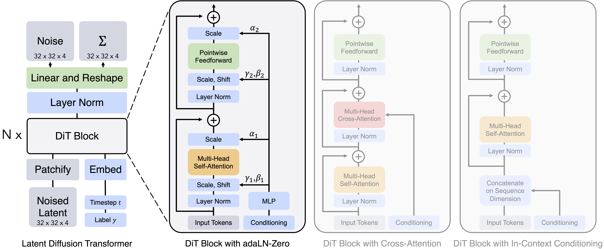

# VAE

## **一、歷史速寫（重點里程碑）**

* **2013–2014**：Kingma & Welling 提出 *Auto-Encoding Variational Bayes*（VAE）；Rezende 等人同時期提出相近方法。**重參數化技巧**（reparameterization trick）是關鍵，讓抽樣可用反向傳播訓練。
* **2016**：**β-VAE**（Higgins et al.）把 KL 權重調大，促進**可解耦的潛空間**（disentanglement）。
* **2017–2019**：**VQ-VAE**（將連續潛向量量化為碼本）、**PixelVAE / Ladder/Hierarchical VAE**（層級結構，畫質與穩定性更好），以及針對「後驗崩潰」的訓練技巧（KL 退火、free-bits）。
* **2020**：**NVAE** 等大型卷積/層級 VAE 展示高解析生成能力。
* **2022 起**：**Latent Diffusion**（如 Stable Diffusion）把擴散過程搬到 VAE 的**連續潛空間**；VAE 成為「高維資料→低維潛表徵」的**前端壓縮器**。

## **二、VAE 解決了哪些痛點？**

1. **不可解的後驗分佈**
   傳統潛變量模型做最大似然時，$p(z|x)$ 難算。VAE 用\*\*變分下界（ELBO）\*\*把它變成可優化的目標：
   $\log p(x)\ge \mathbb E_{q(z|x)}[\log p(x|z)]-\mathrm{KL}(q(z|x)\|p(z))$。
2. **抽樣不可微 → 無法端到端訓練**
   **重參數化**：$z=\mu+\sigma\odot\epsilon$（$\epsilon\sim\mathcal N(0,I)$），讓梯度能穿過「抽樣」這一步。
3. **高維資料的計算成本**
   透過**潛空間**建模，降維後再生成/重建，訓練推論更省算力。
4. **需要不確定性估計**
   VAE 給出 $q(z|x)$ 的均值與變異，天生帶**不確定性**；對異常偵測、補值、風險感知有用。
5. **可控與可插值的表徵**
   KL 正則把後驗拉向先驗（常用 $\mathcal N(0,I)$），潛空間更平滑、可插值，利於屬性控制與條件生成。

> 取捨：VAE 訓練穩、覆蓋廣，但純 VAE 生成常**偏軟/糊**；若追求銳利畫質，會加感知/對抗損失、用 VQ-VAE，或把 VAE 當前端配合**擴散/GAN**。

## **三、可以用於什麼任務？**

**通用生成 / 表徵**

* 影像、語音、表格資料的**生成與資料擴增**
* **條件生成（CVAE）**：按標籤、屬性或文字嵌入生成對應樣本
* **表示學習**：取得可解釋、可插值的潛向量（β-VAE 做 disentanglement）
* **有損壓縮 / 傳輸**：編碼到低維 $z$ 再解碼重建

**品質與修復**

* **異常偵測**：只用正常樣本訓練；測試時以重建誤差或 $-$ELBO 當異常分數
* **去噪 / 補洞（inpainting）/ 超解析度 / 著色**：視為在生成過程中校正缺失或噪聲

**特定資料型態**

* **影像/影片**：圖像生成、屬性編輯、未來幀預測（序列化/層級 VAE）
* **音訊/語音**：語者轉換、音訊生成與去噪（常見 VQ-VAE 或 VAE+Flow）
* **自然語言**：句子生成、情緒/屬性控制（需處理 posterior collapse）
* **時間序列**：帶不確定性的預測、缺失值補全、異常偵測（VRNN/SVAE）
* **圖資料（GraphVAE）**：圖/分子結構生成、連結預測
* **分子與蛋白**：分子設計與**屬性導向優化**（在潛空間做搜尋）
* **推薦系統**：**VAE-based 協同過濾**，對隱式回饋效果好

**與其他模型的搭配**

* **VAE+GAN / AAE**：用對抗損失補銳利度
* **VQ-VAE**：離散碼本，提升高保真影像/音訊生成
* **Latent Diffusion 前端**：如 Stable Diffusion，把昂貴的去噪過程放到 VAE 的低維連續潛空間，兼顧畫質與算力

## **四、什麼情境優先考慮 VAE？**

* 想要**可控、可插值**的潛空間與**不確定性估計**
* 有**缺失值/異常偵測**、**資料增補**需求
* 需要在**有限算力**下處理高維資料（可當壓縮前端 + 其他生成器）

如果你想，我可以用一個小尺寸的實例，帶你把一筆輸入**逐步代入 VAE，含完整矩陣、重參數化與 ELBO 計算**（像上堂課那樣把數字算到底）。

## **五、前向傳播 數學運算**

### 任務設定（真實場景）

* 小圖塊是 2×2 的灰階影像，展平成 4 維向量，數值已做 0–1 正規化。
* 批次大小 batch size = 3（一次三個樣本）。
* VAE 結構：Encoder（4→3→\[μ, logσ²] with latent dim=2）、reparameterization、Decoder（2→3→4, sigmoid 輸出）。

---

### 輸入資料

**痛點**：原始像素空間（4 維）雖小，但實際影像任務常更高維；我們示範降維與「帶不確定性」的編碼方式。

輸入批次 $X \in \mathbb{R}^{3\times 4}$：

$$
X =
\begin{bmatrix}
0.10 & 0.80 & 0.20 & 0.60 \\
0.90 & 0.40 & 0.30 & 0.10 \\
0.50 & 0.70 & 0.90 & 0.20
\end{bmatrix}
\quad (3\times 4)
$$

---

### Encoder：特徵抽取與潛在分佈參數

**痛點**：只用單一向量表示（Deterministic AE）→ 容易過擬合、泛化差；VAE 讓每個樣本對應**分佈**（$\mu,\log\sigma^2$），能表示不確定性並支援**生成**。

##### 1) 線性層 4→3，接 ReLU

權重與偏置：

$$
W_1 =
\begin{bmatrix}
0.20 & -0.10 & 0.30\\
0.40 & 0.50 & -0.20\\
-0.30 & 0.60 & 0.10\\
0.25 & -0.40 & 0.35
\end{bmatrix}
\ (4\times 3),\quad
b_1=\begin{bmatrix}0.05&0.10&-0.05\end{bmatrix}\ (1\times 3)
$$

先做矩陣乘法（只需寫成 $A\cdot B=C$）：

$$
Z_1 = X \cdot W_1 =
\begin{bmatrix}
0.43 & 0.27 & 0.10 \\
0.275 & 0.25 & 0.255 \\
0.16 & 0.76 & 0.17
\end{bmatrix}
\quad (3\times 3)
$$

加偏置（逐列廣播）並做 ReLU：

$$
H_1 = \mathrm{ReLU}(Z_1 + b_1) =
\begin{bmatrix}
0.48 & 0.37 & 0.05 \\
0.325 & 0.35 & 0.205 \\
0.21 & 0.86 & 0.12
\end{bmatrix}
\quad (3\times 3)
$$

> 這步**解痛點**：把原始像素轉成更抽象的特徵（去除雜訊、提取結構）。

##### 2) 輸出潛在分佈參數
$\mu,\ \log \sigma^2 \quad \text{(latent dim = 2)}$

參數：

$$
W_{\mu}=
\begin{bmatrix}
0.30 & -0.20\\
0.10 & 0.40\\
-0.50 & 0.25
\end{bmatrix}
\ (3\times 2),\ 
b_{\mu}=\begin{bmatrix}0.00&0.05\end{bmatrix}\ (1\times 2)
$$

$$
W_{logvar}=
\begin{bmatrix}
0.20 & 0.10\\
-0.30 & 0.15\\
0.40 & -0.25
\end{bmatrix}
\ (3\times 2),\ 
b_{logvar}=\begin{bmatrix}-0.10&0.00\end{bmatrix}\ (1\times 2)
$$

矩陣乘法與加偏置：

$$
H_1\cdot W_{\mu}=
\begin{bmatrix}
0.156000 & 0.064500\\
0.030000 & 0.126250\\
0.089000 & 0.332000
\end{bmatrix}
\ (3\times 2),\quad
\mu = H_1\cdot W_{\mu} + b_{\mu} =
\begin{bmatrix}
0.156000 & 0.114500\\
0.030000 & 0.176250\\
0.089000 & 0.382000
\end{bmatrix}
\ (3\times 2)
$$

$$
H_1\cdot W_{logvar}=
\begin{bmatrix}
0.005000 & 0.091000\\
0.042000 & 0.033750\\
-0.168000 & 0.120000
\end{bmatrix}
\ (3\times 2),\quad
\log\sigma^2 = H_1\cdot W_{logvar} + b_{logvar} =
\begin{bmatrix}
-0.095000 & 0.091000\\
-0.058000 & 0.033750\\
-0.268000 & 0.120000
\end{bmatrix}
\ (3\times 2)
$$

---

### Reparameterization：帶雜訊的可微採樣

**痛點**：直接從 $\mathcal{N}(\mu,\sigma^2)$ 取樣不可微，無法反傳梯度。重參數化 $z=\mu+\sigma\odot\epsilon$（$\epsilon\sim\mathcal{N}(0,1)$）讓梯度能流過 $\mu,\sigma$。

先把 $\log\sigma^2$ 轉成 $\sigma=\exp(\tfrac{1}{2}\log\sigma^2)$：

$$
\sigma =
\begin{bmatrix}
0.953610 & 1.046551\\
0.971416 & 1.017018\\
0.874590 & 1.061837
\end{bmatrix}
\ (3\times 2)
$$

固定本次的高斯噪聲（教學用，實務會每步刷新）：

$$
\epsilon =
\begin{bmatrix}
0.10 & -0.30\\
-1.20 & 0.50\\
0.75 & -0.10
\end{bmatrix}
\ (3\times 2)
$$

得到潛在向量：

$$
z = \mu + \sigma \odot \epsilon =
\begin{bmatrix}
0.251361 & -0.199465\\
-1.136699 & 0.684759\\
0.744943 & 0.275816
\end{bmatrix}
\ (3\times 2)
$$

> 這步**解痛點**：同一張圖可抽多次樣、得不同 $z$ → 提升生成多樣性與不確定性表達。

---

### Decoder：從潛在空間重建輸入

**痛點**：僅靠 AE 的點估計容易學到「記憶體」（過擬合）。VAE 的隨機化解碼迫使模型學到更平滑、可生成的表示。

##### 3) 線性層 2→3，接 ReLU

參數：

$$
W_{d1}=
\begin{bmatrix}
0.45 & -0.35 & 0.15\\
-0.20 & 0.30 & 0.50
\end{bmatrix}
\ (2\times 3),\ 
b_{d1}=\begin{bmatrix}0.05&-0.10&0.00\end{bmatrix}\ (1\times 3)
$$

矩陣乘法與加偏置：

$$
z\cdot W_{d1} =
\begin{bmatrix}
0.153006 & -0.147816 & -0.062028\\
-0.648017 & 0.602923 & 0.172025\\
0.280061 & -0.177985 & 0.249650
\end{bmatrix}
\ (3\times 3)
$$

$$
H_{d1}=\mathrm{ReLU}(z\cdot W_{d1}+b_{d1}) =
\begin{bmatrix}
0.203006 & 0.000000 & 0.000000\\
0.000000 & 0.502923 & 0.172025\\
0.330061 & 0.000000 & 0.249650
\end{bmatrix}
\ (3\times 3)
$$

##### 4) 輸出層 3→4，接 Sigmoid（因為像素在 0–1）

參數：

$$
W_{out}=
\begin{bmatrix}
0.25 & -0.15 & 0.10 & 0.05\\
0.40 & 0.20 & -0.30 & 0.35\\
-0.10 & 0.45 & 0.25 & -0.20
\end{bmatrix}
\ (3\times 4),\ 
b_{out}=\begin{bmatrix}0.00&0.05&-0.05&0.10\end{bmatrix}\ (1\times 4)
$$

矩陣乘法與加偏置：

$$
H_{d1}\cdot W_{out} =
\begin{bmatrix}
0.050751 & -0.030451 & 0.020301 & 0.010150\\
0.183967 & 0.177996 & -0.107871 & 0.141618\\
0.057550 & 0.062833 & 0.095418 & -0.033427
\end{bmatrix}
\ (3\times 4)
$$

$$
\text{logits } Y = H_{d1}\cdot W_{out} + b_{out} =
\begin{bmatrix}
0.050751 & 0.019549 & -0.029699 & 0.110150\\
0.183967 & 0.227996 & -0.157871 & 0.241618\\
0.057550 & 0.112833 & 0.045418 & 0.066573
\end{bmatrix}
\ (3\times 4)
$$

取 sigmoid 得重建 $\hat X$：

$$
\hat X=\sigma(Y)=
\begin{bmatrix}
0.512685 & 0.504887 & 0.492576 & 0.527510\\
0.545862 & 0.556753 & 0.460614 & 0.560112\\
0.514384 & 0.528178 & 0.511353 & 0.516637
\end{bmatrix}
\ (3\times 4)
$$

> 這步**解痛點**：把低維 $z$ 重新「解碼」回像素機率，支援下游**重建誤差**與**生成影像**。

---

### VAE 的損失（觀念 + 本批次數值）

#### 已知（來自前向傳遞）

輸入像素（0–1）：

$$
X =
\begin{bmatrix}
0.10 & 0.80 & 0.20 & 0.60 \\
0.90 & 0.40 & 0.30 & 0.10 \\
0.50 & 0.70 & 0.90 & 0.20
\end{bmatrix}
\quad (3\times 4)
$$

解碼器 **logits**（未經 Sigmoid）：

$$
Y =
\begin{bmatrix}
0.050751 & 0.019549 & -0.029699 & 0.110150\\
0.183967 & 0.227996 & -0.157871 & 0.241618\\
0.057550 & 0.112833 & 0.045418 & 0.066573
\end{bmatrix}
\quad (3\times 4)
$$

Encoder 的潛在分佈參數：

$$
\mu=
\begin{bmatrix}
0.156000 & 0.114500\\
0.030000 & 0.176250\\
0.089000 & 0.382000
\end{bmatrix}
\quad (3\times 2),
\qquad
\log\sigma^2=
\begin{bmatrix}
-0.095000 & 0.091000\\
-0.058000 & 0.033750\\
-0.268000 & 0.120000
\end{bmatrix}
\quad (3\times 2)
$$

> 解痛點：用 **logits 搭配 BCE-with-logits**，比「先 Sigmoid 再 BCE」穩定，避免數值飽和。

---

#### Step 1：重建項（BCE with logits）

（教學展示先把 $Y$ 經 Sigmoid 變成機率 $\hat X$；實作可直接用 with-logits 公式。）

$$
\hat X=\sigma(Y)=
\begin{bmatrix}
0.512685 & 0.504887 & 0.492576 & 0.527510\\
0.545862 & 0.556753 & 0.460614 & 0.560112\\
0.514384 & 0.528178 & 0.511353 & 0.516637
\end{bmatrix}
\quad (3\times 4)
$$

逐元素 BCE：

$$
L_{\text{BCE}} = -\Big[X\odot\log\hat X + (1-X)\odot\log(1-\hat X)\Big]=
\begin{bmatrix}
0.713770 & 0.687330 & 0.684348 & 0.683648\\
0.623785 & 0.722431 & 0.664685 & 0.797074\\
0.693561 & 0.672171 & 0.675238 & 0.713673
\end{bmatrix}
\quad (3\times 4)
$$

對每個樣本把 4 個像素相加：

$$
\text{BCE}_{\text{per-sample}}=
\begin{bmatrix}
2.769096\\
2.807975\\
2.754643
\end{bmatrix}
\quad (3\times 1),
\qquad
\sum \text{BCE}=8.331713
$$

> 解痛點：這一項驅動**重建逼近輸入**（保真）；用 logits 版本保證**梯度穩定**。

---

#### Step 2：KL 正則（把後驗拉近 $\mathcal N(0,I)$）

先把 $\log\sigma^2$ 指數回 $\sigma^2$，同時計算 $\mu^2$：

$$
\sigma^2=\exp(\log\sigma^2)=
\begin{bmatrix}
0.909373 & 1.095269\\
0.943650 & 1.034326\\
0.764908 & 1.127497
\end{bmatrix}
\quad (3\times 2),
\qquad
\mu^2=
\begin{bmatrix}
0.024336 & 0.013110\\
0.000900 & 0.031064\\
0.007921 & 0.145924
\end{bmatrix}
\quad (3\times 2)
$$

每一維的 KL（對角高斯）：

$$
\text{KL}_{\text{per-dim}}
=\tfrac12\Big(\sigma^2+\mu^2-1-\log\sigma^2\Big)=
\begin{bmatrix}
0.014354 & 0.008690\\
0.001275 & 0.015820\\
0.020414 & 0.076710
\end{bmatrix}
\quad (3\times 2)
$$

對每個樣本把 2 維加總：

$$
\text{KL}_{\text{per-sample}}=
\begin{bmatrix}
0.023044\\
0.017095\\
0.097125
\end{bmatrix}
\quad (3\times 1),
\qquad
\sum \text{KL}=0.137264
$$

> 解痛點：KL 讓潛在空間**規整**、可**插值/取樣**，降低過擬合、提升生成一致性。

---

#### Step 3：總損失（負 ELBO）

$$
\text{Loss}=\sum\text{BCE}+\sum\text{KL}
=8.331713+0.137264
=8.468977
$$

也可看每個樣本的總損失（方便除錯/觀察）：

$$
\text{Loss}_{\text{per-sample}}=
\begin{bmatrix}
2.769096\\
2.807975\\
2.754643
\end{bmatrix}
+
\begin{bmatrix}
0.023044\\
0.017095\\
0.097125
\end{bmatrix}
=
\begin{bmatrix}
2.792140\\
2.825070\\
2.851768
\end{bmatrix}
\quad (3\times 1)
$$

> 若採「平均」做法，$\text{Loss}_\text{mean}=8.468977/3\approx 2.822993$。

---

#### 小結：這套 Loss 解的痛點

1. **BCE（重建）**：逼近輸入、保真度↑。
2. **KL（正則）**：讓 $q_\phi(z|x)$ 近似 $\mathcal N(0,I)$，潛在空間更**可控、可生成**。
3. **with-logits** 設計：數值穩定、訓練更順。

> 到這裡，你已經把**真實前向的數值**完整帶入並算出 **VAE 的 ELBO 損失**。如果你想，我可以再用**Gaussian 解碼器**版本或**β-VAE**（調整 KL 權重）重算一遍，幫你比較差異。
