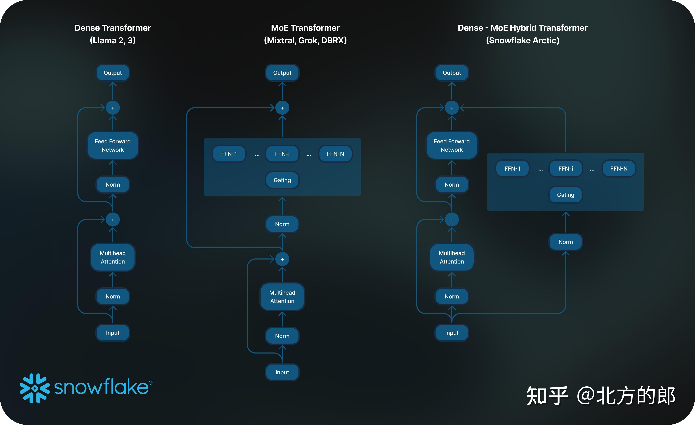
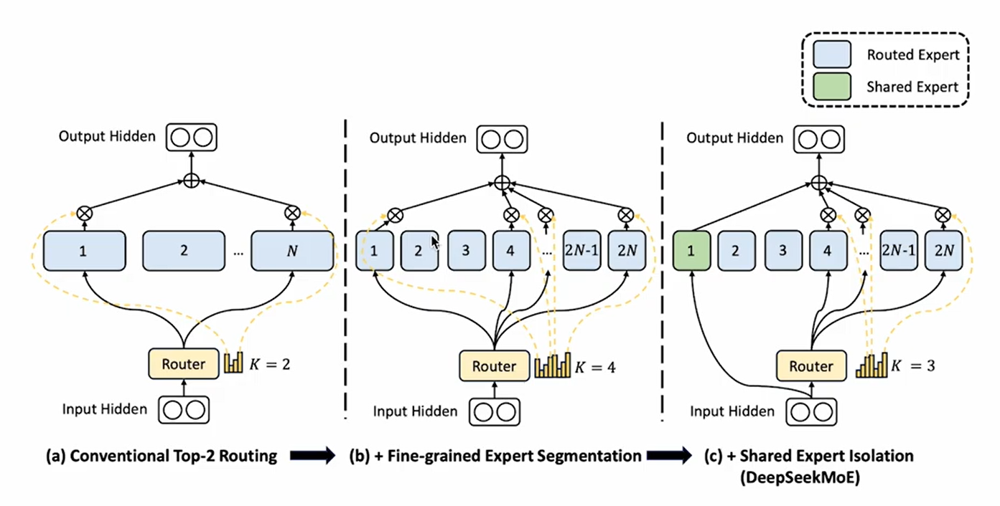

# Moe

# Dense 跟 MoE

> Prerequisite knowledge 先備知識：知道「參數（parameters）大致代表模型容量」「一次前向推論需要的計算量（FLOPs）」「Transformer 區塊裡常見的 Attention 與前饋網路（FFN）」「訓練 vs 推論」即可。

## 1. 故事背景

### 1-1 把模型想成一間餐廳的廚房

你可以把一個大語言模型想成餐廳後場：

* 有人負責讀懂客人的點單（理解輸入）
* 有人負責把菜做出來（產生輸出）
  而「模型的參數」就像廚房裡的廚師、鍋具、流程與食譜的總和。參數越多，通常越有機會把更多菜色與技巧學進來，但也更難伺候。

### 1-2 Dense 時代：每一單都叫全體廚師一起上

Dense（稠密）模型的直覺是：不管客人點什麼，每次出餐都讓同一套完整廚房流程跑一遍，也就是「每次輸入都會動到幾乎全部參數」。在 Transformer 這類架構裡，常見做法是每一層都固定有 Attention + FFN，FFN 也固定是一套「所有輸入都會經過」的計算。這種「全部都算」的方式很直接、工程上也好做，但一旦模型越做越大，每次出餐的成本也會跟著膨脹。

### 1-3 變大的代價：強但很貴

研究與實務都觀察到，把模型做大（參數更多、資料更多、算力更多）往往能帶來更強的效果；但代價是訓練與推論會變得非常吃計算資源。Switch Transformer 論文就直接點出：把「densenly-activated Transformer」做大雖有效，但「極度昂貴」；因此他們把目標改成「更高的計算效率」。

### 1-4 轉念：能不能「店面變超大」，但每次只動用一小部分人力

這時候就出現了關鍵想法：條件式計算（conditional computation）。不要每次都全員出動，而是「看點單內容派出合適的少數人」。2017 年 Shazeer 等人把這件事做成可落地的 Sparsely-Gated MoE：用一個可學的 gate（分派員）決定每次只叫少數幾個 expert（專家小廚房）出來做事，讓模型容量暴增但計算量不要等比例暴增。([arXiv][1])

## 2. 解決的痛點

### 2-1 Dense 的核心痛點：品質要上去，就得每次全員出動

用一句話說 Dense：
「你想要更懂更多、更會做更多菜，就得把整間廚房擴建；而每一單都要把更大的廚房完整跑一遍。」

用非常粗略的計算觀念表示（只抓核心直覺）：
$$\text{Dense 的每次計算量} \propto P_{\text{dense}}$$
也就是參數規模 $P_{\text{dense}}$ 變大，單次推論/訓練前向所需的 FLOPs 通常也跟著上升。

### 2-2 MoE 的做法：多間「專家小廚房」+ 一個「派單員」

MoE（Mixture of Experts）的直覺是把 FFN 這個最「吃參數、吃計算」的部分，改成好幾個「專家版本」，再用 router/gate 來決定某個 token（或某筆輸入）要丟給哪些專家處理。Hugging Face 的整理就用很直白的方式說：MoE layer 由一個 router（gate）和多個 experts 組成，並常用來取代 Transformer 裡的 dense FFN。([Hugging Face][2])

概念上可以寫成（以 top-$k$ 路由為例）：
$$y = \sum_{i \in \text{Top-}k(G(x))} g_i(x),E_i(x)$$
其中 $G(x)$ 是 gate/router 給每個 expert 的分數，$E_i(x)$ 是第 $i$ 個 expert 的輸出，$k$ 通常很小（例如 1 或 2）。([Hugging Face][2])

### 2-3 MoE 解掉的痛點：把「總容量」和「每次成本」拆開

把參數拆成「共享部分」+「很多套專家」後，你可以讓總參數變得非常大，但每次只啟動 $k$ 個專家，讓單次計算接近固定。

用簡化的參數記號表示：
$$P_{\text{total}} \approx P_{\text{shared}} + E\cdot P_e,\quad P_{\text{active}} \approx P_{\text{shared}} + k\cdot P_e$$

* $E$：專家數量
* $P_e$：每個專家的參數量
* $k$：每次實際啟動的專家數（通常 $k \ll E$）

Switch Transformer 把這件事講得很清楚：它追求「在保持每個樣本 FLOPs 幾乎不變的情況下增加參數數量」，做法就是「每次只啟動一部分權重」。

用生活化比喻：

* Dense 是「全能型大廚一個人做完所有菜」或「每單全體同時參與」
* MoE 是「你開了 50 間專門店（壽司、牛排、甜點…），但每位客人只會被導到其中 1～2 間店出餐」
  因此「店的總菜單」變超厚，但「每次出餐動用的人力」仍可控。

### 2-4 MoE 為了做到這件事，還得處理哪些新麻煩

MoE 雖然解了「Dense 太貴」這個大痛點，但要真的跑得順，還會遇到一些典型的系統與訓練挑戰（也就是 MoE 系列工作持續在解的點）：

* 分流塞車（load balancing）：如果 router 老是把 token 都丟給少數幾個熱門專家，就會造成有的專家爆滿、有的專家閒著，整體效率反而變差，因此常需要額外的平衡機制。([Hugging Face][2])
* 通訊與工程複雜度：專家可能分散在不同裝置上，token 路由會帶來跨裝置傳輸與實作難度；Switch Transformer 也明說 MoE 的廣泛採用過去常被「複雜度、通訊成本、訓練不穩」卡住，並以簡化設計來改善。
* 記憶體壓力：雖然一次只算少數專家，但推論時通常仍需要把所有專家權重載入（或以其他方式管理），因此「算得比較少」不等於「一定更省顯存」。([Hugging Face][2])

總結一句：Dense 像「每次都用整台大機器」，MoE 像「把能力拆成很多模組，靠派單員只啟動需要的那幾個」。它最大的價值，就是把「模型總容量」做大，同時讓「每次處理的計算量」不必跟著等比例爆掉。

[1]: https://arxiv.org/abs/1701.06538?utm_source=chatgpt.com "Outrageously Large Neural Networks: The Sparsely-Gated Mixture-of-Experts Layer"
[2]: https://huggingface.co/blog/moe "Mixture of Experts Explained"

## 3（實際案例運算）

### 3-1 真實場景與輸入（把一句話變成模型吃得下的矩陣）

#### 3-1-1 場景設定
電商客服模型收到一句話：「我要退款，進度呢？」  
為了示範 MoE 的「分流到不同 expert」如何省計算、提升專注度，我們只取兩個關鍵 token：
- token 1：「退款」（偏規則/政策）
- token 2：「進度」（偏查詢/流程）

#### 3-1-2 兩個 token 的向量（embedding）組成輸入矩陣 $X$

$$
X\ (shape=2\times 2)=
\begin{bmatrix}
1 & -1\\
0.5 & 1
\end{bmatrix}
$$

### 3-2 Router（派單員）先算「每個 token 該找哪個 expert」

#### 3-2-1 Router 權重（把 token 向量投影成「對每個 expert 的分數」）
MoE 的關鍵是「每個 token 經過一個 router，選少數 expert 來處理」，常見做法是線性層輸出對每個 expert 的 logits，再做 softmax 得機率。 

$$
W_r\ (shape=2\times 2)=
\begin{bmatrix}
1 & -1\\
-1 & 1
\end{bmatrix}
$$

#### 3-2-2 計算 logits：$Z = X\cdot W_r$

$$
Z\ (shape=2\times 2)=
X\ (shape=2\times 2)\cdot W_r\ (shape=2\times 2)=
\begin{bmatrix}
2 & -2\\
-0.5 & 0.5
\end{bmatrix}
$$

### 3-3 Softmax 變成路由機率，並做 top-1（每個 token 只選 1 個 expert）

#### 3-3-1 路由機率（每列對應一個 token，兩欄對應 expert 1 與 expert 2）
這裡我們有 2 個 experts：
- expert 1：偏「退款規則/政策」處理
- expert 2：偏「進度查詢/流程」處理

$$
P\ (shape=2\times 2)=\text{softmax}(Z)=
\begin{bmatrix}
0.982014 & 0.017986\\
0.268941 & 0.731059
\end{bmatrix}
$$

#### 3-3-2 top-1 選擇（每個 token 只派給機率最大的 expert）
- token「退款」選 expert 1（$0.982014$）
- token「進度」選 expert 2（$0.731059$）

$$
A\ (shape=2\times 2)=
\begin{bmatrix}
1 & 0\\
0 & 1
\end{bmatrix}
$$

$$
g\ (shape=2\times 1)=
\begin{bmatrix}
0.982014\\
0.731059
\end{bmatrix}
$$

痛點：避免每個 token 都跑完整的大 FFN，改成「按需派工」，把每次推論的計算量壓住（稀疏啟動）。 

### 3-4 Dispatch（分流）：只把 token 送去被選到的 expert

#### 3-4-1 用選擇矩陣把 token 切出去（真實系統會做 token-to-expert 的 dispatch）
我們用兩個選擇矩陣代表「挑第 1 個 token」與「挑第 2 個 token」。

$$
D^{(1)}\ (shape=1\times 2)=
\begin{bmatrix}
1 & 0
\end{bmatrix}
$$

$$
D^{(2)}\ (shape=1\times 2)=
\begin{bmatrix}
0 & 1
\end{bmatrix}
$$

#### 3-4-2 分別得到送進 expert 的輸入
token「退款」送 expert 1：

$$
X^{(1)}\ (shape=1\times 2)=
D^{(1)}\ (shape=1\times 2)\cdot X\ (shape=2\times 2)=
\begin{bmatrix}
1 & -1
\end{bmatrix}
$$

token「進度」送 expert 2：

$$
X^{(2)}\ (shape=1\times 2)=
D^{(2)}\ (shape=1\times 2)\cdot X\ (shape=2\times 2)=
\begin{bmatrix}
0.5 & 1
\end{bmatrix}
$$

痛點：把不同意圖的 token 分到不同路徑，降低「所有資料擠同一條計算管線」造成的浪費與干擾。 

### 3-5 Expert 1（退款規則 expert）的前向傳播（兩層 FFN：Linear -> ReLU -> Linear）

> 在 Transformer 裡，MoE 常用來取代 dense FFN：把原本「一套 FFN」換成「多套 FFN experts + router」。 

#### 3-5-1 Expert 1 的第一層線性：$H^{(1)}_{\text{pre}} = X^{(1)}\cdot W^{(1)}_1 + b^{(1)}_1$

$$
W^{(1)}_1\ (shape=2\times 3)=
\begin{bmatrix}
1 & 0 & -1\\
0 & 1 & 1
\end{bmatrix}
$$

$$
b^{(1)}_1\ (shape=1\times 3)=
\begin{bmatrix}
0 & 0 & 0
\end{bmatrix}
$$

$$
H^{(1)}_{\text{pre}}\ (shape=1\times 3)=
X^{(1)}\ (shape=1\times 2)\cdot W^{(1)}_1\ (shape=2\times 3)=
\begin{bmatrix}
1 & -1 & -2
\end{bmatrix}
$$

#### 3-5-2 啟用函數 ReLU：$H^{(1)}=\text{ReLU}(H^{(1)}_{\text{pre}})$

$$
H^{(1)}\ (shape=1\times 3)=
\begin{bmatrix}
1 & 0 & 0
\end{bmatrix}
$$

#### 3-5-3 Expert 1 的第二層線性：$Y^{(1)}=H^{(1)}\cdot W^{(1)}_2 + b^{(1)}_2$

$$
W^{(1)}_2\ (shape=3\times 2)=
\begin{bmatrix}
1 & 0\\
0 & 1\\
1 & 1
\end{bmatrix}
$$

$$
b^{(1)}_2\ (shape=1\times 2)=
\begin{bmatrix}
0 & 0
\end{bmatrix}
$$

$$
Y^{(1)}\ (shape=1\times 2)=
H^{(1)}\ (shape=1\times 3)\cdot W^{(1)}_2\ (shape=3\times 2)=
\begin{bmatrix}
1 & 0
\end{bmatrix}
$$

#### 3-5-4 乘上 router 給的權重（top-1 的 gate 值）
token「退款」對 expert 1 的 gate 值是 $0.982014$：

$$
g^{(1)}\ (shape=1\times 1)=
\begin{bmatrix}
0.982014
\end{bmatrix}
$$

$$
\tilde{Y}^{(1)}\ (shape=1\times 2)=
g^{(1)}\ (shape=1\times 1)\cdot Y^{(1)}\ (shape=1\times 2)=
\begin{bmatrix}
0.982014 & 0
\end{bmatrix}
$$

痛點：讓「退款」相關訊息走一條更專注的子網路，減少不同任務互相拉扯，提升表達的針對性。 

### 3-6 Expert 2（進度查詢 expert）的前向傳播（兩層 FFN：Linear -> ReLU -> Linear）

#### 3-6-1 Expert 2 的第一層線性：$H^{(2)}_{\text{pre}} = X^{(2)}\cdot W^{(2)}_1 + b^{(2)}_1$

$$
W^{(2)}_1\ (shape=2\times 3)=
\begin{bmatrix}
0 & 1 & 1\\
1 & 0 & -1
\end{bmatrix}
$$

$$
b^{(2)}_1\ (shape=1\times 3)=
\begin{bmatrix}
0 & 0 & 0
\end{bmatrix}
$$

$$
H^{(2)}_{\text{pre}}\ (shape=1\times 3)=
X^{(2)}\ (shape=1\times 2)\cdot W^{(2)}_1\ (shape=2\times 3)=
\begin{bmatrix}
1 & 0.5 & -0.5
\end{bmatrix}
$$

#### 3-6-2 啟用函數 ReLU：$H^{(2)}=\text{ReLU}(H^{(2)}_{\text{pre}})$

$$
H^{(2)}\ (shape=1\times 3)=
\begin{bmatrix}
1 & 0.5 & 0
\end{bmatrix}
$$

#### 3-6-3 Expert 2 的第二層線性：$Y^{(2)}=H^{(2)}\cdot W^{(2)}_2 + b^{(2)}_2$

$$
W^{(2)}_2\ (shape=3\times 2)=
\begin{bmatrix}
1 & 1\\
0 & 1\\
1 & 0
\end{bmatrix}
$$

$$
b^{(2)}_2\ (shape=1\times 2)=
\begin{bmatrix}
0 & 0
\end{bmatrix}
$$

$$
Y^{(2)}\ (shape=1\times 2)=
H^{(2)}\ (shape=1\times 3)\cdot W^{(2)}_2\ (shape=3\times 2)=
\begin{bmatrix}
1 & 1.5
\end{bmatrix}
$$

#### 3-6-4 乘上 router 給的權重（top-1 的 gate 值）
token「進度」對 expert 2 的 gate 值是 $0.731059$：

$$
g^{(2)}\ (shape=1\times 1)=
\begin{bmatrix}
0.731059
\end{bmatrix}
$$

$$
\tilde{Y}^{(2)}\ (shape=1\times 2)=
g^{(2)}\ (shape=1\times 1)\cdot Y^{(2)}\ (shape=1\times 2)=
\begin{bmatrix}
0.731059 & 1.096588
\end{bmatrix}
$$

痛點：把「進度」查詢的訊息交給另一條子網路，讓模型用更少計算做到「分工處理不同型態訊息」。 

### 3-7 Gather（回填）：把各 expert 的輸出放回原本 token 位置並合併

#### 3-7-1 先把 expert 輸出散回到 $2\times 2$（沒被該 expert 處理的 token 位置補 0）
需要用轉置的選擇矩陣 $D^{(1)T}, D^{(2)T}$：

$$
D^{(1)T}\ (shape=2\times 1)=
\begin{bmatrix}
1\\
0
\end{bmatrix}
$$

$$
D^{(2)T}\ (shape=2\times 1)=
\begin{bmatrix}
0\\
1
\end{bmatrix}
$$

$$
\tilde{Y}^{(1)}_{\text{full}}\ (shape=2\times 2)=
D^{(1)T}\ (shape=2\times 1)\cdot \tilde{Y}^{(1)}\ (shape=1\times 2)=
\begin{bmatrix}
0.982014 & 0\\
0 & 0
\end{bmatrix}
$$

$$
\tilde{Y}^{(2)}_{\text{full}}\ (shape=2\times 2)=
D^{(2)T}\ (shape=2\times 1)\cdot \tilde{Y}^{(2)}\ (shape=1\times 2)=
\begin{bmatrix}
0 & 0\\
0.731059 & 1.096588
\end{bmatrix}
$$

#### 3-7-2 合併成 MoE 輸出：$Y_{\text{moe}}=\tilde{Y}^{(1)}_{\text{full}}+\tilde{Y}^{(2)}_{\text{full}}$

$$
Y_{\text{moe}}\ (shape=2\times 2)=
\begin{bmatrix}
0.982014 & 0\\
0.731059 & 1.096588
\end{bmatrix}
$$

痛點：把「分工後的結果」安全地合回同一條序列表示，讓後續層可以像處理一般 Transformer 一樣繼續運算。 :contentReference[oaicite:6]{index=6}

### 3-8 殘差連接（像 Transformer FFN 一樣把新訊息加回去）

#### 3-8-1 計算 block 輸出：$O = X + Y_{\text{moe}}$

$$
O\ (shape=2\times 2)=
\begin{bmatrix}
1.982014 & -1\\
1.231059 & 2.096588
\end{bmatrix}
$$

痛點：保留原始輸入資訊並讓更新是「加法微調」，降低表示被破壞的風險，使推論更穩定。 

## 4 面試考題

### 4-1 基礎觀念：什麼是 MoE？它和 Dense 最大差異在哪？
**題目**  
請用一句話定義 MoE（Mixture of Experts），並說明它和 Dense Transformer 的最大差異。

**解答**  
MoE 是一種「條件式計算」架構：對每個輸入（常見到 token 粒度）只啟動少數幾個 expert 子網路來計算，而不是每次都啟動全部參數。最大差異在於 Dense 是「每個 token 都走同一套 FFN」，MoE 是「每個 token 先被 router 分流，走少數 expert」。

---

### 4-2 Router / Gating：logits 與 softmax 機率代表什麼？
**題目**  
MoE router 輸出 logits，再做 softmax 得到機率。請說明 logits 與 softmax 後機率各代表什麼。

**解答**  
logits 是「token 對每個 expert 的偏好分數（未正規化）」；softmax 後是「在該 token 的 expert 候選集合中，各 expert 被選用的相對機率」，通常用來做 top-$k$ 選擇與加權。

---

### 4-3 張量形狀：為什麼 softmax 後常是矩陣而不是一維向量？
**題目**  
若 $Z$ 的 shape 是 $(T, E)$（$T$ 個 token，$E$ 個 experts），對 $Z$ 做 softmax 後的結果 shape 是什麼？為什麼不是一維？

**解答**  
softmax 後仍是 $(T, E)$。因為對每個 token（每一列）各自把 $E$ 個 expert 分數正規化成一個機率分佈，所以每個 token 都有自己的 $E$ 維機率向量，堆疊起來就是矩陣。:contentReference[oaicite:2]{index=2}

---

### 4-4 top-1 與 top-2：差別與取捨
**題目**  
top-1 routing 與 top-2 routing 的差別是什麼？請說出至少兩個取捨點（效果/成本/穩定性皆可）。

**解答**  
- top-1：每個 token 只給 1 個 expert；計算與通訊更省，工程更簡單，但可能降低表達彈性與容錯。  
- top-2：每個 token 給 2 個 experts；通常更有彈性、效果可能更好，但計算量與通訊量增加、負載更難平衡。

---

### 4-5 前向公式：請寫出 MoE layer 的核心計算
**題目**  
請寫出常見 top-$k$ MoE 的輸出公式（token 級），並說明各符號意義。

**解答**  
常見形式：
$$
y=\sum_{i\in \text{Top-}k(G(x))} p_i(x)\,E_i(x)
$$
- $x$：token 表示  
- $G(\cdot)$：router/gate，輸出對各 expert 的分數或機率  
- $p_i(x)$：softmax 後對 expert $i$ 的權重（機率或經正規化權重）  
- $E_i(\cdot)$：第 $i$ 個 expert（多為 FFN 子網路）  
- Top-$k$：只啟動權重最大的 $k$ 個 experts（稀疏啟動）

---

### 4-6 計算量：MoE 為什麼能「總參數很大但每 token FLOPs 近似固定」？
**題目**  
請用「總參數量」與「每 token 啟動參數量」解釋 MoE 的計算效率直覺。

**解答**  
若有 $E$ 個 experts、每次只啟動 $k$ 個（$k\ll E$），則總參數大致為：
$$
P_{\text{total}}\approx P_{\text{shared}}+E\cdot P_e
$$
但每 token 實際參與計算的參數更接近：
$$
P_{\text{active}}\approx P_{\text{shared}}+k\cdot P_e
$$
因此可以把「容量（總參數）」做很大，同時維持「每 token 計算量」不隨 $E$ 線性爆增。

---

### 4-7 系統瓶頸：為什麼算術 FLOPs 變少，不代表端到端一定更快？
**題目**  
MoE 把每 token 計算量壓低後，為什麼實務上速度可能沒有同比提升？請列出兩個常見原因。

**解答**  
1. **通訊成本**：token 需要 dispatch 到各 expert、再 gather 回來，常涉及 all-to-all 類型通訊，可能吃掉大量時間。:contentReference[oaicite:6]{index=6}  
2. **負載不均**：router 若偏向少數 experts，某些 GPU/experts 壅塞、其他閒置等待，導致利用率下降。

---

### 4-8 負載平衡：什麼是 load balancing？為什麼需要？
**題目**  
在 MoE 中什麼是 load balancing？如果不做會發生什麼事？

**解答**  
load balancing 是讓 token 分配到 experts 更平均的機制。若不做，router 可能把大量 token 丟給少數熱門 experts，造成：  
- 部分 experts 過載、延遲上升  
- 其他 experts 閒置、算力浪費  
- 訓練不穩或效果下降  
因此許多 MoE 系統會搭配負載平衡策略與容量限制。

---

### 4-9 訓練穩定：Switch Transformer 解了哪些「MoE 難以普及」的痛點？
**題目**  
Switch Transformer 為何被認為讓 MoE 更容易大規模採用？請說明它想解決的 MoE 主要阻礙。

**解答**  
Switch Transformer 指出 MoE 過去難以普及的原因包含「複雜度、通訊成本、訓練不穩定」，並提出更簡化的 routing 與訓練技巧來改善，讓大規模稀疏模型更可訓練、更有效率。

---

### 4-10 推論部署：MoE 的 GPU 記憶體一定比較省嗎？
**題目**  
有人說 MoE 因為每次只算少數 experts，所以推論顯存一定更省。這句話對嗎？請說明。

**解答**  
不一定。MoE 的「每次啟動計算」變少，但「總權重」更大；推論時可能仍需要把大量 expert 權重常駐在 GPU（或分散在多卡上），再加上 dispatch/gather 的緩衝與通訊開銷，顯存未必比較省。

---

### 4-11 工程題：你會如何定位 MoE 的瓶頸在「算力、記憶體頻寬、還是通訊」？
**題目**  
假設一個 MoE 模型吞吐不如預期，你會用哪些觀察指標快速判斷瓶頸是 compute-bound、memory-bound、還是 communication-bound？

**解答**  
可行判斷方向（面試回答抓重點即可）：  
- **compute-bound**：GPU SM 利用率高、算子時間集中在 GEMM/FFN，通訊佔比低。  
- **memory-bound**：顯存帶寬接近上限、算力利用率不高但時間花在權重/activation 搬運。  
- **communication-bound**：all-to-all / gather / scatter 等通訊佔比高，GPU 常在等待同步；可參考框架提供的 MoE dispatcher/overlap 設計與觀測。

---

### 4-12 開放題：什麼情境你會「不建議」用 MoE？
**題目**  
請列出兩種你會不建議使用 MoE 的真實場景，並說明理由。

**解答**  
- **單卡或少卡、且重視低延遲小 batch 推論**：MoE 可能被 dispatch/gather 與權重存取拖累，收益不一定覆蓋工程成本。
- **系統/團隊無法負擔通訊與負載平衡工程**：MoE 的實作與調參比 Dense 複雜，若沒有相應基礎設施（例如成熟 MoE 框架），容易踩到不穩定與效率不佳問題。

