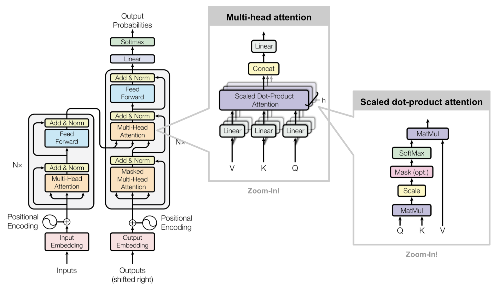

# Attention

# 1 attention

## 1-1 真實場景與輸入

### 1-1-1 真實場景：客服系統要讀懂「退貨流程期限」

想像你在做電商客服 AI，客人丟一句：「退貨 流程 期限」。模型在讀到「流程」或「期限」時，應該把注意力放到同一句話裡最相關的詞（例如「期限」），才不會回答成一般流程而漏掉時間限制。

痛點：在同一句短訊裡抓到關鍵字之間的關聯，避免答非所問。

### 1-1-2 把文字變成向量：Embedding 矩陣 $X$

我們把句子切成 3 個 token（教學用，向量維度刻意做小）：

* token1：退貨
* token2：流程
* token3：期限

$$
X\ (shape=3\times 2)=
\begin{bmatrix}
1 & 0\\
0 & 1\\
1 & 1
\end{bmatrix}
$$

痛點：把離散文字變成可計算的數字，才能做後續的相似度與資訊聚合。

## 1-2 產生 Query、Key、Value

### 1-2-1 注意力的核心公式（前向傳播）

Scaled Dot-Product Attention 的核心計算是： ([arXiv][1])

$$
\mathrm{Attention}(Q,K,V)=\mathrm{softmax}\left(\frac{QK^T}{\sqrt{d_k}}\right)V
$$

這裡我們設定 $d_k=2$（Key 的維度）。

痛點：用同一套機制把「要找什麼」和「從哪裡拿資訊」拆開，讓模型能動態挑重點。

### 1-2-2 參數：$W_Q,W_K,W_V$ 與 bias

（教學用簡化成單頭注意力，維度都設為 2）

$$
W_Q\ (shape=2\times 2)=
\begin{bmatrix}
1 & 0\\
0 & 1
\end{bmatrix}
$$

$$
b_Q\ (shape=1\times 2)=
\begin{bmatrix}
0 & 0
\end{bmatrix}
$$

$$
W_K\ (shape=2\times 2)=
\begin{bmatrix}
0.707107 & 0.707107\\
1.414214 & 1.414214
\end{bmatrix}
$$

$$
b_K\ (shape=1\times 2)=
\begin{bmatrix}
-0.707107 & -0.707107
\end{bmatrix}
$$

$$
W_V\ (shape=2\times 2)=
\begin{bmatrix}
1 & 0\\
0 & 1
\end{bmatrix}
$$

$$
b_V\ (shape=1\times 2)=
\begin{bmatrix}
0 & 0
\end{bmatrix}
$$

痛點：同一段輸入要分成「比對用索引(K)」與「要帶走的內容(V)」，避免資訊混在一起不好取用。

### 1-2-3 計算 $Q=XW_Q+b_Q$

先做矩陣乘法：

$$
X\ (shape=3\times 2)\cdot W_Q\ (shape=2\times 2)=Q_{\mathrm{raw}}\ (shape=3\times 2)
$$

$$
Q_{\mathrm{raw}}\ (shape=3\times 2)=
\begin{bmatrix}
1 & 0\\
0 & 1\\
1 & 1
\end{bmatrix}
$$

把 bias 展開成同 shape（broadcast 成 3 列）：

$$
B_Q\ (shape=3\times 2)=
\begin{bmatrix}
0 & 0\\
0 & 0\\
0 & 0
\end{bmatrix}
$$

$$
Q_{\mathrm{raw}}\ (shape=3\times 2)+B_Q\ (shape=3\times 2)=Q\ (shape=3\times 2)
$$

$$
Q\ (shape=3\times 2)=
\begin{bmatrix}
1 & 0\\
0 & 1\\
1 & 1
\end{bmatrix}
$$

痛點：讓每個位置都能形成自己的「提問向量」，後面才能針對不同詞去找上下文。

### 1-2-4 計算 $K=XW_K+b_K$

先做矩陣乘法：

$$
X\ (shape=3\times 2)\cdot W_K\ (shape=2\times 2)=K_{\mathrm{raw}}\ (shape=3\times 2)
$$

$$
K_{\mathrm{raw}}\ (shape=3\times 2)=
\begin{bmatrix}
0.707107 & 0.707107\\
1.414214 & 1.414214\\
2.121320 & 2.121320
\end{bmatrix}
$$

把 bias 展開：

$$
B_K\ (shape=3\times 2)=
\begin{bmatrix}
-0.707107 & -0.707107\\
-0.707107 & -0.707107\\
-0.707107 & -0.707107
\end{bmatrix}
$$

$$
K_{\mathrm{raw}}\ (shape=3\times 2)+B_K\ (shape=3\times 2)=K\ (shape=3\times 2)
$$

$$
K\ (shape=3\times 2)=
\begin{bmatrix}
0 & 0\\
0.707107 & 0.707107\\
1.414214 & 1.414214
\end{bmatrix}
$$

痛點：建立可被快速比對的「索引座標」，讓關鍵詞更容易在相似度計算中被凸顯。

### 1-2-5 計算 $V=XW_V+b_V$

先做矩陣乘法：

$$
X\ (shape=3\times 2)\cdot W_V\ (shape=2\times 2)=V_{\mathrm{raw}}\ (shape=3\times 2)
$$

$$
V_{\mathrm{raw}}\ (shape=3\times 2)=
\begin{bmatrix}
1 & 0\\
0 & 1\\
1 & 1
\end{bmatrix}
$$

bias 展開：

$$
B_V\ (shape=3\times 2)=
\begin{bmatrix}
0 & 0\\
0 & 0\\
0 & 0
\end{bmatrix}
$$

$$
V_{\mathrm{raw}}\ (shape=3\times 2)+B_V\ (shape=3\times 2)=V\ (shape=3\times 2)
$$

$$
V\ (shape=3\times 2)=
\begin{bmatrix}
1 & 0\\
0 & 1\\
1 & 1
\end{bmatrix}
$$

痛點：把真正要被「加權帶走」的內容先準備好，後面聚合時不會丟掉語意。

## 1-3 計算注意力分數

### 1-3-1 轉置 $K^T$

$$
K^T\ (shape=2\times 3)=
\begin{bmatrix}
0 & 0.707107 & 1.414214\
0 & 0.707107 & 1.414214
\end{bmatrix}
$$

痛點：把「每個詞的 Key」排成可一次對全句比對的形狀，提升批次計算效率。

### 1-3-2 相似度分數：$S_{\mathrm{raw}}=QK^T$

$$
Q\ (shape=3\times 2)\cdot K^T\ (shape=2\times 3)=S_{\mathrm{raw}}\ (shape=3\times 3)
$$

$$
S_{\mathrm{raw}}\ (shape=3\times 3)=
\begin{bmatrix}
0 & 0.707107 & 1.414214\\
0 & 0.707107 & 1.414214\\
0 & 1.414214 & 2.828427
\end{bmatrix}
$$

痛點：用一次矩陣乘法就算出「每個詞對全句」的關聯度，避免逐字迴圈太慢。

### 1-3-3 縮放：$S=\dfrac{S_{\mathrm{raw}}}{\sqrt{d_k}}$

$$
\sqrt{d_k}=\sqrt{2}=1.414214
$$

$$
S\ (shape=3\times 3)=\frac{1}{1.414214},S_{\mathrm{raw}}\ (shape=3\times 3)
$$

$$
S\ (shape=3\times 3)=
\begin{bmatrix}
0 & 0.5 & 1\\
0 & 0.5 & 1\\
0 & 1 & 2
\end{bmatrix}
$$

（這個縮放是為了避免內積隨維度變大而讓 softmax 過度飽和，提升穩定性。） ([nlp.seas.harvard.edu][2])

痛點：避免分數過大導致 softmax 變得極端，讓訓練與推論更穩定。

## 1-4 softmax 變成權重

### 1-4-1 注意力權重：$A=\mathrm{softmax}(S)$（逐列 softmax）

$$
A\ (shape=3\times 3)=\mathrm{softmax}\left(S\ (shape=3\times 3)\right)
$$

$$
A\ (shape=3\times 3)=
\begin{bmatrix}
0.186324 & 0.307196 & 0.506480\\
0.186324 & 0.307196 & 0.506480\\
0.090031 & 0.244728 & 0.665241
\end{bmatrix}
$$

你可以把第 2 列（對應 token2「流程」）看成：它最關注 token3「期限」（權重 0.506480 最大）；第 3 列（對應 token3「期限」）更強烈關注自己（0.665241 最大）。

痛點：把關聯度轉成可解釋的「比例」，並自然壓低不重要的詞以避免噪聲。

## 1-5 加權求和得到輸出

### 1-5-1 聚合內容：$O=AV$

$$
A\ (shape=3\times 3)\cdot V\ (shape=3\times 2)=O\ (shape=3\times 2)
$$

$$
O\ (shape=3\times 2)=
\begin{bmatrix}
0.692804 & 0.813676\\
0.692804 & 0.813676\\
0.755272 & 0.909969
\end{bmatrix}
$$

痛點：把整句話的資訊濃縮回每個位置的向量，讓每個詞都帶著「已整理好的上下文重點」。

## 1-6 回到真實場景：它怎麼幫你答對「期限」

### 1-6-1 用權重解讀：為什麼「流程」會去看「期限」

看 $A$ 的第 2 列（token2「流程」）：

$$
A_{(\text{流程})}\ (shape=1\times 3)=
\begin{bmatrix}
0.186324 & 0.307196 & 0.506480
\end{bmatrix}
$$

它把超過一半的注意力（0.506480）放在「期限」，所以輸出向量 $O$ 在「流程」這個位置，會自然混入「期限」的資訊，讓後續層更容易生成像「退貨期限是 7 天，流程是…」這種不漏重點的回答。

痛點：讓模型在回答時把「最需要一起出現的關鍵資訊」綁在同一個表示裡，降低漏答關鍵條件的機率。

[1]: https://arxiv.org/abs/1706.03762?utm_source=chatgpt.com "Attention Is All You Need"
[2]: https://nlp.seas.harvard.edu/2018/04/03/attention.html?utm_source=chatgpt.com "The Annotated Transformer"
