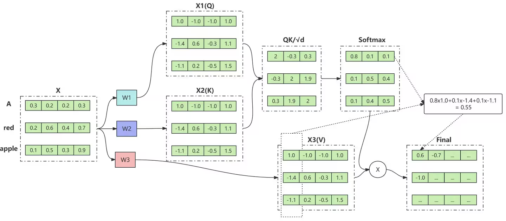

# QKV

## 1. 故事背景：嘈雜的會議室與信息過濾

想像你身處一個大型的跨部門會議，會議室裡有數十人，每個人都急著發言、分享數據或提出問題。你是一位產品經理，只關心與你負責的專案相關的資訊。會議非常嘈雜，你該如何從眾多聲音中篩選出對你有價值的內容？

傳統的處理方式（就像早期的 RNN 模型）是逐個聽每個人發言，並且記住之前聽到的內容，但這樣不僅速度慢，而且當會議進行到後半段時，你可能早就忘了開場時某個關鍵人物提到的細節。更糟的是，你只能按照發言順序被動接收，無法主動跳過不相關的內容。

為了解決這個困境，你設計了一套「智慧過濾系統」：
- 每個人發言時，身上會顯示兩個牌子：一個是「主題標籤」（Key），簡述他們在講什麼；另一個是「發言內容」（Value），也就是他們實際說的話。
- 你自己則帶著一個「關注焦點」（Query），上面寫著你當下關心的主題。

當會議開始，你不需要逐一聽完所有人的發言，而是先快速掃過每個人的主題標籤（Key），比對是否與你的關注焦點（Query）匹配。如果匹配度高，你就仔細聽他的發言內容（Value）；如果匹配度低，你就自動忽略。這樣一來，你就能在短時間內掌握所有與你有關的資訊，而且無論發言者坐在會議室的哪個位置（對應序列中的距離），你都能直接關注到他們。

這就是 QKV 機制的雛型：Query 代表你的需求，Key 代表資訊來源的標籤，Value 代表真正的資訊內容。透過 Query 和 Key 的匹配，決定要提取哪些 Value。

## 2. 解決的痛點

### 2-1 突破序列計算的順序束縛

在傳統的 RNN 模型中，處理句子必須一個詞接一個詞，就像在會議中必須按照發言順序逐一聆聽，無法同時關注不同位置的發言者。這種順序計算導致訓練速度慢，且無法充分利用現代平行運算硬體。

QKV 機制讓模型可以一次計算所有位置之間的匹配程度，用矩陣運算取代循序計算：
$$
\text{Attention}(Q, K, V) = \text{softmax}\left(\frac{QK^T}{\sqrt{d_k}}\right)V
$$
這裡的 $Q$、$K$、$V$ 都是矩陣，每一列對應一個位置的 Query、Key、Value。透過一次矩陣乘法 $QK^T$，就能算出所有 Query 與所有 Key 的匹配分數，徹底解放了平行計算的能力，大幅提升訓練效率。

### 2-2 捕捉長距離的語義關聯

在 RNN 中，資訊需要沿著時間步一步一步傳遞，當句子很長時，早期的資訊容易被稀釋或遺忘，就像會議開到後半段，你可能忘了第一個人講的細節。這種長距離依賴缺失會讓模型無法理解像「他 10 年前去過的那家餐廳，現在已經關了」這種需要跨越長距離指代關係的句子。

QKV 機制允許每個詞直接與序列中任意位置的詞進行交互，無論距離多遠，都能計算它們的相關性。因為 $QK^T$ 同時考慮了所有位置對，沒有中間傳遞的衰減，所以長距離的依賴可以被直接捕捉。

### 2-3 實現動態且靈活的資訊篩選

傳統的簡單加權平均或卷積操作，對所有輸入一視同仁，無法根據上下文動態調整關注的焦點。這就像在會議中不加區別地記錄每個人說的話，最後得到一堆雜亂無章的筆記。

QKV 透過學習得到 Query 和 Key，讓模型能夠根據目前詞的語義（Query）去判斷哪些其他詞（Key）值得關注，再從那些詞中提取有價值的內容（Value）。這個過程是動態的：同樣一個詞，在不同句子中，它的 Query 可能不同，關注的對象也會隨之改變。例如：
- 在句子「貓追老鼠」中，「貓」的 Query 會讓它高度關注「追」和「老鼠」；
- 在句子「貓睡著了」中，「貓」的 Query 會讓它更關注「睡著了」而忽略其他無關詞。

這種靈活性讓模型能夠根據上下文精準提取資訊，而不是被固定的模式束縛。

### 2-4 提供多角度的表徵空間

實際應用中，Transformer 會使用多組 QKV（多頭注意力），就像會議中你同時有多個關注焦點：一方面關心技術細節，另一方面關心時間安排。每一組 QKV 可以學習不同的匹配規則，讓模型能從不同角度理解輸入。

多頭注意力公式：
$$
\text{MultiHead}(Q, K, V) = \text{Concat}(\text{head}_1, \ldots, \text{head}_h)W^O
$$
其中每個頭 $\text{head}_i = \text{Attention}(QW_i^Q, KW_i^K, VW_i^V)$。

這就像你在會議中同時用多個 Query 去掃描 Key，一個 Query 找技術資訊，另一個 Query 找時間資訊，最後把所有相關資訊彙整起來，形成更全面的理解。

## 3 實際案例運算

我們以句子「貓 追 老鼠」為例，來說明QKV的計算過程。假設每個詞我們已經透過嵌入層得到了一個向量，再經過三個不同的線性變換得到了Q、K、V矩陣。為了計算方便，我們直接給出這些矩陣的數值。

### 3-1 輸入矩陣：Q, K, V

假設我們有三個詞，分別是「貓」、「追」、「老鼠」。每個詞對應一個查詢向量Q、一個鍵向量K、一個值向量V。我們將所有詞的Q拼成矩陣Q，所有詞的K拼成矩陣K，所有詞的V拼成矩陣V。

矩陣Q (shape=3×3): 每一列對應一個詞的查詢向量，順序為「貓」、「追」、「老鼠」。

$$
Q\ (shape=3\times 3)=
\begin{bmatrix}
2 & 0 & 1 \\
0 & 2 & 1 \\
1 & 1 & 1
\end{bmatrix}
$$

矩陣K (shape=3×3): 每一列對應一個詞的鍵向量，順序為「貓」、「追」、「老鼠」。

$$
K\ (shape=3\times 3)=
\begin{bmatrix}
0 & 2 & 1 \\
1 & 1 & 1 \\
1 & 1 & 1
\end{bmatrix}
$$

矩陣V (shape=3×3): 每一列對應一個詞的值向量，順序為「貓」、「追」、「老鼠」。

$$
V\ (shape=3\times 3)=
\begin{bmatrix}
1 & 0 & 1 \\
2 & 1 & 0 \\
0 & 2 & 1
\end{bmatrix}
$$

### 3-2 計算注意力分數矩陣 S = Q·K^T

首先需要計算K的轉置K^T，然後用Q乘以K^T得到分數矩陣S。S中的每個元素S_ij表示第i個詞的查詢與第j個詞的鍵的匹配程度。

$$
K^T\ (shape=3\times 3)=
\begin{bmatrix}
0 & 1 & 1 \\
2 & 1 & 1 \\
1 & 1 & 1
\end{bmatrix}
$$

計算S:

$$
S = Q \cdot K^T =
\begin{bmatrix}
2 & 0 & 1 \\
0 & 2 & 1 \\
1 & 1 & 1
\end{bmatrix}
\cdot
\begin{bmatrix}
0 & 1 & 1 \\
2 & 1 & 1 \\
1 & 1 & 1
\end{bmatrix}
=
\begin{bmatrix}
1 & 3 & 3 \\
5 & 3 & 3 \\
3 & 3 & 3
\end{bmatrix}
$$

$$
S\ (shape=3\times 3)=
\begin{bmatrix}
1 & 3 & 3 \\
5 & 3 & 3 \\
3 & 3 & 3
\end{bmatrix}
$$

痛點：透過一次矩陣乘法同時計算所有詞之間的注意力分數，讓模型能夠平行捕捉序列中任意兩個詞的關係，打破了RNN循序計算的限制，大幅提升運算效率。

### 3-3 對分數進行縮放並套用Softmax

為了防止內積過大導致softmax梯度極小，通常會除以一個縮放因子 $\sqrt{d_k}$，這裡 $d_k=3$，所以縮放因子為 $\sqrt{3}\approx 1.732$。先進行縮放，然後對每一列（每個查詢對所有鍵的分數）做softmax，得到注意力權重矩陣A。

縮放後的S_scaled:

$$
S_{\text{scaled}} = \frac{S}{\sqrt{3}} \approx
\begin{bmatrix}
0.577 & 1.732 & 1.732 \\
2.887 & 1.732 & 1.732 \\
1.732 & 1.732 & 1.732
\end{bmatrix}
$$

對每一行做softmax（指數歸一化），得到注意力權重矩陣A（近似值保留三位小數）：

第一行（貓的查詢）：softmax([0.577, 1.732, 1.732]) ≈ [0.136, 0.432, 0.432]  
第二行（追的查詢）：softmax([2.887, 1.732, 1.732]) ≈ [0.614, 0.193, 0.193]  
第三行（老鼠的查詢）：softmax([1.732, 1.732, 1.732]) ≈ [0.333, 0.333, 0.333]

因此：

$$
A\ (shape=3\times 3)\approx
\begin{bmatrix}
0.136 & 0.432 & 0.432 \\
0.614 & 0.193 & 0.193 \\
0.333 & 0.333 & 0.333
\end{bmatrix}
$$

痛點：softmax將分數轉換為機率分佈，讓模型能夠以加權和的形式聚合資訊，同時透過縮放避免梯度消失，穩定訓練過程。

### 3-4 加權求和得到輸出矩陣O = A·V

用注意力權重A乘以值矩陣V，得到最終每個詞的輸出向量O。O的每一行是對應詞經過注意力聚合後的結果。

計算 O = A * V：

$$
V\ (shape=3\times 3)=
\begin{bmatrix}
1 & 0 & 1 \\
2 & 1 & 0 \\
0 & 2 & 1
\end{bmatrix}
$$

逐行計算：

第一行（貓的輸出）：
$$
\begin{aligned}
O_{1,:} &= [0.136, 0.432, 0.432] \cdot V \\
&= [0.136\times1 + 0.432\times2 + 0.432\times0,\quad 0.136\times0 + 0.432\times1 + 0.432\times2,\quad 0.136\times1 + 0.432\times0 + 0.432\times1] \\
&= [1.0,\ 1.296,\ 0.568]
\end{aligned}
$$

第二行（追的輸出）：
$$
\begin{aligned}
O_{2,:} &= [0.614, 0.193, 0.193] \cdot V \\
&= [0.614\times1 + 0.193\times2 + 0.193\times0,\quad 0.614\times0 + 0.193\times1 + 0.193\times2,\quad 0.614\times1 + 0.193\times0 + 0.193\times1] \\
&= [1.0,\ 0.579,\ 0.807]
\end{aligned}
$$

第三行（老鼠的輸出）：
$$
\begin{aligned}
O_{3,:} &= [0.333, 0.333, 0.333] \cdot V \\
&= [0.333\times1 + 0.333\times2 + 0.333\times0,\quad 0.333\times0 + 0.333\times1 + 0.333\times2,\quad 0.333\times1 + 0.333\times0 + 0.333\times1] \\
&= [1.0,\ 1.0,\ 0.666]
\end{aligned}
$$

因此，輸出矩陣O (shape=3×3) 為：

$$
O\ (shape=3\times 3)\approx
\begin{bmatrix}
1.0 & 1.296 & 0.568 \\
1.0 & 0.579 & 0.807 \\
1.0 & 1.0 & 0.666
\end{bmatrix}
$$

痛點：透過加權求和，每個詞都能動態聚合與其相關的上下文資訊，解決了RNN中長距離資訊衰減的問題，讓模型能靈活提取全局特徵。

### 3-5 總結

透過上述三步矩陣運算（Q·K^T, softmax, A·V），我們完成了單頭注意力機制的前向傳播。這個過程讓模型能夠根據詞義（Q和K）動態決定關注哪些詞，然後從那些詞的內容（V）中提取資訊。在實際應用中，多頭注意力會平行執行多組這樣的計算，讓模型從不同角度理解序列。

痛點：整個QKV機制讓模型具備了動態、平行、長距離的資訊聚合能力，這正是Transformer能夠成功處理序列資料的關鍵。