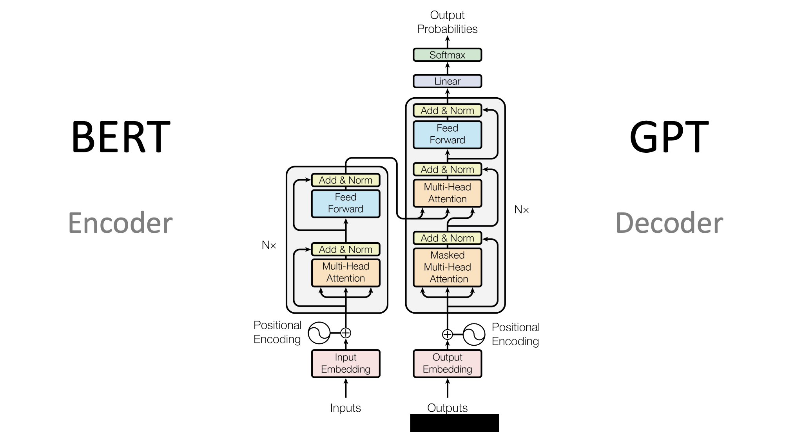

# Transformer

## 1、把生活中的句子變成模型看得懂的數字

### 1-1、真實場景與 token
真實場景：你在手機鍵盤打出「今天 天氣 很」，想讓模型預測下一個字最可能是什麼（例如「好」「冷」「熱」）。

我們把輸入序列長度設為 $L=3$，模型維度設為 $d_{\text{model}}=4$。

tokens：
- $t_1=$「今天」
- $t_2=$「天氣」
- $t_3=$「很」

痛點：把「文字」變成可計算的向量，讓模型能開始做矩陣運算。

### 1-2、詞向量 Embedding 與位置向量 Positional Encoding
詞向量矩陣 $E$（每列是一個 token 的向量）：

$$
E\ (shape=3\times 4)=
\begin{bmatrix}
0.20 & 0.10 & 0.00 & 0.30\\
0.00 & 0.40 & 0.10 & 0.00\\
0.30 & 0.00 & 0.20 & 0.10
\end{bmatrix}
$$

位置向量矩陣 $P$（讓「第幾個字」有訊息）：

$$
P\ (shape=3\times 4)=
\begin{bmatrix}
0.01 & 0.02 & 0.03 & 0.04\\
0.02 & 0.01 & 0.00 & 0.03\\
0.03 & 0.00 & 0.01 & 0.02
\end{bmatrix}
$$

相加得到輸入表示 $X=E+P$：

$$
X\ (shape=3\times 4)=
\begin{bmatrix}
0.21 & 0.12 & 0.03 & 0.34\\
0.02 & 0.41 & 0.10 & 0.03\\
0.33 & 0.00 & 0.21 & 0.12
\end{bmatrix}
$$

痛點：同一個字在不同位置意思可能不同，位置資訊避免「順序感」丟失。

## 2、用線性層做出 Q、K、V（像是在問：我在找什麼、我有什麼、我提供什麼）

### 2-1、權重矩陣（模型學到的參數）
Query 權重 $W_Q$：

$$
W_Q\ (shape=4\times 4)=
\begin{bmatrix}
0.50 & 0.10 & 0.00 & 0.20\\
0.00 & 0.30 & 0.40 & 0.10\\
0.20 & 0.00 & 0.10 & 0.30\\
0.10 & 0.20 & 0.00 & 0.40
\end{bmatrix}
$$

Key 權重 $W_K$：

$$
W_K\ (shape=4\times 4)=
\begin{bmatrix}
0.40 & 0.00 & 0.20 & 0.10\\
0.10 & 0.30 & 0.00 & 0.20\\
0.00 & 0.20 & 0.50 & 0.00\\
0.30 & 0.10 & 0.00 & 0.40
\end{bmatrix}
$$

Value 權重 $W_V$：

$$
W_V\ (shape=4\times 4)=
\begin{bmatrix}
0.30 & 0.20 & 0.00 & 0.10\\
0.00 & 0.10 & 0.40 & 0.20\\
0.20 & 0.00 & 0.10 & 0.30\\
0.10 & 0.30 & 0.20 & 0.00
\end{bmatrix}
$$

痛點：把同一份輸入拆成不同「角色」的表示，方便後續做關聯與取用資訊。:contentReference[oaicite:0]{index=0}

### 2-2、計算 Q、K、V
$$
X\cdot W_Q=Q
$$

$$
Q\ (shape=3\times 4)=
\begin{bmatrix}
0.145 & 0.125 & 0.051 & 0.199\\
0.033 & 0.131 & 0.174 & 0.087\\
0.219 & 0.057 & 0.021 & 0.177
\end{bmatrix}
$$

$$
X\cdot W_K=K
$$

$$
K\ (shape=3\times 4)=
\begin{bmatrix}
0.198 & 0.076 & 0.057 & 0.181\\
0.058 & 0.146 & 0.054 & 0.096\\
0.168 & 0.054 & 0.171 & 0.081
\end{bmatrix}
$$

$$
X\cdot W_V=V
$$

$$
V\ (shape=3\times 4)=
\begin{bmatrix}
0.103 & 0.156 & 0.119 & 0.054\\
0.029 & 0.054 & 0.180 & 0.114\\
0.153 & 0.102 & 0.045 & 0.096
\end{bmatrix}
$$

痛點：用可學習的投影把「語意」轉成可比對的空間，讓相似度計算更有效。

## 3、Scaled Dot-Product Attention（含因果遮罩）

### 3-1、先算相似度分數（還沒 softmax）
設定 $d_k=4$，所以 $\sqrt{d_k}=2$。注意力分數：

$$
S=\frac{QK^T}{\sqrt{d_k}}
$$

先算 $QK^T$：

$$
Q\cdot K^T = QK^T\ (shape=3\times 3)=
\begin{bmatrix}
0.077136 & 0.048518 & 0.055950\\
0.042155 & 0.038788 & 0.049419\\
0.080928 & 0.039150 & 0.057798
\end{bmatrix}
$$

再除以 $2$ 得到 $S$：

$$
S\ (shape=3\times 3)=
\begin{bmatrix}
0.038568 & 0.024259 & 0.027975\\
0.021078 & 0.019394 & 0.024710\\
0.040464 & 0.019575 & 0.028899
\end{bmatrix}
$$

痛點：用縮放避免 $QK^T$ 數值過大導致 softmax 飽和、梯度不穩定。:contentReference[oaicite:1]{index=1}

### 3-2、加入因果遮罩（GPT 類：不能偷看未來）
因為要「預測下一個字」，第 $i$ 個位置只能看 $j\le i$ 的 token，所以遮罩矩陣 $M$（上三角為 $-10^9$ 近似 $-\infty$）：

$$
M\ (shape=3\times 3)=
\begin{bmatrix}
0 & -10^9 & -10^9\\
0 & 0 & -10^9\\
0 & 0 & 0
\end{bmatrix}
$$

遮罩後分數：

$$
S+M=\tilde{S}
$$

$$
\tilde{S}\ (shape=3\times 3)=
\begin{bmatrix}
0.038568 & -10^9 & -10^9\\
0.021078 & 0.019394 & -10^9\\
0.040464 & 0.019575 & 0.028899
\end{bmatrix}
$$

痛點：避免模型在訓練時「偷看未來答案」，符合真實打字預測的因果流程。:contentReference[oaicite:2]{index=2}

### 3-3、softmax 變成注意力權重
$$
A=\mathrm{softmax}(\tilde{S})
$$

$$
A\ (shape=3\times 3)=
\begin{bmatrix}
1.000000 & 0.000000 & 0.000000\\
0.500421 & 0.499579 & 0.000000\\
0.336947 & 0.329981 & 0.333072
\end{bmatrix}
$$

痛點：把「該看誰」變成機率分配，做可微分的資訊聚合。:contentReference[oaicite:3]{index=3}

## 4、加權取值（把重要資訊匯總成新的表示）

### 4-1、用權重加總 V
$$
A\cdot V=Z
$$

$$
Z\ (shape=3\times 4)=
\begin{bmatrix}
0.103000 & 0.156000 & 0.119000 & 0.054000\\
0.066031 & 0.105043 & 0.149474 & 0.083975\\
0.095235 & 0.104356 & 0.114482 & 0.087788
\end{bmatrix}
$$

痛點：把分散在不同 token 的關鍵訊息加權彙整，提升長距離依賴的可用性。

### 4-2、輸出投影（把 attention 輸出拉回模型維度）
輸出權重 $W_O$：

$$
W_O\ (shape=4\times 4)=
\begin{bmatrix}
0.20 & 0.00 & 0.10 & 0.30\\
0.10 & 0.30 & 0.00 & 0.20\\
0.00 & 0.20 & 0.40 & 0.00\\
0.30 & 0.10 & 0.00 & 0.20
\end{bmatrix}
$$

$$
Z\cdot W_O=H_{\text{attn}}
$$

$$
H_{\text{attn}}\ (shape=3\times 4)=
\begin{bmatrix}
0.052400 & 0.076000 & 0.057900 & 0.072900\\
0.048903 & 0.069805 & 0.066393 & 0.057613\\
0.055819 & 0.062982 & 0.055316 & 0.066999
\end{bmatrix}
$$

痛點：把匯總後的資訊重新映射到模型主幹空間，方便和殘差串接、層疊多層。

## 5、Add & Norm（殘差連接與 LayerNorm）

### 5-1、殘差相加
$$
X+H_{\text{attn}}=R_1
$$

$$
R_1\ (shape=3\times 4)=
\begin{bmatrix}
0.262400 & 0.196000 & 0.087900 & 0.412900\\
0.068903 & 0.479805 & 0.166393 & 0.087613\\
0.385819 & 0.062982 & 0.265316 & 0.186999
\end{bmatrix}
$$

痛點：保留原始訊息通道，減少深層網路資訊衰減、讓訓練更穩定。

### 5-2、LayerNorm（此處用 $\gamma=1,\beta=0$）
$$
\mathrm{LN}(R_1)=\mathrm{LN}_1
$$

$$
\mathrm{LN}_1\ (shape=3\times 4)=
\begin{bmatrix}
0.191852 & -0.371820 & -1.289485 & 1.469452\\
-0.797265 & 1.688765 & -0.207434 & -0.684067\\
1.366337 & -1.381293 & 0.340751 & -0.325795
\end{bmatrix}
$$

痛點：把每個位置的數值尺度拉齊，穩定梯度與收斂速度。

## 6、前饋網路 FFN（把特徵做非線性變換）

### 6-1、第一層線性
$W_1$：

$$
W_1\ (shape=4\times 6)=
\begin{bmatrix}
0.50 & 0.00 & 0.20 & 0.10 & 0.00 & 0.30\\
0.10 & 0.40 & 0.00 & 0.20 & 0.30 & 0.00\\
0.00 & 0.20 & 0.50 & 0.00 & 0.10 & 0.20\\
0.20 & 0.10 & 0.00 & 0.40 & 0.00 & 0.10
\end{bmatrix}
$$

（本例 $b_1=\vec{0}$）

$$
\mathrm{LN}_1\cdot W_1=F_1
$$

$$
F_1\ (shape=3\times 6)=
\begin{bmatrix}
0.352635 & -0.259680 & -0.606372 & 0.532602 & -0.240494 & -0.053396\\
-0.366569 & 0.565613 & -0.263170 & -0.015600 & 0.485886 & -0.349073\\
0.479880 & -0.516947 & 0.443643 & -0.269943 & -0.380313 & 0.445472
\end{bmatrix}
$$

痛點：用更高維的中間空間提升表達能力，讓模型能做更複雜的特徵組合。

### 6-2、ReLU 非線性
$$
\mathrm{ReLU}(F_1)=G
$$

$$
G\ (shape=3\times 6)=
\begin{bmatrix}
0.352635 & 0.000000 & 0.000000 & 0.532602 & 0.000000 & 0.000000\\
0.000000 & 0.565613 & 0.000000 & 0.000000 & 0.485886 & 0.000000\\
0.479880 & 0.000000 & 0.443643 & 0.000000 & 0.000000 & 0.445472
\end{bmatrix}
$$

痛點：引入非線性，否則多層線性疊起來仍只是線性，學不到複雜規則。

### 6-3、第二層線性（投回 $d_{\text{model}}$）
$W_2$：

$$
W_2\ (shape=6\times 4)=
\begin{bmatrix}
0.20 & 0.10 & 0.00 & 0.30\\
0.00 & 0.20 & 0.40 & 0.10\\
0.30 & 0.00 & 0.10 & 0.20\\
0.10 & 0.30 & 0.00 & 0.00\\
0.00 & 0.20 & 0.20 & 0.10\\
0.20 & 0.00 & 0.30 & 0.10
\end{bmatrix}
$$

（本例 $b_2=\vec{0}$）

$$
G\cdot W_2=F_2
$$

$$
F_2\ (shape=3\times 4)=
\begin{bmatrix}
0.123787 & 0.195044 & 0.000000 & 0.105790\\
0.000000 & 0.210300 & 0.323422 & 0.105150\\
0.318163 & 0.047988 & 0.178006 & 0.277240
\end{bmatrix}
$$

痛點：把非線性後的特徵壓回主幹維度，才能和後續層一致銜接。

## 7、第二次 Add & Norm，得到可用來預測的表徵

### 7-1、殘差相加
$$
\mathrm{LN}_1+F_2=R_2
$$

$$
R_2\ (shape=3\times 4)=
\begin{bmatrix}
0.315639 & -0.176776 & -1.289485 & 1.575243\\
-0.797265 & 1.899065 & 0.115988 & -0.578917\\
1.684501 & -1.333305 & 0.518757 & -0.048555
\end{bmatrix}
$$

痛點：同時保留「注意力聚合」與「非線性變換」兩條路的資訊，避免單一路徑失真。

### 7-2、LayerNorm
$$
\mathrm{LN}(R_2)=\mathrm{LN}_2
$$

$$
\mathrm{LN}_2\ (shape=3\times 4)=
\begin{bmatrix}
0.203709 & -0.275132 & -1.357167 & 1.428589\\
-0.903389 & 1.641939 & -0.041281 & -0.697269\\
1.361947 & -1.416735 & 0.288574 & -0.233785
\end{bmatrix}
$$

痛點：讓每層輸出的分佈穩定，便於堆疊更多層而不爆炸或消失。

## 8、用最後一個位置做下一詞預測（Linear + Softmax）

### 8-1、取最後位置向量（代表「目前打到這裡」）
我們用第 3 個 token（「很」）的位置向量做「下一個字」預測：

$$
h_{\text{last}}\ (shape=1\times 4)=
\begin{bmatrix}
1.361947 & -1.416735 & 0.288574 & -0.233785
\end{bmatrix}
$$

痛點：把「目前上下文」濃縮成一個向量，方便直接產生下一步決策。

### 8-2、輸出線性層（映射到詞彙表 logits）
假設詞彙表只有 5 個候選（真實系統會更大）：
1. 好
2. 冷
3. 熱
4. 不錯
5. 糟

輸出權重 $W_{\text{out}}$：

$$
W_{\text{out}}\ (shape=4\times 5)=
\begin{bmatrix}
0.30 & 0.10 & 0.00 & 0.20 & 0.00\\
0.00 & 0.20 & 0.30 & 0.00 & 0.10\\
0.10 & 0.00 & 0.20 & 0.30 & 0.20\\
0.00 & 0.30 & 0.10 & 0.00 & 0.20
\end{bmatrix}
$$

$$
h_{\text{last}}\cdot W_{\text{out}}=\text{logits}
$$

$$
\text{logits}\ (shape=1\times 5)=
\begin{bmatrix}
0.437441 & -0.217288 & -0.390684 & 0.358961 & -0.130716
\end{bmatrix}
$$

痛點：把內部表徵轉成「各候選答案的分數」，才能做分類或生成。

### 8-3、Softmax 得到機率
$$
\mathrm{softmax}(\text{logits})=\text{probs}
$$

$$
\text{probs}\ (shape=1\times 5)=
\begin{bmatrix}
0.290062 & 0.150711 & 0.126719 & 0.268168 & 0.164340
\end{bmatrix}
$$

因此此例中最可能的下一個字是「好」（機率約 $0.290$），其次是「不錯」（約 $0.268$）。

痛點：把分數轉成可解釋、可抽樣的機率分佈，用於真實的輸入法預測或文字生成。:contentReference[oaicite:4]{index=4}