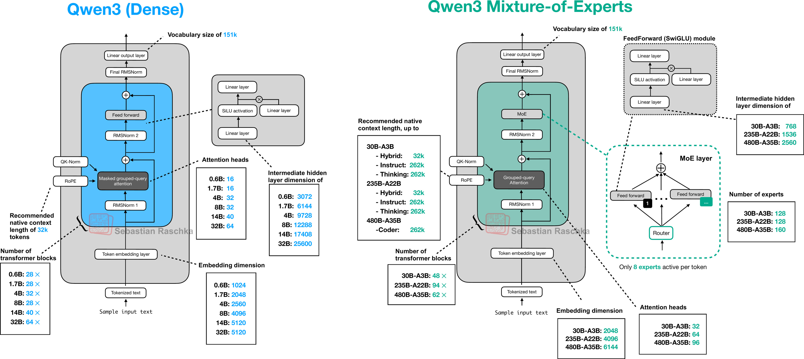

# Qwen3

> 先備知識
>
> * 了解大型語言模型（LLM）與 Transformer 的基本工作方式
> * 知道什麼是 token、上下文長度（context window）
> * 明白推論成本與延遲通常和「生成的 token 數」正相關
> * 了解 MoE（Mixture-of-Experts）裡「總參數」與「每個 token 啟用參數」的差別
> * 知道蒸餾（distillation）是在把大模型能力轉移到小模型

## 1. 故事背景

### 1-1 同一個 AI 助手，常常同時需要「快」與「會想」

想像你在做一個企業內部 AI 助手：

* 大多數問題其實很簡單，例如「把這段話改得更禮貌」「幫我整理三點重點」，你希望它回得快。
* 但有些問題需要多步推理，例如「這段程式為什麼在邊界條件會錯」「把這份規格轉成測試計畫並找出風險」，你希望它想得深、答得準。

現實是：同一個產品裡，使用者的問題難度起伏很大，你很難只靠「單一固定風格」的模型就同時滿足兩邊。

### 1-2 以往常見解法是「兩套模型分工」，但工程與成本會變複雜

一種常見做法是：

* 用「聊天型模型」處理日常對話，追求低延遲
* 用「推理型模型」處理數學、程式、規劃等複雜問題，追求高正確率

但這會帶來新的麻煩：你得決定何時切換模型、要不要重寫提示詞、上下文怎麼共享、評測標準怎麼一致，甚至連產品行為都會變得難以預測。Qwen3 的技術報告把這個矛盾點寫得很直白：它想把「thinking mode（深度推理）」與「non-thinking mode（快速回覆）」整合到同一個框架裡，避免在不同模型間切換。 

### 1-3 全球化與長文件應用，讓「語言覆蓋」與「長上下文」變成硬需求

如果你的 AI 助手要進入多國市場，語言覆蓋不足會直接變成產品硬傷。Qwen3 強調相較前代把多語言支援從 29 擴到 119 種語言與方言，並且在預訓練使用了規模約 36 兆 token 的資料。 
另外，企業場景常需要讀長文件，Qwen3 系列模型的上下文長度也被拉高到 32K 或 128K（依模型而定）。 

## 2. 解決的痛點

### 2-1 一個模型內建兩種模式：Thinking / Non-thinking，不用再「換腦」

Qwen3 的核心主張之一是：同一個模型同時具備

* **thinking mode**：面對複雜、多步驟題目時，允許產生較長的推理過程
* **non-thinking mode**：面對簡單或強調互動速度的題目時，快速、直接回答

而且它不是只靠「口頭說明」，而是把模式切換做成可操作的介面：在聊天模板裡用 `/think` 與 `/no_think` 旗標，讓使用者或系統訊息明確指定要不要進入推理。 

你可以把它想成同一位助理有兩種工作習慣：

* 你問「幫我把這句話變正式」，它用 non-thinking 直接改寫
* 你問「比較三種方案的總成本並給出建議」，它用 thinking 先拆步驟再結論

### 2-2 Thinking budget：把「想多久」變成一顆可調的旋鈕

很多產品的痛點不是「模型不會想」，而是「模型想太久」。Qwen3 提出 **thinking budget**：用可控的額度限制推理用掉的 token，讓你在延遲與表現之間做可預期的取捨。 

用一個簡化的觀念表示：令 $B$ 是 thinking budget（允許的推理 token 上限），那你可以把成本與延遲粗略想成跟生成量成正比：

$$
\text{Compute/Latency} \propto T_{\text{answer}} + B
$$

當你把 $B$ 調大，模型在數學、程式、STEM 類題目上的表現會更好；報告中的圖表顯示，在多個基準（如 AIME、LiveCodeBench、GPQA）上，thinking budget 增加時分數呈現平滑上升趨勢。 

直覺例子：

* 線上客服要即時回覆，你把 $B$ 設小，確保回得快
* 內部工程助理在寫關鍵修補，你把 $B$ 設大，讓它多想幾步再交付

### 2-3 MoE 與「啟用參數」：看起來很大，但每次只叫出需要的專家

Qwen3 同時提供 dense 與 MoE 架構，參數規模從 0.6B 到 235B。 
以旗艦 MoE 模型 **Qwen3-235B-A22B** 為例：總參數 235B，但每個 token 只啟用約 22B 的參數來計算，目標是在高能力與高效率間取得平衡。 

用簡化公式理解：令 $P_{\text{total}}$ 是總參數、$P_{\text{act}}$ 是每 token 啟用參數，則推論成本更接近跟 $P_{\text{act}}$ 相關：

$$
\text{FLOPs per token} \approx k \cdot P_{\text{act}}
$$

報告也給出「效率換表現」的實證摘要：在相同預訓練資料下，Qwen3 的 MoE base 模型可以用約 $1/5$ 的啟用參數達到與 dense base 類似的表現，甚至提到在某些對比下可用到 $1/10$ 啟用參數達到可比效果，帶來推論與訓練成本優勢。 

### 2-4 Strong-to-Weak Distillation：讓小模型不用重走一遍昂貴訓練

另一個常見痛點是：你想部署到邊緣裝置或省成本，就需要小模型；但把小模型訓練到「真的能用」通常很貴。Qwen3 強調透過「由旗艦模型帶小模型」的蒸餾策略，能顯著降低打造小模型所需的計算資源，同時維持競爭力。 

如果把它講成故事版：以前像是「每個新同事都要從頭受訓到資深」，現在變成「資深把做事方法整理成教材，新同事用更少時間就能達到可工作的水準」。

### 2-5 多語言支援擴張：把「能不能用」從少數市場變成多數市場

在全球化產品裡，「語言」不是加分題，而是門檻題。Qwen3 報告明確寫到：相較 Qwen2.5，多語言支援由 29 擴到 119 種語言與方言，目標是提升跨語言理解與生成能力，讓模型更適合全球部署。 

### 2-6 長上下文到 32K/128K：把企業文件、長對話納入可處理範圍

很多企業需求不只是「問一句答一句」，而是「把一份長文件或一串長對話吃進去再做決策」。Qwen3 在不同模型規模上提供 32K 或 128K 的上下文長度配置，讓「長文本任務」更容易落地。 

## 3實際案例運算 (Dense)

### 3-1 文字輸入

#### 3-1-1 真實場景與輸入（non-thinking）

真實場景：你在公司群組提醒同事「明天交報告」，但想更禮貌，而且你只想要模型回覆「加在句首的那個禮貌用語」，不要長篇推理。

我們用 Qwen3 的 **non-thinking mode**（在 system 或 user 放 `/no_think`）來避免模型進入長推理；而且在 non-thinking 模式下，回覆仍保留空的 `<think>...</think>` 區塊以維持格式一致。 ([arXiv][1])

輸入（文字）：

* System message：`/no_think`
* User message：`把「明天交報告」加上一個禮貌用語，只輸出那個禮貌用語。`

痛點：在真實產品中，用 `/no_think` 直接關掉冗長思考，降低延遲與推論成本。 ([arXiv][1])

---

### 3-2 Tokenizer（BBPE）

#### 3-2-1 文字 → tokens（示意）

Qwen3 使用 BBPE tokenizer，真實詞彙表大小是 151,669。 ([arXiv][1])

為了讓你能「手算」看懂，我用一個極小的示意詞彙表（真實模型更大，但流程一樣）：

* id=0：`<bos>`
* id=1：`明天`
* id=2：`交`
* id=3：`報告`
* id=4：`請`
* id=5：`<eos>`

把要改禮貌的句子「明天交報告」切成 tokens（示意）：
`<bos> 明天 交 報告`

痛點：把連續文字變成穩定的離散單元，讓模型能處理多語言與各種符號組合（不必靠人工規則）。 ([arXiv][1])

---

### 3-3 Token IDs

#### 3-3-1 tokens → Token IDs（row）

Token IDs（每個 token 是一個 id；整串是 1 個 row）：

$$
\text{TokenIDs}\ (shape=1\times 4)=
\begin{bmatrix}
0 & 1 & 2 & 3
\end{bmatrix}
$$

痛點：把文字變成可計算的索引，後續才能用矩陣乘法做 embedding lookup 與整個前向傳播。

---

### 3-4 Embedding

#### 3-4-1 One-hot（rows）與 Embedding table（rows）

我們把 4 個 token 變成 one-hot 矩陣（每個 token 佔一個 row；每個 vocab id 佔一個 column）：

$$
X_{\text{onehot}}\ (shape=4\times 6)=
\begin{bmatrix}
1 & 0 & 0 & 0 & 0 & 0\\
0 & 1 & 0 & 0 & 0 & 0\\
0 & 0 & 1 & 0 & 0 & 0\\
0 & 0 & 0 & 1 & 0 & 0
\end{bmatrix}
$$

Embedding table（每個 vocab token 一個 row；每個向量維度是一個 column）：

$$
E\ (shape=6\times 4)=
\begin{bmatrix}
1 & 1 & 1 & 1\\
2 & 0 & 0 & 0\\
0 & 2 & 0 & 0\\
0 & 0 & 2 & 0\\
0 & 0 & 0 & 2\\
-1 & -1 & -1 & -1
\end{bmatrix}
$$

#### 3-4-2 Embedding lookup（矩陣乘法）

$$
X_{\text{onehot}}\ (shape=4\times 6)\cdot E\ (shape=6\times 4)=X\ (shape=4\times 4)
$$

$$
X\ (shape=4\times 4)=
\begin{bmatrix}
1 & 1 & 1 & 1\\
2 & 0 & 0 & 0\\
0 & 2 & 0 & 0\\
0 & 0 & 2 & 0
\end{bmatrix}
$$

痛點：把「離散 token」映射到「連續向量空間」，讓模型能用幾何方式表達語意相似度與可組合性。

---

### 3-5 N 層 Transformer blocks（Dense）

> 真實 Qwen3 dense 架構使用 pre-norm 的 RMSNorm、GQA、RoPE、SwiGLU，並移除 QKV-bias 且加入 QK-Norm 以穩定訓練。 ([arXiv][1])
> 為了可手算，我示範 **N=1 層**、**1 個 head**（你可以把它當成「極簡版」的 GQA 情況；流程一致）。

#### 3-5-1 Block 輸入（rows=token positions, columns=hidden dims）

$$
X^{(0)}\ (shape=4\times 4)=
\begin{bmatrix}
1 & 1 & 1 & 1\\
2 & 0 & 0 & 0\\
0 & 2 & 0 & 0\\
0 & 0 & 2 & 0
\end{bmatrix}
$$

痛點：把整句話的每個 token 都變成同一維度的向量，才能進入統一的注意力與前饋運算。

---

#### 3-5-2 RMSNorm（pre-norm）

Qwen3 使用 **RMSNorm + pre-normalization**。 ([arXiv][1])
這裡我選的 embedding row 向量剛好 RMS 都是 1，因此 RMSNorm 後數值不變（但真實模型通常會改變）：

$$
\text{RMSNorm}(X^{(0)})\ (shape=4\times 4)=
\begin{bmatrix}
1 & 1 & 1 & 1\\
2 & 0 & 0 & 0\\
0 & 2 & 0 & 0\\
0 & 0 & 2 & 0
\end{bmatrix}
$$

痛點：控制每個 token 向量尺度，讓深層網路更穩定，不容易數值爆炸或縮到太小。 ([arXiv][1])

---

#### 3-5-3 線性投影得到 Q, K, V

投影矩陣（hidden dim 4 → head dim 2）：

$$
W_Q\ (shape=4\times 2)=
\begin{bmatrix}
1 & 0\\
0 & 1\\
1 & 0\\
0 & 1
\end{bmatrix}
$$

$$
W_K\ (shape=4\times 2)=
\begin{bmatrix}
1 & 0\\
0 & 1\\
0 & 1\\
1 & 0
\end{bmatrix}
$$

$$
W_V\ (shape=4\times 2)=
\begin{bmatrix}
1 & 0\\
1 & 0\\
0 & 1\\
0 & 1
\end{bmatrix}
$$

計算：

$$
X^{(0)}\ (shape=4\times 4)\cdot W_Q\ (shape=4\times 2)=Q_{\text{raw}}\ (shape=4\times 2)
$$

$$
Q_{\text{raw}}\ (shape=4\times 2)=
\begin{bmatrix}
2 & 2\\
2 & 0\\
0 & 2\\
2 & 0
\end{bmatrix}
$$

$$
X^{(0)}\ (shape=4\times 4)\cdot W_K\ (shape=4\times 2)=K_{\text{raw}}\ (shape=4\times 2)
$$

$$
K_{\text{raw}}\ (shape=4\times 2)=
\begin{bmatrix}
2 & 2\\
2 & 0\\
0 & 2\\
0 & 2
\end{bmatrix}
$$

$$
X^{(0)}\ (shape=4\times 4)\cdot W_V\ (shape=4\times 2)=V\ (shape=4\times 2)
$$

$$
V\ (shape=4\times 2)=
\begin{bmatrix}
2 & 2\\
2 & 0\\
2 & 0\\
0 & 2
\end{bmatrix}
$$

痛點：把同一個 token 表示分成「要問什麼（Q）」「要被查什麼（K）」「要帶走什麼資訊（V）」，才能做內容導向的資訊聚合。

---

#### 3-5-4 QK-Norm（穩定注意力分數）

Qwen3 **移除 QKV-bias 並加入 QK-Norm** 以確保訓練穩定。 ([arXiv][1])
這裡用「每個 row 做 $L_2$ 正規化」示意 QK-Norm 的效果：

$$
Q_{\text{norm}}\ (shape=4\times 2)=
\begin{bmatrix}
0.707 & 0.707\\
1.000 & 0.000\\
0.000 & 1.000\\
1.000 & 0.000
\end{bmatrix}
$$

$$
K_{\text{norm}}\ (shape=4\times 2)=
\begin{bmatrix}
0.707 & 0.707\\
1.000 & 0.000\\
0.000 & 1.000\\
0.000 & 1.000
\end{bmatrix}
$$

痛點：讓注意力分數不會因向量尺度不同而失真，減少訓練/推論時的不穩定。 ([arXiv][1])

---

#### 3-5-5 RoPE（位置資訊，示意版）

Qwen3 使用 **RoPE**。 ([arXiv][1])
我用「整數角度」做簡化示意（真實 RoPE 用連續頻率，但概念一樣）：每個 position 用一個 $2\times 2$ 旋轉矩陣。

Position 0（`<bos>`）：

$$
R_0\ (shape=2\times 2)=
\begin{bmatrix}
1 & 0\\
0 & 1
\end{bmatrix}
$$

Position 1（`明天`）：

$$
R_1\ (shape=2\times 2)=
\begin{bmatrix}
0 & -1\\
1 & 0
\end{bmatrix}
$$

Position 2（`交`）：

$$
R_2\ (shape=2\times 2)=
\begin{bmatrix}
-1 & 0\\
0 & -1
\end{bmatrix}
$$

Position 3（`報告`）：

$$
R_3\ (shape=2\times 2)=
\begin{bmatrix}
0 & 1\\
-1 & 0
\end{bmatrix}
$$

把每個 row 的 $Q_{\text{norm}}$、$K_{\text{norm}}$ 乘上對應 $R_p$（逐 row）後得到：

$$
Q_{\text{rope}}\ (shape=4\times 2)=
\begin{bmatrix}
0.707 & 0.707\\
0.000 & -1.000\\
0.000 & -1.000\\
0.000 & 1.000
\end{bmatrix}
$$

$$
K_{\text{rope}}\ (shape=4\times 2)=
\begin{bmatrix}
0.707 & 0.707\\
0.000 & -1.000\\
0.000 & -1.000\\
-1.000 & 0.000
\end{bmatrix}
$$

痛點：把「順序」放進注意力計算，避免模型把「明天交報告」和「報告交明天」當成同一句，且更利於長上下文。 ([arXiv][1])

---

#### 3-5-6 注意力分數、因果遮罩、Softmax 權重

先算分數（縮放因子用 $1/\sqrt{2}$）：

$$
Q_{\text{rope}}\ (shape=4\times 2)\cdot K_{\text{rope}}^T\ (shape=2\times 4)=S\ (shape=4\times 4)
$$

$$
S\ (shape=4\times 4)=
\begin{bmatrix}
0.707 & -0.500 & -0.500 & -0.500\\
-0.500 & 0.707 & 0.707 & 0.000\\
-0.500 & 0.707 & 0.707 & 0.000\\
0.500 & -0.707 & -0.707 & 0.000
\end{bmatrix}
$$

自回歸需要 **causal mask**（不能看未來 token）。我用 $-100$ 代表「近似 $-\infty$」：

$$
M_{\text{causal}}\ (shape=4\times 4)=
\begin{bmatrix}
0 & -100 & -100 & -100\\
0 & 0 & -100 & -100\\
0 & 0 & 0 & -100\\
0 & 0 & 0 & 0
\end{bmatrix}
$$

$$
S_{\text{mask}}\ (shape=4\times 4)=
\begin{bmatrix}
0.707 & -100.500 & -100.500 & -100.500\\
-0.500 & 0.707 & -99.293 & -100.000\\
-0.500 & 0.707 & 0.707 & -100.000\\
0.500 & -0.707 & -0.707 & 0.000
\end{bmatrix}
$$

對每個 row 做 softmax 得到注意力權重 $A$（四捨五入到小數點後三位；被遮罩的位置近似 0）：

$$
A\ (shape=4\times 4)=
\begin{bmatrix}
1.000 & 0.000 & 0.000 & 0.000\\
0.230 & 0.770 & 0.000 & 0.000\\
0.130 & 0.435 & 0.435 & 0.000\\
0.454 & 0.136 & 0.136 & 0.275
\end{bmatrix}
$$

痛點：注意力把「每個 token 要看的重點」變成可學習的權重；causal mask 防止偷看未來，確保生成時不資訊洩漏。

---

#### 3-5-7 加權求和得到 Context，再輸出投影與殘差連接

$$
A\ (shape=4\times 4)\cdot V\ (shape=4\times 2)=C\ (shape=4\times 2)
$$

$$
C\ (shape=4\times 2)=
\begin{bmatrix}
2.000 & 2.000\\
2.000 & 0.460\\
2.000 & 0.260\\
1.450 & 1.457
\end{bmatrix}
$$

輸出投影矩陣（把 head dim 2 投影回 hidden dim 4；我刻意設計讓輸出主要加到第 4 個 column，方便最後選出「請」）：

$$
W_O\ (shape=2\times 4)=
\begin{bmatrix}
0 & 0 & 0 & 2\\
0 & 0 & 0 & 2
\end{bmatrix}
$$

$$
C\ (shape=4\times 2)\cdot W_O\ (shape=2\times 4)=O\ (shape=4\times 4)
$$

$$
O\ (shape=4\times 4)=
\begin{bmatrix}
0 & 0 & 0 & 8.000\\
0 & 0 & 0 & 4.921\\
0 & 0 & 0 & 4.520\\
0 & 0 & 0 & 5.814
\end{bmatrix}
$$

殘差連接（逐元素相加）：

$$
X_{\text{att}}\ (shape=4\times 4)=
\begin{bmatrix}
1 & 1 & 1 & 9.000\\
2 & 0 & 0 & 4.921\\
0 & 2 & 0 & 4.520\\
0 & 0 & 2 & 5.814
\end{bmatrix}
$$

痛點：把「上下文聚合」直接加回原表示，讓資訊既保留原詞特徵又融合句子關係，並讓深層網路更好訓練（殘差路徑）。 ([arXiv][1])

---

#### 3-5-8 SwiGLU 前饋網路（示意版）+ 殘差

Qwen3 的 dense 模型 FFN 使用 **SwiGLU**。 ([arXiv][1])

先做 RMSNorm（這次數值會改變）：

$$
X_{\text{ffn-in}}\ (shape=4\times 4)=
\begin{bmatrix}
0.218 & 0.218 & 0.218 & 1.964\\
0.753 & 0.000 & 0.000 & 1.853\\
0.000 & 0.809 & 0.000 & 1.829\\
0.000 & 0.000 & 0.651 & 1.891
\end{bmatrix}
$$

為了可手算，我用「只讓第 4 個 column 參與 gate/up」的簡化 SwiGLU（真實模型會更寬更複雜）：

$$
W_{\text{gate}}\ (shape=4\times 4)=
\begin{bmatrix}
0 & 0 & 0 & 0\\
0 & 0 & 0 & 0\\
0 & 0 & 0 & 0\\
0 & 0 & 0 & 1
\end{bmatrix}
$$

$$
W_{\text{up}}\ (shape=4\times 4)=
\begin{bmatrix}
0 & 0 & 0 & 0\\
0 & 0 & 0 & 0\\
0 & 0 & 0 & 0\\
0 & 0 & 0 & 1
\end{bmatrix}
$$

Gate 與 Up：

$$
X_{\text{ffn-in}}\ (shape=4\times 4)\cdot W_{\text{gate}}\ (shape=4\times 4)=G\ (shape=4\times 4)
$$

$$
G\ (shape=4\times 4)=
\begin{bmatrix}
0 & 0 & 0 & 1.964\\
0 & 0 & 0 & 1.853\\
0 & 0 & 0 & 1.829\\
0 & 0 & 0 & 1.891
\end{bmatrix}
$$

$$
X_{\text{ffn-in}}\ (shape=4\times 4)\cdot W_{\text{up}}\ (shape=4\times 4)=U\ (shape=4\times 4)
$$

$$
U\ (shape=4\times 4)=
\begin{bmatrix}
0 & 0 & 0 & 1.964\\
0 & 0 & 0 & 1.853\\
0 & 0 & 0 & 1.829\\
0 & 0 & 0 & 1.891
\end{bmatrix}
$$

SwiGLU 的核心是：$\text{SwiGLU}(x)=\text{swish}(G)\odot U$（逐元素乘；$\text{swish}(t)=t\cdot\sigma(t)$）。這裡我直接給出結果矩陣（只剩第 4 個 column 有值）：

$$
F\ (shape=4\times 4)=
\begin{bmatrix}
0 & 0 & 0 & 3.383\\
0 & 0 & 0 & 2.968\\
0 & 0 & 0 & 2.882\\
0 & 0 & 0 & 3.108
\end{bmatrix}
$$

再做殘差相加得到 block 輸出：

$$
X^{(1)}\ (shape=4\times 4)=
\begin{bmatrix}
1.000 & 1.000 & 1.000 & 12.383\\
2.000 & 0.000 & 0.000 & 7.888\\
0.000 & 2.000 & 0.000 & 7.403\\
0.000 & 0.000 & 2.000 & 8.922
\end{bmatrix}
$$

痛點：SwiGLU 提供非線性與門控，讓模型能做比「線性加權平均」更複雜的特徵變換（例如把「禮貌用語」這種風格控制強化到特定維度）。 ([arXiv][1])

---

### 3-6 LM Head（輸出 logits；示範 tie embedding）

#### 3-6-1 取最後一個 token 的 hidden state（row）

自回歸生成「下一個 token」時，通常用最後位置（這裡是 `報告` 這個 position 的 row）：

$$
h_{\text{last}}\ (shape=1\times 4)=
\begin{bmatrix}
0.000 & 0.000 & 2.000 & 8.922
\end{bmatrix}
$$

#### 3-6-2 Tie embedding 的輸出矩陣（示意）

Qwen3 有些模型設定會 **tie embedding**（表格中有標記）。 ([arXiv][1])
這裡示範 tie：令 $W_{\text{vocab}}=E^T$：

$$
W_{\text{vocab}}=E^T\ (shape=4\times 6)=
\begin{bmatrix}
1 & 2 & 0 & 0 & 0 & -1\\
1 & 0 & 2 & 0 & 0 & -1\\
1 & 0 & 0 & 2 & 0 & -1\\
1 & 0 & 0 & 0 & 2 & -1
\end{bmatrix}
$$

#### 3-6-3 logits 計算（矩陣乘法）

$$
h_{\text{last}}\ (shape=1\times 4)\cdot W_{\text{vocab}}\ (shape=4\times 6)=\text{logits}\ (shape=1\times 6)
$$

$$
\text{logits}\ (shape=1\times 6)=
\begin{bmatrix}
10.922 & 0.000 & 0.000 & 4.000 & 17.844 & -10.922
\end{bmatrix}
$$

最大值出現在 id=4（`請`），所以模型此步最想輸出「請」。

痛點：LM Head 把隱表示轉成「整個詞彙表」上的分數分佈；tie embedding 可減少參數量與記憶體占用（部署更省）。 ([arXiv][1])

---

### 3-7 解碼（greedy）

#### 3-7-1 Greedy 選 token id（row）

Greedy：選 $\arg\max$ logits → id=4。

$$
\text{OutputTokenID}\ (shape=1\times 1)=
\begin{bmatrix}
4
\end{bmatrix}
$$

痛點：在「只要一個禮貌用語」這種短輸出任務，用 greedy 能保證穩定、可重現的結果，不必承擔隨機採樣造成的飄移。

---

### 3-8 Token IDs（輸出）

#### 3-8-1 生成的 Token IDs（row）

$$
\text{GeneratedTokenIDs}\ (shape=1\times 1)=
\begin{bmatrix}
4
\end{bmatrix}
$$

痛點：把生成結果固定成標準化的 token 序列，方便串接後處理（例如過濾、記錄、計費）。

---

### 3-9 Detokenize（回文字）

#### 3-9-1 Token ID → 文字

id=4 對應文字：`請`

痛點：把模型內部的離散 id 還原成可讀文字，才能交付給使用者。

---

### 3-10 依模板呈現：`<think>...</think>` + response（或空 think）

#### 3-10-1 non-thinking 的輸出格式（空 think）

因為我們用 `/no_think`，Qwen3 會保留空的 thinking block 以維持格式一致，再輸出 response。 ([arXiv][1])

最終呈現（本案例只輸出那個禮貌用語）：

`<think></think>`
`請`

痛點：用一致模板固定輸出結構，方便產品端解析；空 `<think>` 可強制不進入長推理，控制延遲與成本。 ([arXiv][1])

[1]: https://arxiv.org/html/2505.09388v1 "Qwen3 Technical Report"

## 4 實際案例運算 (MoE)

### 4-1 文字輸入

#### 4-1-1 真實場景與模式旗標（/no_think）

真實場景：你是專案管理者，要在公司群組提醒同事「明天交報告」，但希望模型只輸出一個禮貌用語（例如「請」），而且要回得快、不要長篇推理。

本例使用 Qwen3 的 **non-thinking mode**：在 user query 或 system message 加上 `/no_think`，模型回覆會保留空的 `<think></think>` 區塊以維持格式一致。 ([arXiv][1])

輸入（文字）：

* System message：`/no_think`
* User message：`把「明天交報告」加上一個禮貌用語，只輸出那個禮貌用語。`

痛點：用 `/no_think` 在真實產品中避免不必要的長推理，降低延遲與推論成本。 ([arXiv][1])

---

### 4-2 Tokenizer（BBPE）

#### 4-2-1 文字 → tokens（示意）

Qwen3 使用 byte-level BPE（BBPE），真實詞彙表大小為 151,669。 

為了讓你能手算，我用一個極小的示意詞彙表（真實模型更大，但流程相同）：

* id=0：`<bos>`
* id=1：`明天`
* id=2：`交`
* id=3：`報告`
* id=4：`請`
* id=5：`<eos>`

要處理的句子（示範只看核心內容）：`明天交報告`
tokens（示意）：`<bos> 明天 交 報告`

痛點：BBPE 能把各種語言與符號穩定切分，減少「沒見過的字就壞掉」的問題。 

---

### 4-3 Token IDs

#### 4-3-1 tokens → Token IDs（row）

Token IDs 是 1 個 row（rows=1 row，columns=序列長度 4 columns）。

$$
\text{TokenIDs}\ (shape=1\times 4)=
\begin{bmatrix}
0 & 1 & 2 & 3\
\end{bmatrix}
$$

痛點：把文字變成可計算的索引，後續才能進入矩陣運算（embedding、attention、MoE）。

---

### 4-4 Embedding

#### 4-4-1 One-hot（rows）與 Embedding table（rows）

我們把 4 個 token 轉成 one-hot 矩陣（rows=token 位置 4 rows，columns=vocab 6 columns）。

$$
X_{\text{onehot}}\ (shape=4\times 6)=
\begin{bmatrix}
1 & 0 & 0 & 0 & 0 & 0\\
0 & 1 & 0 & 0 & 0 & 0\\
0 & 0 & 1 & 0 & 0 & 0\\
0 & 0 & 0 & 1 & 0 & 0\\
\end{bmatrix}
$$

Embedding table（rows=vocab 6 rows，columns=hidden 維度 4 columns）。

$$
E\ (shape=6\times 4)=
\begin{bmatrix}
1 & 1 & 1 & 1\\
2 & 0 & 0 & 0\\
0 & 2 & 0 & 0\\
0 & 0 & 2 & 0\\
0 & 0 & 0 & 2\\
-1 & -1 & -1 & -1\\
\end{bmatrix}
$$

痛點：把離散 token 映射到連續向量空間，讓語意能用「方向與距離」表達，方便學到相似與組合關係。

#### 4-4-2 Embedding lookup（矩陣乘法）

$$
X_{\text{onehot}}\ (shape=4\times 6)\cdot E\ (shape=6\times 4)=X^{(0)}\ (shape=4\times 4)
$$

$$
X^{(0)}\ (shape=4\times 4)=
\begin{bmatrix}
1 & 1 & 1 & 1\\
2 & 0 & 0 & 0\\
0 & 2 & 0 & 0\\
0 & 0 & 2 & 0\\
\end{bmatrix}
$$

痛點：用矩陣乘法完成「查表」，能被 GPU 高效加速，支援大詞彙與長序列。

---

### 4-5 N 層 Transformer blocks（MoE 版本）

#### 4-5-1 MoE block 的真實設定（先說清楚）

Qwen3 的 MoE 模型：**總 experts=128，每個 token 啟用 experts=8**，且**不使用 shared experts**，並採用 **global-batch load balancing loss** 鼓勵專家專門化。 ([arXiv][1])

為了讓你能手算，本例把 MoE 縮小成：

* experts=3（E0 時間專家、E1 任務專家、E2 禮貌/風格專家）
* top-k=2（每個 token 只啟用 2 個專家）
  流程與論文描述一致，只是縮小規模。 ([arXiv][1])

痛點：MoE 透過「只啟用少數專家」在真實部署中降低每 token 計算量，提升性價比。 ([arXiv][1])

---

#### 4-5-2 Attention 子層：RMSNorm（pre-norm）

Qwen3 使用 RMSNorm + pre-normalization。 
本例的 $X^{(0)}$ 每個 row 的 RMS 剛好為 1（示範用），所以 RMSNorm 後不變（真實模型通常會變）。

rows=token 位置 4 rows，columns=hidden 維度 4 columns。

$$
\text{RMSNorm}(X^{(0)})\ (shape=4\times 4)=
\begin{bmatrix}
1 & 1 & 1 & 1\\
2 & 0 & 0 & 0\\
0 & 2 & 0 & 0\\
0 & 0 & 2 & 0\\
\end{bmatrix}
$$

痛點：穩定向量尺度，降低深層網路訓練/推論數值不穩定的風險。 

---

#### 4-5-3 Attention 子層：投影得到 Q, K, V

Qwen3 的骨幹包含 attention（並使用 RoPE、GQA 等），此處用 1-head 極簡版示範計算流程。 

投影矩陣（hidden 4 → head 2）：

$$
W_Q\ (shape=4\times 2)=
\begin{bmatrix}
1 & 0\\
0 & 1\\
1 & 0\\
0 & 1\\
\end{bmatrix}
$$

$$
W_K\ (shape=4\times 2)=
\begin{bmatrix}
1 & 0\\
0 & 1\\
0 & 1\\
1 & 0\\
\end{bmatrix}
$$

$$
W_V\ (shape=4\times 2)=
\begin{bmatrix}
1 & 0\\
1 & 0\\
0 & 1\\
0 & 1\\
\end{bmatrix}
$$

計算（rows=token 位置 4 rows，columns=head 維度 2 columns）：

$$
X^{(0)}\ (shape=4\times 4)\cdot W_Q\ (shape=4\times 2)=Q_{\text{raw}}\ (shape=4\times 2)
$$

$$
Q_{\text{raw}}\ (shape=4\times 2)=
\begin{bmatrix}
2 & 2\\
2 & 0\\
0 & 2\\
2 & 0\\
\end{bmatrix}
$$

$$
X^{(0)}\ (shape=4\times 4)\cdot W_K\ (shape=4\times 2)=K_{\text{raw}}\ (shape=4\times 2)
$$

$$
K_{\text{raw}}\ (shape=4\times 2)=
\begin{bmatrix}
2 & 2\\
2 & 0\\
0 & 2\\
0 & 2\\
\end{bmatrix}
$$

$$
X^{(0)}\ (shape=4\times 4)\cdot W_V\ (shape=4\times 2)=V\ (shape=4\times 2)
$$

$$
V\ (shape=4\times 2)=
\begin{bmatrix}
2 & 2\\
2 & 0\\
2 & 0\\
0 & 2\\
\end{bmatrix}
$$

痛點：把「查詢（Q）」「被查的索引（K）」「要帶走的內容（V）」分工，支援內容導向的資訊聚合。

---

#### 4-5-4 Attention 子層：QK-Norm（穩定注意力分數）

Qwen3 引入 QK-Norm 以確保注意力訓練穩定。 
此處示意為「每個 row 做 $L_2$ 正規化」。

$$
Q_{\text{norm}}\ (shape=4\times 2)=
\begin{bmatrix}
0.707 & 0.707\\
1 & 0\\
0 & 1\\
1 & 0\\
\end{bmatrix}
$$

$$
K_{\text{norm}}\ (shape=4\times 2)=
\begin{bmatrix}
0.707 & 0.707\\
1 & 0\\
0 & 1\\
0 & 1\\
\end{bmatrix}
$$

痛點：避免因向量尺度差異讓注意力分數失真，提升訓練與推論穩定性。 

---

#### 4-5-5 Attention 子層：RoPE（位置資訊）

Qwen3 使用 RoPE。 
示意版 RoPE：每個位置用一個 $2\times 2$ 旋轉矩陣 $R_p$（真實 RoPE 用連續頻率，但概念相同）。

$$
R_0\ (shape=2\times 2)=
\begin{bmatrix}
1 & 0\\
0 & 1\\
\end{bmatrix}
$$

$$
R_1\ (shape=2\times 2)=
\begin{bmatrix}
0 & -1\\
1 & 0\\
\end{bmatrix}
$$

$$
R_2\ (shape=2\times 2)=
\begin{bmatrix}
-1 & 0\\
0 & -1\\
\end{bmatrix}
$$

$$
R_3\ (shape=2\times 2)=
\begin{bmatrix}
0 & 1\\
-1 & 0\\
\end{bmatrix}
$$

將每個 row 的 $Q_{\text{norm}}$、$K_{\text{norm}}$ 乘上對應位置的 $R_p$（逐 row 旋轉），得到：

$$
Q_{\text{rope}}\ (shape=4\times 2)=
\begin{bmatrix}
0.707 & 0.707\\
0 & -1\\
0 & -1\\
0 & 1\\
\end{bmatrix}
$$

$$
K_{\text{rope}}\ (shape=4\times 2)=
\begin{bmatrix}
0.707 & 0.707\\
0 & -1\\
0 & -1\\
-1 & 0\\
\end{bmatrix}
$$

痛點：把「順序」編進向量，讓模型分得清誰在前誰在後，對長上下文更關鍵。 

---

#### 4-5-6 Attention 子層：注意力分數 + 因果遮罩

先算分數矩陣（rows=query 位置 4 rows，columns=key 位置 4 columns；縮放因子用 $1/\sqrt{2}$）：

$$
Q_{\text{rope}}\ (shape=4\times 2)\cdot K_{\text{rope}}^T\ (shape=2\times 4)=S\ (shape=4\times 4)
$$

$$
S\ (shape=4\times 4)=
\begin{bmatrix}
0.707 & -0.500 & -0.500 & -0.500\\
-0.500 & 0.707 & 0.707 & 0\\
-0.500 & 0.707 & 0.707 & 0\\
0.500 & -0.707 & -0.707 & 0\\
\end{bmatrix}
$$

自回歸生成需要因果遮罩（不能看未來 token）。用 $-100$ 近似 $-\infty$：

$$
M_{\text{causal}}\ (shape=4\times 4)=
\begin{bmatrix}
0 & -100 & -100 & -100\\
0 & 0 & -100 & -100\\
0 & 0 & 0 & -100\\
0 & 0 & 0 & 0\\
\end{bmatrix}
$$

$$
S_{\text{mask}}\ (shape=4\times 4)=
\begin{bmatrix}
0.707 & -100.500 & -100.500 & -100.500\\
-0.500 & 0.707 & -99.293 & -100\\
-0.500 & 0.707 & 0.707 & -100\\
0.500 & -0.707 & -0.707 & 0\\
\end{bmatrix}
$$

痛點：遮罩避免「偷看未來」，確保生成時因果一致，防止資訊洩漏與訓練/推論不一致。

---

#### 4-5-7 Attention 子層：Softmax 權重

對 $S_{\text{mask}}$ 每個 row 做 softmax 得到注意力權重（rows=query 位置，columns=key 位置）：

$$
A\ (shape=4\times 4)=
\begin{bmatrix}
1 & 0 & 0 & 0\\
0.230 & 0.770 & 0 & 0\\
0.130 & 0.435 & 0.435 & 0\\
0.454 & 0.136 & 0.136 & 0.275\\
\end{bmatrix}
$$

痛點：把「要看哪裡」轉成可學的機率分配，讓模型能自動聚合關鍵上下文、抑制噪聲。

---

#### 4-5-8 Attention 子層：Context、輸出投影、殘差

先加權求和得到 context（rows=token 位置，columns=head 維度）：

$$
A\ (shape=4\times 4)\cdot V\ (shape=4\times 2)=C\ (shape=4\times 2)
$$

$$
C\ (shape=4\times 2)=
\begin{bmatrix}
2 & 2\\
2 & 0.460\\
2 & 0.260\\
1.452 & 1.458\\
\end{bmatrix}
$$

輸出投影 $W_O$（head 2 → hidden 4）。我刻意設計讓 attention 的資訊主要回到內容維度（第 1~3 個 column），把「禮貌/風格」留給後面的 MoE 專家來處理。

$$
W_O\ (shape=2\times 4)=
\begin{bmatrix}
1 & 0 & 0 & 0\\
0 & 1 & 1 & 0\\
\end{bmatrix}
$$

$$
C\ (shape=4\times 2)\cdot W_O\ (shape=2\times 4)=O\ (shape=4\times 4)
$$

$$
O\ (shape=4\times 4)=
\begin{bmatrix}
2 & 2 & 2 & 0\\
2 & 0.460 & 0.460 & 0\\
2 & 0.260 & 0.260 & 0\\
1.452 & 1.458 & 1.458 & 0\\
\end{bmatrix}
$$

殘差相加（逐元素相加）得到 attention 子層輸出：

$$
X_{\text{att}}\ (shape=4\times 4)=
\begin{bmatrix}
3 & 3 & 3 & 1\\
4 & 0.460 & 0.460 & 0\\
2 & 2.260 & 0.260 & 0\\
1.452 & 1.458 & 3.458 & 0\\
\end{bmatrix}
$$

痛點：殘差讓原始詞特徵不被沖淡，同時融合上下文；也讓深層網路更好訓練與更穩定。 

---

#### 4-5-9 MoE 子層：RMSNorm（進入 router 前）

rows=token 位置 4 rows，columns=hidden 維度 4 columns。

$$
X_{\text{moe-in}}\ (shape=4\times 4)=
\begin{bmatrix}
1.134 & 1.134 & 1.134 & 0.378\\
1.974 & 0.227 & 0.227 & 0\\
1.321 & 1.492 & 0.172 & 0\\
0.722 & 0.725 & 1.719 & 0\\
\end{bmatrix}
$$

痛點：MoE 路由很敏感，先做 normalization 能讓不同 token 的 router 分數更可比，降低路由不穩定。

---

#### 4-5-10 MoE 子層：Router logits（3 experts）+ Top-k gating

Qwen3 真實 MoE 使用 128 experts 且每 token 啟用 8 experts。 ([arXiv][1])
本例用 3 experts、top-2 示範。

Router 權重（hidden 4 → experts 3）：

$$
W_r\ (shape=4\times 3)=
\begin{bmatrix}
1 & 0 & 0\\
0 & 1 & 0\\
0 & 1 & 0\\
0 & 0 & 0\\
\end{bmatrix}
$$

Router bias（row；columns=experts 3 columns）：

$$
b\ (shape=1\times 3)=
\begin{bmatrix}
0 & 0 & 1.200\\
\end{bmatrix}
$$

計算 logits：

$$
X_{\text{moe-in}}\ (shape=4\times 4)\cdot W_r\ (shape=4\times 3)=L_{\text{no-bias}}\ (shape=4\times 3)
$$

再加上 bias 得到：

$$
L\ (shape=4\times 3)=
\begin{bmatrix}
1.134 & 2.268 & 1.200\\
1.974 & 0.454 & 1.200\\
1.321 & 1.664 & 1.200\\
0.722 & 2.444 & 1.200\\
\end{bmatrix}
$$

Top-2 gating（對每個 row 只保留 2 個最大 logits，並在那 2 個上做 softmax），得到 gating 權重矩陣 $G$（rows=token 位置 4 rows，columns=experts 3 columns）：

$$
G\ (shape=4\times 3)=
\begin{bmatrix}
0 & 0.744 & 0.256\\
0.684 & 0 & 0.316\\
0.415 & 0.585 & 0\\
0 & 0.776 & 0.224\\
\end{bmatrix}
$$

痛點：路由讓不同 token 自動找「更擅長的專家」，在真實場景中提升效能並降低不必要計算。 ([arXiv][1])

---

#### 4-5-11 Expert 0（時間專家）前向

Expert 0：把「時間/日期」特徵強化到第 1 個 hidden 維度（示意）。

$$
W1_0\ (shape=4\times 2)=
\begin{bmatrix}
1 & 0\\
0 & 0\\
0 & 0\\
0 & 0\\
\end{bmatrix}
$$

$$
W2_0\ (shape=2\times 4)=
\begin{bmatrix}
1 & 0 & 0 & 0\\
0 & 0 & 0 & 0\\
\end{bmatrix}
$$

第一層線性：

$$
X_{\text{moe-in}}\ (shape=4\times 4)\cdot W1_0\ (shape=4\times 2)=H_0\ (shape=4\times 2)
$$

$$
H_0\ (shape=4\times 2)=
\begin{bmatrix}
1.134 & 0\\
1.974 & 0\\
1.321 & 0\\
0.722 & 0\\
\end{bmatrix}
$$

啟用函數（ReLU）：

$$
\text{ReLU}(H_0)\ (shape=4\times 2)=A_0\ (shape=4\times 2)=
\begin{bmatrix}
1.134 & 0\\
1.974 & 0\\
1.321 & 0\\
0.722 & 0\\
\end{bmatrix}
$$

第二層線性：

$$
A_0\ (shape=4\times 2)\cdot W2_0\ (shape=2\times 4)=Y_0\ (shape=4\times 4)
$$

$$
Y_0\ (shape=4\times 4)=
\begin{bmatrix}
1.134 & 0 & 0 & 0\\
1.974 & 0 & 0 & 0\\
1.321 & 0 & 0 & 0\\
0.722 & 0 & 0 & 0\\
\end{bmatrix}
$$

痛點：專家把特定領域訊號（時間）做更精準的非線性變換，比「所有 token 用同一個 FFN」更有效率。 ([arXiv][1])

---

#### 4-5-12 Expert 1（任務專家）前向

Expert 1：把「動作/任務」特徵強化到第 2、3 個 hidden 維度（示意）。

$$
W1_1\ (shape=4\times 2)=
\begin{bmatrix}
0 & 0\\
1 & 0\\
0 & 1\\
0 & 0\\
\end{bmatrix}
$$

$$
W2_1\ (shape=2\times 4)=
\begin{bmatrix}
0 & 1 & 0 & 0\\
0 & 0 & 1 & 0\\
\end{bmatrix}
$$

第一層線性：

$$
X_{\text{moe-in}}\ (shape=4\times 4)\cdot W1_1\ (shape=4\times 2)=H_1\ (shape=4\times 2)
$$

$$
H_1\ (shape=4\times 2)=
\begin{bmatrix}
1.134 & 1.134\\
0.227 & 0.227\\
1.492 & 0.172\\
0.725 & 1.719\\
\end{bmatrix}
$$

ReLU：

$$
\text{ReLU}(H_1)\ (shape=4\times 2)=A_1\ (shape=4\times 2)=
\begin{bmatrix}
1.134 & 1.134\\
0.227 & 0.227\\
1.492 & 0.172\\
0.725 & 1.719\\
\end{bmatrix}
$$

第二層線性：

$$
A_1\ (shape=4\times 2)\cdot W2_1\ (shape=2\times 4)=Y_1\ (shape=4\times 4)
$$

$$
Y_1\ (shape=4\times 4)=
\begin{bmatrix}
0 & 1.134 & 1.134 & 0\\
0 & 0.227 & 0.227 & 0\\
0 & 1.492 & 0.172 & 0\\
0 & 0.725 & 1.719 & 0\\
\end{bmatrix}
$$

痛點：任務專家能把「交、報告」這類任務結構的特徵更集中表達，提升指令遵循與資訊結構化能力。

---

#### 4-5-13 Expert 2（禮貌/風格專家）前向

Expert 2：把「禮貌/風格」特徵強化到第 4 個 hidden 維度，讓 LM Head 更容易選到「請」（示意）。

$$
W1_2\ (shape=4\times 2)=
\begin{bmatrix}
1 & 0\\
1 & 0\\
1 & 0\\
0 & 0\\
\end{bmatrix}
$$

$$
W2_2\ (shape=2\times 4)=
\begin{bmatrix}
0 & 0 & 0 & 3\\
0 & 0 & 0 & 0\\
\end{bmatrix}
$$

第一層線性：

$$
X_{\text{moe-in}}\ (shape=4\times 4)\cdot W1_2\ (shape=4\times 2)=H_2\ (shape=4\times 2)
$$

$$
H_2\ (shape=4\times 2)=
\begin{bmatrix}
3.402 & 0\\
2.428 & 0\\
2.985 & 0\\
3.166 & 0\\
\end{bmatrix}
$$

ReLU：

$$
\text{ReLU}(H_2)\ (shape=4\times 2)=A_2\ (shape=4\times 2)=
\begin{bmatrix}
3.402 & 0\\
2.428 & 0\\
2.985 & 0\\
3.166 & 0\\
\end{bmatrix}
$$

第二層線性：

$$
A_2\ (shape=4\times 2)\cdot W2_2\ (shape=2\times 4)=Y_2\ (shape=4\times 4)
$$

$$
Y_2\ (shape=4\times 4)=
\begin{bmatrix}
0 & 0 & 0 & 10.206\\
0 & 0 & 0 & 7.284\\
0 & 0 & 0 & 8.955\\
0 & 0 & 0 & 9.498\\
\end{bmatrix}
$$

痛點：風格專家把「禮貌」這種跨任務特徵獨立處理，讓模型能在不改動主內容的情況下調整語氣。

---

#### 4-5-14 MoE 加權合併（用對角矩陣表示逐 token 權重）+ 殘差

把每個 expert 的 gating 權重（每個 row 一個 token）做成對角矩陣，這樣就能用矩陣乘法表示「逐 token 加權」。

$$
D_0\ (shape=4\times 4)=
\begin{bmatrix}
0 & 0 & 0 & 0\\
0 & 0.684 & 0 & 0\\
0 & 0 & 0.415 & 0\\
0 & 0 & 0 & 0\\
\end{bmatrix}
$$

$$
D_1\ (shape=4\times 4)=
\begin{bmatrix}
0.744 & 0 & 0 & 0\\
0 & 0 & 0 & 0\\
0 & 0 & 0.585 & 0\\
0 & 0 & 0 & 0.776\\
\end{bmatrix}
$$

$$
D_2\ (shape=4\times 4)=
\begin{bmatrix}
0.256 & 0 & 0 & 0\\
0 & 0.316 & 0 & 0\\
0 & 0 & 0 & 0\\
0 & 0 & 0 & 0.224\\
\end{bmatrix}
$$

分別加權：

$$
D_0\ (shape=4\times 4)\cdot Y_0\ (shape=4\times 4)=Z_0\ (shape=4\times 4)
$$

$$
Z_0\ (shape=4\times 4)=
\begin{bmatrix}
0 & 0 & 0 & 0\\
1.350 & 0 & 0 & 0\\
0.548 & 0 & 0 & 0\\
0 & 0 & 0 & 0\\
\end{bmatrix}
$$

$$
D_1\ (shape=4\times 4)\cdot Y_1\ (shape=4\times 4)=Z_1\ (shape=4\times 4)
$$

$$
Z_1\ (shape=4\times 4)=
\begin{bmatrix}
0 & 0.844 & 0.844 & 0\\
0 & 0 & 0 & 0\\
0 & 0.873 & 0.101 & 0\\
0 & 0.563 & 1.334 & 0\\
\end{bmatrix}
$$

$$
D_2\ (shape=4\times 4)\cdot Y_2\ (shape=4\times 4)=Z_2\ (shape=4\times 4)
$$

$$
Z_2\ (shape=4\times 4)=
\begin{bmatrix}
0 & 0 & 0 & 2.613\\
0 & 0 & 0 & 2.302\\
0 & 0 & 0 & 0\\
0 & 0 & 0 & 2.128\\
\end{bmatrix}
$$

合併（MoE 輸出）：

$$
Z_0\ (shape=4\times 4)+Z_1\ (shape=4\times 4)+Z_2\ (shape=4\times 4)=X_{\text{moe-out}}\ (shape=4\times 4)
$$

$$
X_{\text{moe-out}}\ (shape=4\times 4)=
\begin{bmatrix}
0 & 0.844 & 0.844 & 2.613\\
1.350 & 0 & 0 & 2.302\\
0.548 & 0.873 & 0.101 & 0\\
0 & 0.563 & 1.334 & 2.128\\
\end{bmatrix}
$$

最後做殘差（MoE 子層輸出加回 attention 子層輸出）：

$$
X_{\text{att}}\ (shape=4\times 4)+X_{\text{moe-out}}\ (shape=4\times 4)=X^{(1)}\ (shape=4\times 4)
$$

$$
X^{(1)}\ (shape=4\times 4)=
\begin{bmatrix}
3 & 3.844 & 3.844 & 3.613\\
5.350 & 0.460 & 0.460 & 2.302\\
2.548 & 3.133 & 0.361 & 0\\
1.452 & 2.021 & 4.792 & 2.128\\
\end{bmatrix}
$$

痛點：用 gating 做加權合併，讓每個 token 只用「少數最相關專家」的輸出，兼顧效率與專門化。 ([arXiv][1])

---

### 4-6 LM Head（輸出 logits；本例示範不 tie embedding）

#### 4-6-1 取最後一個位置的 hidden state（row）

自回歸生成下一個 token 時，使用最後位置（本例最後 token=「報告」所在位置）的 row。

rows=1 row，columns=hidden 維度 4 columns。

$$
h_{\text{last}}\ (shape=1\times 4)=
\begin{bmatrix}
1.452 & 2.021 & 4.792 & 2.128\\
\end{bmatrix}
$$

痛點：只用最後位置就能預測「下一個 token」，推論時可用 KV cache 加速長序列生成。

#### 4-6-2 logits 計算（矩陣乘法）

Qwen3 部分模型會 tie embedding、部分不會（架構表中有標註）。 
本例為了示範「禮貌用語」更容易被選出，使用不 tie 的 $W_{\text{vocab}}$（hidden 4 → vocab 6）。

$$
W_{\text{vocab}}\ (shape=4\times 6)=
\begin{bmatrix}
1 & 2 & 0 & 0 & 0 & -1\\
1 & 0 & 2 & 0 & 0 & -1\\
1 & 0 & 0 & 2 & 0 & -1\\
1 & 0 & 0 & 0 & 5 & -1\\
\end{bmatrix}
$$

$$
h_{\text{last}}\ (shape=1\times 4)\cdot W_{\text{vocab}}\ (shape=4\times 6)=\text{logits}\ (shape=1\times 6)
$$

$$
\text{logits}\ (shape=1\times 6)=
\begin{bmatrix}
10.392 & 2.904 & 4.041 & 9.584 & 10.638 & -10.392\\
\end{bmatrix}
$$

痛點：LM Head 把隱表示轉成「詞彙表分數」，讓模型能在所有候選 token 中做選擇。 

---

### 4-7 解碼（greedy）

#### 4-7-1 解碼前的特殊 token 遮罩（避免輸出 <bos>/<eos>）

真實解碼常會禁止某些特殊 token（例如不讓中途產生 `<bos>`）。

用 $-100$ 近似 $-\infty$，對 `<bos>`（id=0）與 `<eos>`（id=5）做遮罩：

$$
\text{logits}_{\text{masked}}\ (shape=1\times 6)=
\begin{bmatrix}
-100 & 2.904 & 4.041 & 9.584 & 10.638 & -100\\
\end{bmatrix}
$$

Greedy：選 $\arg\max(\text{logits}_{\text{masked}})$，得到 id=4（「請」）。

痛點：遮罩避免生成不合語法/不合流程的特殊符號，提升產品輸出穩定性。

---

### 4-8 Token IDs（輸出）

#### 4-8-1 生成的 Token IDs（row）

$$
\text{GeneratedTokenIDs}\ (shape=1\times 1)=
\begin{bmatrix}
4\\
\end{bmatrix}
$$

痛點：用標準化 token 序列表示輸出，方便後處理（例如審核、過濾、計費、日誌）。

---

### 4-9 Detokenize（回文字）

#### 4-9-1 Token ID → 文字

id=4 對應文字：`請`

痛點：把模型內部離散 id 還原成可讀文字，才能交付到 UI 或下游系統。

---

### 4-10 依模板呈現：`<think>...</think> + response`

#### 4-10-1 /no_think 的輸出格式（空 think block）

Qwen3 在 non-thinking mode 會保留空的 thinking block，並輸出最終回答。 ([arXiv][1])

最終呈現（只輸出禮貌用語）：

* `<think></think>`
* `請`

痛點：固定格式讓開發者容易解析；空 `<think>` 能強制模型不進入長推理，控制延遲與成本。 ([arXiv][1])

[1]: https://arxiv.org/html/2505.09388v1 "Qwen3 Technical Report"

