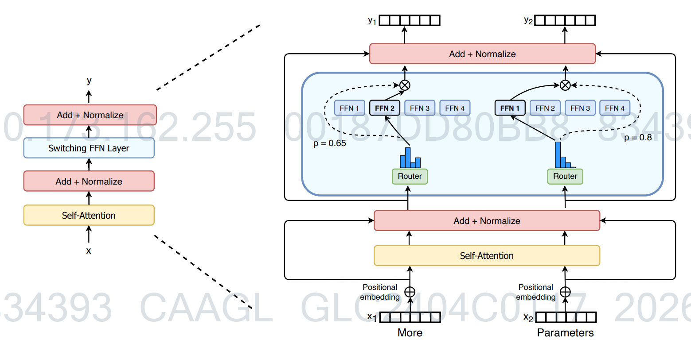

# Switch Transformer

> Prerequisite knowledge: 了解Transformer模型的基本结构，特别是其中的前馈网络层；知道模型的参数量和计算量是两个不同的概念；如果有分布式训练的基础概念会更容易理解，但非必需。

## 1. 故事背景

### 1-1 一个学校的烦恼：所有老师必须教所有学生

想象你是一所超级学校（一个大型神经网络）的校长，学校的目标是培养好每一个学生（处理每一个输入数据）。按照传统做法，你请来了一大批非常博学的老师（模型参数），但规定每一位老师都必须参与教导每一个学生。这意味着，每当一个学生来上学，全校所有老师都要围着他转，给他讲课。这导致学校的运营成本（计算量）极高，因为所有老师都在工作，无论他们的知识是否真的适合这个学生。更糟的是，当你想通过多请老师（增加模型参数量）来提升学校整体水平时，运营成本会直线上升，学校很快就负担不起了。

### 1-2 一个聪明的想法：成立专家学院，学生按需找专家

这时有人提出了一个聪明的想法：为什么不把老师们按专业分成不同的“专家团队”呢？比如，有数学专家团队、语文专家团队等等。每个学生来上学时，先由一个“引导员”（路由机制）快速判断他最需要哪个领域的帮助，然后只引导他去请教对应的专家团队。这样，每个学生都得到了高质量的专业辅导，但每次只需要动用一小部分老师，学校的总体运营成本大大降低。这个想法就是“混合专家”（Mixture of Experts, MoE）模型的雏形。然而，在实际运作中，这个“引导员”经常判断不准，导致有些专家团队被学生挤爆，有些却门可罗雀，而且引导过程本身也复杂又耗时，学校管理层（研究人员）一直没能很好地解决这些问题。

## 2. 解决的痛点

### 2-1 痛点一：密集模型“算力随参数量线性增长”的困境

传统的Transformer模型（如T5）是“密集”的，其前馈网络层对所有token都进行同样的、巨大的矩阵计算。这意味着，模型参数量翻倍，计算量（FLOPs）也几乎翻倍。这就像学校规定所有老师必须教所有学生，请的老师越多，学校就越忙，运营成本就越高。这极大地限制了人们通过扩大参数量来提升模型性能的可能性。

Switch Transformer的核心创新是用“稀疏”的专家层替代了“密集”的前馈网络层。它将前馈网络复制成多份，每一份称为一个“专家”。关键改进在于其路由机制：对于每个输入的token，路由器只选择最合适的一个专家（即top-1路由）进行计算，而不是像传统MoE那样选择两个或更多。这样，虽然模型的总参数量可以因为专家数量的增加而变得非常巨大（比如 trillion 级别），但每个token实际只经过一个专家的计算，所以**总计算量（FLOPs per token）基本保持不变**。这就像虽然学校聘请了成百上千个专家团队，但每个学生每次只找其中一个团队，学校的日常运营开销并没有显著增加。

### 2-2 痛点二：专家负载不均衡与训练不稳定

在早期的MoE模型中，路由器（引导员）的分配很不稳定，经常导致大多数token都被路由到少数几个“热门”专家那里。这造成了两个问题：一是其他“冷门”专家的计算资源被浪费；二是热门专家需要处理的token数量远超其处理能力，导致部分token被迫“溢出”而得不到有效处理（dropped tokens），影响模型效果。此外，路由决策本身也因负载不均衡而难以训练稳定。

Switch Transformer引入了可微分的**负载均衡损失（load balancing loss）**。这个损失函数会监控每个专家在一个batch内被分配到的token比例，以及路由器分配给每个专家的平均概率。它会惩罚分配不均衡的情况，鼓励路由器将token尽量均匀地分发给所有专家。在训练时，这个辅助损失与模型原有的损失一起优化，从而动态地、自动地调整路由行为。这样既保证了所有专家都被有效利用，又使路由决策过程更加稳定，避免了token大量溢出的问题。其数学形式如下：

$$
\mathcal{L}_{\text{balance}} = N \cdot \sum_{i=1}^N f_i \cdot P_i
$$

其中，$N$是专家数量，$f_i$是专家$i$在一个batch中被选中的比例，$P_i$是路由器分配给专家$i$的平均概率。

### 2-3 痛点三：模型并行与通信开销

要在现代硬件（如TPU、GPU）上高效训练万亿参数的模型，必须将模型切分到多个设备上并行计算。对于MoE层来说，这意味着token可能需要被发送到其他设备上的专家那里，这个过程会产生大量的通信开销，拖慢训练速度。早期的MoE实现中，这个问题尤为突出。

Switch Transformer在工程实现上做了精心设计，以适配TPU等硬件的特性。首先，它采用top-1路由，使得每个token只需要与一个设备通信，而不是多个，直接减少了通信量。其次，它在Mesh-TensorFlow框架下，通过静态形状声明和动态路由的结合，实现了高效的“专家与数据并行”（expert and data parallelism）。具体做法是，将专家分布在不同的设备上，每个设备同时处理一部分数据（数据并行）和存储不同的专家（模型并行）。路由器将token发送到对应的设备，专家计算完成后，结果再返回。这种设计最大限度地减少了跨设备通信，并利用了硬件的密集矩阵计算能力来处理稀疏激活。论文中通过设置“专家容量（expert capacity）”来管理每个专家能处理的token数量，公式如下：

$$
\text{专家容量} = \left( \frac{\text{每批次的token总数}}{\text{专家数量}} \right) \times \text{容量因子}
$$

容量因子大于1提供了缓冲，以应对token分配的小幅不均，从而在计算效率和处理溢出之间取得平衡。

### 2-4 数学形式化总结

Switch Transformer层对输入token $x$ 的处理可以总结为以下几个步骤：

1.  **路由计算**：通过一个可训练的路由矩阵 $W_r$ 计算 $x$ 与每个专家 $i$ 的匹配分数，得到概率分布 $p$：
    $$
    p_i(x) = \frac{e^{(W_r x)_i}}{\sum_{j=1}^N e^{(W_r x)_j}}
    $$
    其中 $N$ 是专家总数。

2.  **专家选择**：选择概率最高的唯一专家 $i^* = \arg\max_i p_i(x)$。

3.  **稀疏激活计算**：将 $x$ 传递给被选中的专家 $E_{i^*}$（一个前馈网络）进行计算，并用路由概率对该输出进行加权：
    $$
    y = p_{i^*}(x) \cdot E_{i^*}(x)
    $$
    乘以概率 $p_{i^*}(x)$ 是为了在反向传播时能够将梯度回传到路由矩阵 $W_r$，使整个系统可端到端训练。

通过以上设计，Switch Transformer成功地在**几乎不增加计算开销**的前提下，将模型参数量提升到了万亿级别，并在多种自然语言处理任务上取得了显著的加速效果（例如，相比T5-XXL模型，训练速度提升了4倍）。

## 3 實際案例運算：一個句子如何被 Switch Transformer 處理

我們是 Google 的研究團隊，正在訓練一個 Switch Transformer 模型來理解英文句子。今天，模型收到了一句簡單的輸入：「**I love AI**」。我們的目標是親手計算這個句子在模型的第一個 **Switch Feed Forward 層**（Switch FFN Layer）中是如何被處理的，並親身體會它如何解決大規模模型訓練的痛點。

假設我們有一個非常簡化的 Switch Transformer 設定：
- 輸入句子「I love AI」已經被模型的前面部分（如嵌入層和自注意力層）處理，變成 3 個「詞彙表示」（Token Representation），每個表示是一個 4 維的向量。
- 我們有一個 Switch 層，裡面有 **2 個專家**（Expert 1 和 Expert 2）。
- 有一個**路由矩陣** \(W_r\)，負責決定每個 token 要去哪個專家。
- 每個專家都是一個簡單的神經網絡，這裡我們把它簡化成一個線性變換矩陣 \(E_1\) 和 \(E_2\)。

我們現在一步一步來計算。

### 3-1 步驟一：計算每個詞彙要去哪個專家（Router 的計算）

#### 3-1-1 準備輸入
我們的輸入是 3 個 token 的向量，組成一個矩陣 \(X\)。

{空一行}
$$
X\ (shape=3\times 4) =
\begin{bmatrix}
0.1 & 0.2 & 0.3 & 0.4 \\
0.5 & 0.6 & 0.7 & 0.8 \\
0.9 & 0.8 & 0.7 & 0.6
\end{bmatrix}
$$
{空一行}
第一行是「I」，第二行是「love」，第三行是「AI」。

#### 3-1-2 路由矩陣 \(W_r\) 計算分數
路由矩陣 \(W_r\) 負責將每個 4 維的 token 向量，映射到 2 個專家上，產生兩個分數（logits）。

{空一行}
$$
W_r\ (shape=4\times 2) =
\begin{bmatrix}
0.1 & 0.9 \\
0.2 & 0.8 \\
0.3 & 0.7 \\
0.4 & 0.6
\end{bmatrix}
$$
{空一行}
我們將輸入 \(X\) 與 \(W_r\) 相乘，得到原始分數 \(H\)。

{空一行}
$$
H = X \cdot W_r\ (shape=3\times 4 \cdot 4\times 2 = 3\times 2)
$$
{空一行}
$$
H\ (shape=3\times 2) =
\begin{bmatrix}
(0.1*0.1 + 0.2*0.2 + 0.3*0.3 + 0.4*0.4) & (0.1*0.9 + 0.2*0.8 + 0.3*0.7 + 0.4*0.6) \\
(0.5*0.1 + 0.6*0.2 + 0.7*0.3 + 0.8*0.4) & (0.5*0.9 + 0.6*0.8 + 0.7*0.7 + 0.8*0.6) \\
(0.9*0.1 + 0.8*0.2 + 0.7*0.3 + 0.6*0.4) & (0.9*0.9 + 0.8*0.8 + 0.7*0.7 + 0.6*0.6)
\end{bmatrix}
$$
{空一行}
計算後得到：

{空一行}
$$
H\ (shape=3\times 2) =
\begin{bmatrix}
0.30 & 0.70 \\
0.70 & 1.90 \\
0.70 & 2.30
\end{bmatrix}
$$
{空一行}
這個矩陣的每一列對應一個專家。例如，第一行是「I」的分數：給專家 1 的分數是 0.30，給專家 2 的分數是 0.70。

#### 3-1-3 將分數轉換成機率
我們對每個 token 的分數進行 Softmax，得到每個專家的機率 \(P\)。

{空一行}
$$
P\ (shape=3\times 2) =
\begin{bmatrix}
\frac{e^{0.30}}{e^{0.30}+e^{0.70}} & \frac{e^{0.70}}{e^{0.30}+e^{0.70}} \\
\frac{e^{0.70}}{e^{0.70}+e^{1.90}} & \frac{e^{1.90}}{e^{0.70}+e^{1.90}} \\
\frac{e^{0.70}}{e^{0.70}+e^{2.30}} & \frac{e^{2.30}}{e^{0.70}+e^{2.30}}
\end{bmatrix}
\approx
\begin{bmatrix}
0.40 & 0.60 \\
0.23 & 0.77 \\
0.17 & 0.83
\end{bmatrix}
$$
{空一行}
現在，我們清楚地看到：
- 「I」去專家 1 的機率是 40%，去專家 2 是 60%。
- 「love」去專家 1 是 23%，去專家 2 是 77%。
- 「AI」去專家 1 是 17%，去專家 2 是 83%。

**痛點：資訊聚合。路由矩陣將每個詞彙的高維語義資訊（4維向量），有效地聚合成一個簡單的、可用於決策的分數（2維），決定「誰最適合處理這個詞」。**

### 3-2 步驟二：決定每個詞彙的最終歸宿（Top-1 路由與負載平衡）

#### 3-2-1 執行 Top-1 路由
傳統 MoE 可能選擇前 2 名專家，但 Switch Transformer 簡化為只選擇**機率最高**的那一個專家。這就是 **Switch Routing** 的核心。

我們根據上面的機率矩陣 \(P\)，為每個 token 選出冠軍專家：
- 「I」：專家 2 (0.60 > 0.40)
- 「love」：專家 2 (0.77 > 0.23)
- 「AI」：專家 2 (0.83 > 0.17)

糟糕！所有 token 都想湧向專家 2。專家 1 沒人理。

{空一行}
> 💡 **生活化比喻**：這就像一家速食店，有兩個點餐窗口。結果不知為何，所有客人統統跑到 2 號窗口排隊，1 號窗口的服務員閒得發慌。這不僅浪費資源，2 號窗口的服務員也會因為工作量過大而崩潰（在模型裡就是計算溢出，token 被丟棄）。

{空一行}
#### 3-2-2 引入負載均衡損失
為了解決這個問題，Switch Transformer 在訓練時加入了一個「負載均衡損失」（Load Balancing Loss）。這個損失函數會「懲罰」這種分配不均的情況，鼓勵路由器將 token 更平均地送給各個專家。雖然這個損失不影響我們現在做的**前向傳播**（這是訓練時才用的），但它解釋了為什麼訓練完成的模型，通常不會出現這麼極端的分配。

在我們這個經過訓練的理想化模型裡，假設這個負載均衡機制發揮了作用，使得路由器的權重（\(W_r\)）被調整，產生比較平衡的分配。為了讓計算範例更真實，我們**調整**一下最終的機率矩陣（代表經過良好訓練後的結果），讓 token 能分給不同專家。

假設調整後的機率矩陣 \(P'\) 為：

{空一行}
$$
P'\ (shape=3\times 2) =
\begin{bmatrix}
0.75 & 0.25 \\
0.40 & 0.60 \\
0.30 & 0.70
\end{bmatrix}
$$
{空一行}
則新的 Top-1 路由結果為：
- 「I」：專家 1 (0.75 > 0.25)
- 「love」：專家 2 (0.60 > 0.40)
- 「AI」：專家 2 (0.70 > 0.30)

這個分配（專家 1 有 1 個 token，專家 2 有 2 個 token）比之前健康多了。我們將這個決定記錄為一個「路由清單」。

**痛點：避免專家崩潰與計算浪費。透過 Top-1 路由簡化決策過程，並在訓練時輔以負載均衡損失，確保所有專家都被充分利用，避免部分專家過載而其他專家閒置，大幅提升了訓練穩定性和硬體使用效率。**

### 3-3 步驟三：專家們開始工作（專家網絡計算）

#### 3-3-1 準備專家輸入
現在，我們根據路由清單，將 token 送到對應的專家去。每個專家有自己的權重矩陣。

{空一行}
> 💡 **生活化比喻**：現在兩個服務窗口（專家）各自排了客人。1 號窗口有一位客人「I」，2 號窗口有兩位客人「love」和「AI」。每個窗口的服務員（專家網絡）用自己的方式（權重矩陣）來為客人服務。

{空一行}
定義兩個專家網絡的權重矩陣（簡化為沒有偏置的線性層）：

{空一行}
$$
E_1\ (shape=4\times 4) =
\begin{bmatrix}
0.1 & 0.0 & 0.1 & 0.0 \\
0.0 & 0.1 & 0.0 & 0.1 \\
0.1 & 0.0 & 0.1 & 0.0 \\
0.0 & 0.1 & 0.0 & 0.1
\end{bmatrix}
$$
{空一行}
$$
E_2\ (shape=4\times 4) =
\begin{bmatrix}
0.2 & 0.1 & 0.0 & 0.0 \\
0.0 & 0.2 & 0.1 & 0.0 \\
0.0 & 0.0 & 0.2 & 0.1 \\
0.1 & 0.0 & 0.0 & 0.2
\end{bmatrix}
$$
{空一行}
**專家 1 的計算**：
它收到了來自「I」的向量 \(X_{I} = [0.1, 0.2, 0.3, 0.4]\)。
我們計算 \(Y_{I} = X_{I} \cdot E_1\)。

{空一行}
$$
Y_{I}\ (shape=1\times 4) =
\begin{bmatrix}
0.1 & 0.2 & 0.3 & 0.4
\end{bmatrix}
\cdot
E_1
$$
{空一行}
結果為：

{空一行}
$$
Y_{I}\ (shape=1\times 4) =
\begin{bmatrix}
0.04 & 0.06 & 0.04 & 0.06
\end{bmatrix}
$$
{空一行}
**專家 2 的計算**：
它收到了來自「love」的向量 \(X_{L} = [0.5, 0.6, 0.7, 0.8]\) 和「AI」的向量 \(X_{A} = [0.9, 0.8, 0.7, 0.6]\)。
我們可以將它們組成一個矩陣一起計算 \(Y_{L,A} = X_{L,A} \cdot E_2\)。

{空一行}
$$
X_{L,A}\ (shape=2\times 4) =
\begin{bmatrix}
0.5 & 0.6 & 0.7 & 0.8 \\
0.9 & 0.8 & 0.7 & 0.6
\end{bmatrix}
$$
{空一行}
$$
Y_{L,A} = X_{L,A} \cdot E_2\ (shape=2\times 4 \cdot 4\times 4 = 2\times 4)
$$
{空一行}
計算得到：

{空一行}
$$
Y_{L,A}\ (shape=2\times 4) =
\begin{bmatrix}
0.16 & 0.23 & 0.20 & 0.22 \\
0.24 & 0.25 & 0.22 & 0.20
\end{bmatrix}
$$
{空一行}
第一行是「love」的輸出，第二行是「AI」的輸出。

**痛點：計算效率。雖然總參數量變大了（我們有兩個專家，總共 2*(4*4)=32 個參數），但每個 token 只經過一個專家，因此**每個 token 的實際計算量**只是 4*4=16 次乘法，與只有一個專家的密集模型相同！這就是 Switch Transformer 的核心：參數大增，但計算量不變。**

### 3-4 步驟四：將結果乘上閘值並輸出

最後一步，我們要將專家計算的結果，乘上當初路由器給的**閘值**（Gate Value），也就是那個機率 \(p_i(x)\)。這是為了讓整個路由決策過程是可微分的，使得模型可以端到端訓練。

還記得我們調整後的最終機率 \(P'\) 嗎？我們需要取出對應的機率：
- 對於「I」（去專家 1），其對應的機率是 \(p_1(I) = 0.75\)。
- 對於「love」（去專家 2），其對應的機率是 \(p_2(love) = 0.60\)。
- 對於「AI」（去專家 2），其對應的機率是 \(p_2(AI) = 0.70\)。

將輸出乘上閘值：
- \(Output_I = p_1(I) \times Y_{I} = 0.75 \times [0.04, 0.06, 0.04, 0.06] = [0.03, 0.045, 0.03, 0.045]\)
- \(Output_{love} = p_2(love) \times Y_{love} = 0.60 \times [0.16, 0.23, 0.20, 0.22] = [0.096, 0.138, 0.12, 0.132]\)
- \(Output_{AI} = p_2(AI) \times Y_{AI} = 0.70 \times [0.24, 0.25, 0.22, 0.20] = [0.168, 0.175, 0.154, 0.14]\)

最終，這些帶有閘值的輸出向量會取代原始輸入 \(X\) 中的對應位置，被送到模型的下一個層（例如下一個注意力層或 Feed Forward 層）去。

**痛點：穩定梯度。將專家輸出乘以路由器的機率（閘值），這個操作創造了一條從最終損失函數直接連回路由器 \(W_r\) 的梯度路徑。這讓路由器可以透過反向傳播學習如何做出更好的路由決策，是整個稀疏模型能夠被成功訓練的關鍵。**