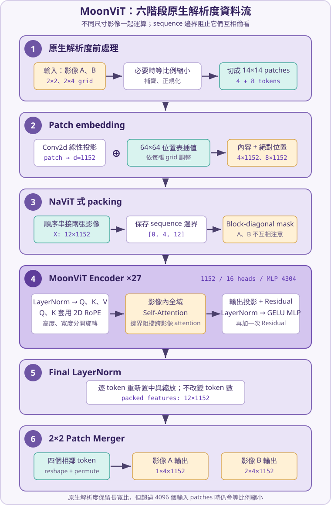

# MoonViT

MoonViT（也常寫作 Moon-ViT）是 Kimi-VL 使用的 **Native-resolution Vision Encoder（原生解析度視覺編碼器）**：它盡量沿用影像原本的長寬比，把不同尺寸的影像整理成可一起運算的 token 序列，而不是先把每張圖硬拉成同一個正方形。

## 1. 故事背景：為什麼不能把所有圖片都縮成正方形？

想像你正在做一個可以讀文件與操作電腦的 AI 助理。它一天會看到三種很不一樣的畫面：

- 一頁直式發票，細小文字集中在表格裡。
- 一張 3840×2160 的桌面截圖，右下角有一顆很小的按鈕。
- 一張很長的網頁截圖，內容一路向下延伸。

傳統 [Vision Transformer（ViT）](vit.md) 常先把所有圖片縮放成固定尺寸，例如 224×224。這很像把發票、電視畫面和長卷軸都塞進同一個相框：雖然 batch 很整齊，但長寬比被扭曲，細字也可能在縮小時消失。

另一種做法是把高解析度圖片切成很多方形小圖，再逐塊編碼。它保住了局部細節，卻帶來新的問題：一個表格可能被切成左右兩半，模型必須另外記住小圖的拼接順序，也不容易一次看到全圖關係。

MoonViT 的目標是：**影像有多寬、多高，就用相對應的 patch grid；不同 grid 可以放進同一個 batch，但每張圖仍保有自己的邊界與二維位置。**

| 方法 | 怎麼處理不同尺寸圖片 | 主要代價 |
| --- | --- | --- |
| 固定尺寸 ViT | 全部 resize 成相同方形 | 長寬比可能失真，細節可能消失 |
| 切圖／tiling | 高解析度影像切成多張小圖 | 全域脈絡被切開，還要管理拼接順序 |
| **MoonViT** | 保留長寬比，依實際 grid 產生可變長 token | 高解析度的全域 attention 仍然昂貴 |

> **先釐清一個常見誤解：**「原生解析度」不等於完全不縮放，更不等於無限解析度。官方獨立模型在 patch 數超過 4096 時仍會等比例縮小，並把長寬補到可供 2×2 merger 分組的倍數。它保留的是**長寬比與彈性 grid**，不是無條件保留每個原始 pixel。

## 2. MoonViT 的核心答案

MoonViT 建立在 [Transformer](../../llm/core/transformer.md) encoder 上，關鍵不是發明一種全新的注意力公式，而是把「不同尺寸圖片如何進入同一個 Transformer」整理好：

1. **彈性 patch grid**：不把圖片強制變成同一尺寸，只在超過 token 預算時等比例縮小。
2. **NaViT 式 packing**：把多張圖片的 patch tokens 串成一條序列，減少 batch padding 浪費。
3. **兩種位置訊號一起用**：可插值的絕對位置編碼保留 SigLIP 初始化能力，[2D Rotary Position Embedding（2D RoPE）](../../llm/positional-encoding/rope.md)則把高度與寬度座標直接旋轉進 Q、K，補強高解析度位置判斷。
4. **影像邊界不能穿越**：透過 `cu_seqlens` 或 block-diagonal mask，讓每張影像只對自己的 tokens 做 [Self-Attention（自注意力）](../../llm/core/attention.md)。
5. **最後把 2×2 鄰居分組**：空間 token 數降為四分之一，方便後續 projector 接到語言模型。

在支援可變長度序列的 [FlashAttention](../../systems/inference/flashattention.md) 中，`cu_seqlens` 就像每張圖片在長隊伍裡的起訖號碼。GPU 可以一次處理整條 packed sequence，同時知道哪些 token 屬於同一張圖。

## 3. 六階段真實資料流

架構圖與後面的數值範例都使用以下相同編號與順序。

| 編號 | 階段 | 輸入 → 輸出 | 如何回應痛點 |
| --- | --- | --- | --- |
| 1 | **原生解析度前處理** | 圖片 → 正規化 patches 與 `grid_hws` | 保留長寬比，只在超過 token 預算時縮小 |
| 2 | **Patch embedding** | patches → 內容 embedding + 插值後絕對位置 | 讓不同 grid 都有可用的二維絕對位置，同時承接 SigLIP 權重 |
| 3 | **NaViT 式 packing** | 多張可變長序列 → packed sequence + `cu_seqlens` | 避免把所有圖片 padding 成最大方形，也阻止跨影像 attention |
| 4 | **MoonViT Encoder** | packed tokens → 具全域脈絡的 packed tokens | 2D RoPE 保留高度／寬度位置；影像內全域 attention 看完整畫面 |
| 5 | **Final LayerNorm** | encoder 輸出 → 尺度穩定的特徵 | 統一最後一層特徵分布，方便後續模組接收 |
| 6 | **2×2 Patch Merger** | 每張 (H_p\times W_p) token grid → ((H_p/2)(W_p/2)) 組特徵 | token 組數除以 4，同時保留每組四個子 patch 特徵 |

### 3.1 階段 1 的真實前處理規則

官方獨立 `MoonViT-SO-400M` 的 patch size 是 14。若原圖寬高為 (W,H)，初步 patch 數為

$$
N=\left\lfloor\frac{W}{14}\right\rfloor
  \left\lfloor\frac{H}{14}\right\rfloor.
$$

當 (N>4096) 時，processor 以

$$
s=\sqrt{\frac{4096}{N}}
$$

等比例縮放寬高。官方 preprocessor 設定 `pad_input=true`，所以接著將寬高補成 (2\times14=28) 的倍數，確保階段 6 能把 patch grid 每 2×2 個一組。最後以 mean 0.5、standard deviation 0.5 正規化 RGB channels，再切成 patches。

### 3.2 真實模型與教學模型

完整的 400M 模型不適合手算，因此正文使用縮小但資料流一致的 toy model。所有 toy 數值只用來追蹤資料如何流動，不是官方權重或真實影像特徵。

| 設定 | `MoonViT-SO-400M` | 本文 toy model |
| --- | ---: | ---: |
| 輸入 channels | RGB 3 | 灰階 1 |
| Patch size | 14×14 | 1×1 |
| Input token limit | 4096 | 12（兩圖合計） |
| Hidden size (d) | 1152 | 4 |
| Encoder layers | 27 | 1 |
| Attention heads | 16 | 1 |
| Head dimension | 72 | 4 |
| MLP intermediate size | 4304 | 4 |
| 初始絕對位置表 | 64×64×1152 | 2×2×4 |
| Merge kernel | 2×2 | 2×2 |

## 4. 完整數值範例：兩張不同寬度的圖片如何一起通過 MoonViT

我們用兩張已縮小到 toy 尺寸的灰階圖片：影像 A 是 2×2，影像 B 是 2×4。每個 pixel 就是一個 patch，因此兩張圖會分別產生 4 與 8 個 tokens。

為了讓式子可讀，以下小數顯示到三位；實際計算保留完整精度。所有 [LayerNorm](../../foundations/normalization/layernorm.md) 都使用 (epsilon=10^{-5})、(gamma=[1,1,1,1])、(eta=[0,0,0,0])。

### 階段 1 — 原生解析度前處理

兩張原始灰階影像矩陣為：

$$
I_A=
\begin{bmatrix}
0&0.25\\
0.50&0.75
\end{bmatrix}
\quad\text{shape}=(2,2),
$$

$$
I_B=
\begin{bmatrix}
0.25&0.50&0.75&1.00\\
0&0.25&0.50&0.75
\end{bmatrix}
\quad\text{shape}=(2,4).
$$

兩張圖都沒有超過 toy token 上限，尺寸也已經能被 2×2 merger 整除，所以不需要縮放或 padding。沿用官方 preprocessor 的 mean 0.5、standard deviation 0.5：

$$
I_{norm}=\frac{I-0.5}{0.5}=2I-1.
$$

得到正規化影像 (N_A) 與 (N_B)：

$$
N_A=
\begin{bmatrix}
-1&-0.5\\
0&0.5
\end{bmatrix}
\quad\text{shape}=(2,2),
$$

$$
N_B=
\begin{bmatrix}
-0.5&0&0.5&1\\
-1&-0.5&0&0.5
\end{bmatrix}
\quad\text{shape}=(2,4).
$$

按 row-major 順序切成 1×1 patches 並攤平，形成 **patch pixel matrix (P_{pixel})**：

$$
P_{pixel}=
\begin{bmatrix}
-1\\-0.5\\0\\0.5\\
-0.5\\0\\0.5\\1\\-1\\-0.5\\0\\0.5
\end{bmatrix}
\quad\text{shape}=(12,1).
$$

前 4 列屬於影像 A，後 8 列屬於影像 B；另保存 **grid matrix (G)**：

$$
G=
\begin{bmatrix}
2&2\\
2&4
\end{bmatrix}
\quad\text{shape}=(2,2).
$$

這個 (G) 就是官方程式的 `grid_hws`。它會一路提供給位置編碼、attention 邊界與 patch merger。

### 階段 2 — Patch embedding：內容投影加上插值絕對位置

真實模型用 kernel size 14、stride 14 的 `Conv2d` 同時切 patch 與投影。toy patch 只有一個灰階值，所以可寫成線性投影。**Patch projection weight (W_E)** 為：

$$
W_E=
\begin{bmatrix}
0.6&-0.2&0.4&0.8
\end{bmatrix}
\quad\text{shape}=(1,4).
$$

toy 的 patch projection 不使用 bias；等價的 **bias vector (b_E)** 為

$$
b_E=\begin{bmatrix}0&0&0&0\end{bmatrix}
\quad\text{shape}=(1,4).
$$

矩陣關係為：

$$
\underbrace{P_{pixel}}_{(12,1)}\cdot
\underbrace{W_E}_{(1,4)}=
\underbrace{E}_{(12,4)}.
$$

得到 **patch content embedding (E)**：

$$
E=
\begin{bmatrix}
-0.6&0.2&-0.4&-0.8\\
-0.3&0.1&-0.2&-0.4\\
0&0&0&0\\
0.3&-0.1&0.2&0.4\\
-0.3&0.1&-0.2&-0.4\\
0&0&0&0\\
0.3&-0.1&0.2&0.4\\
0.6&-0.2&0.4&0.8\\
-0.6&0.2&-0.4&-0.8\\
-0.3&0.1&-0.2&-0.4\\
0&0&0&0\\
0.3&-0.1&0.2&0.4
\end{bmatrix}
\quad\text{shape}=(12,4).
$$

MoonViT 從 SigLIP-SO-400M 初始化，因此保留可學習的絕對位置表。toy 的 **base position table (P_0)** 攤平成：

$$
P_0=
\begin{bmatrix}
0&0&0&0\\
0&0.3&0&0.3\\
0.1&0&0.1&0\\
0.1&0.3&0.1&0.3
\end{bmatrix}
\quad\text{shape}=(4,4).
$$

它對應一個 2×2×4 的位置 grid。影像 A 剛好是 2×2，因此插值後 **position matrix (P_A)** 與 (P_0) 相同：

$$
P_A=
\begin{bmatrix}
0&0&0&0\\
0&0.3&0&0.3\\
0.1&0&0.1&0\\
0.1&0.3&0.1&0.3
\end{bmatrix}
\quad\text{shape}=(4,4).
$$

真實實作使用 bicubic interpolation。為了手算，toy 在水平方向使用線性插值，把寬度 2 拉到 4；輸出的 **position matrix (P_B)** 是：

$$
P_B=
\begin{bmatrix}
0&0&0&0\\
0&0.1&0&0.1\\
0&0.2&0&0.2\\
0&0.3&0&0.3\\
0.1&0&0.1&0\\
0.1&0.1&0.1&0.1\\
0.1&0.2&0.1&0.2\\
0.1&0.3&0.1&0.3
\end{bmatrix}
\quad\text{shape}=(8,4).
$$

依 A、B 順序串接，得到 **packed absolute position matrix (P_{abs})**：

$$
P_{abs}=
\begin{bmatrix}
0&0&0&0\\
0&0.3&0&0.3\\
0.1&0&0.1&0\\
0.1&0.3&0.1&0.3\\
0&0&0&0\\
0&0.1&0&0.1\\
0&0.2&0&0.2\\
0&0.3&0&0.3\\
0.1&0&0.1&0\\
0.1&0.1&0.1&0.1\\
0.1&0.2&0.1&0.2\\
0.1&0.3&0.1&0.3
\end{bmatrix}
\quad\text{shape}=(12,4).
$$

內容 embedding 與位置 embedding 逐元素相加：

$$
X=E+P_{abs}=
\begin{bmatrix}
-0.6&0.2&-0.4&-0.8\\
-0.3&0.4&-0.2&-0.1\\
0.1&0&0.1&0\\
0.4&0.2&0.3&0.7\\
-0.3&0.1&-0.2&-0.4\\
0&0.1&0&0.1\\
0.3&0.1&0.2&0.6\\
0.6&0.1&0.4&1.1\\
-0.5&0.2&-0.3&-0.8\\
-0.2&0.2&-0.1&-0.3\\
0.1&0.2&0.1&0.2\\
0.4&0.2&0.3&0.7
\end{bmatrix}
\quad\text{shape}=(12,4).
$$

階段 2 的輸出 (X) 已經同時包含「這塊 patch 看到了什麼」與「它位於哪一個絕對格子」。

### 階段 3 — NaViT 式 packing：串接，但不能混在一起

前一步其實已依 A、B 順序把 tokens 排成 (X)。packing 還必須記住每張圖的長度：

$$
L=
\begin{bmatrix}
4&8
\end{bmatrix}
\quad\text{shape}=(1,2),
$$

累積後得到 **cumulative sequence lengths (C)**：

$$
C=\operatorname{cumsum}([0,4,8])=
\begin{bmatrix}
0&4&12
\end{bmatrix}
\quad\text{shape}=(1,3).
$$

也就是官方程式中的 `cu_seqlens=[0,4,12]`：索引 ([0,4)) 是 A，([4,12)) 是 B。

若不用可變長 FlashAttention，而是顯式建立 mask，完整的 **packed attention visibility matrix (M)** 為：

$$
M=
\begin{bmatrix}
1&1&1&1&0&0&0&0&0&0&0&0\\
1&1&1&1&0&0&0&0&0&0&0&0\\
1&1&1&1&0&0&0&0&0&0&0&0\\
1&1&1&1&0&0&0&0&0&0&0&0\\
0&0&0&0&1&1&1&1&1&1&1&1\\
0&0&0&0&1&1&1&1&1&1&1&1\\
0&0&0&0&1&1&1&1&1&1&1&1\\
0&0&0&0&1&1&1&1&1&1&1&1\\
0&0&0&0&1&1&1&1&1&1&1&1\\
0&0&0&0&1&1&1&1&1&1&1&1\\
0&0&0&0&1&1&1&1&1&1&1&1\\
0&0&0&0&1&1&1&1&1&1&1&1
\end{bmatrix}
\quad\text{shape}=(12,12).
$$

`1` 表示可以互看，`0` 表示必須遮住。這是 block-diagonal 結構：影像 A 內部完整互看、影像 B 內部完整互看，右上與左下兩塊全是 0。

> **痛點對應：**packing 省掉「把短圖片補成最長圖片」的空算；`cu_seqlens` 又保證兩張圖雖然排在同一條序列，語意仍不會污染彼此。

### 階段 4 — MoonViT Encoder：LayerNorm、2D RoPE、Attention 與 MLP

真實 MoonViT 重複 27 個 encoder layers；toy 只計算一層。這一層採 pre-norm 結構：先 LayerNorm 再做 attention，加回 residual；接著再 LayerNorm、通過 MLP，最後再加一次 residual。

#### 階段 4.1 — 第一個 LayerNorm 與 Q、K、V

對 (X) 的每一列獨立做 LayerNorm。對任一列 (x_i)，轉換為

$$
\operatorname{LN}(x_i)=
\frac{x_i-\mu_i}{\sqrt{\sigma_i^2+10^{-5}}}\odot\gamma+\beta.
$$

階段 2 輸出 (X) 的 **row mean matrix (mu_X)** 與 **row variance matrix (sigma_X^2)** 為：

$$
\mu_X=
\begin{bmatrix}
-0.400\\-0.050\\0.050\\0.400\\-0.200\\0.050\\
0.300\\0.550\\-0.350\\-0.100\\0.150\\0.400
\end{bmatrix}
\quad\text{shape}=(12,1),
$$

$$
\sigma_X^2=
\begin{bmatrix}
0.140\\0.073\\0.003\\0.035\\0.035\\0.003\\
0.035\\0.133\\0.133\\0.035\\0.003\\0.035
\end{bmatrix}
\quad\text{shape}=(12,1).
$$

代入 (gamma=[1,1,1,1])、(eta=[0,0,0,0])，得到 **normalized attention input (N_1)**：

$$
N_1=
\begin{bmatrix}
-0.535&1.604&0&-1.069\\
-0.928&1.671&-0.557&-0.186\\
0.998&-0.998&0.998&-0.998\\
0&-1.069&-0.534&1.603\\
-0.534&1.603&0&-1.069\\
-0.998&0.998&-0.998&0.998\\
0&-1.069&-0.534&1.603\\
0.137&-1.236&-0.412&1.511\\
-0.412&1.511&0.137&-1.236\\
-0.534&1.603&0&-1.069\\
-0.998&0.998&-0.998&0.998\\
0&-1.069&-0.534&1.603
\end{bmatrix}
\quad\text{shape}=(12,4).
$$

真實實作以一個 `wqkv` 線性層一次產生 [Query、Key、Value（QKV）](../../llm/core/qkv.md)。toy 為了容易追蹤，使用相同的單位權重：

$$
W_Q=W_K=W_V=W_O=
\begin{bmatrix}
1&0&0&0\\
0&1&0&0\\
0&0&1&0\\
0&0&0&1
\end{bmatrix}
\quad\text{shape}=(4,4).
$$

所有 attention bias 都設定為 0；完整的 **bias vectors** 為

$$
b_Q=b_K=b_V=b_O=
\begin{bmatrix}0&0&0&0\end{bmatrix}
\quad\text{shape}=(1,4).
$$

因此

$$
\underbrace{N_1}_{(12,4)}\cdot
\underbrace{W_Q}_{(4,4)}=
\underbrace{Q}_{(12,4)},\qquad
\underbrace{N_1}_{(12,4)}\cdot
\underbrace{W_K}_{(4,4)}=
\underbrace{K}_{(12,4)},
$$

$$
\underbrace{N_1}_{(12,4)}\cdot
\underbrace{W_V}_{(4,4)}=
\underbrace{V}_{(12,4)}.
$$

所以三個完整矩陣共享同一組數值：

$$
Q=K=V=N_1=
\begin{bmatrix}
-0.535&1.604&0&-1.069\\
-0.928&1.671&-0.557&-0.186\\
0.998&-0.998&0.998&-0.998\\
0&-1.069&-0.534&1.603\\
-0.534&1.603&0&-1.069\\
-0.998&0.998&-0.998&0.998\\
0&-1.069&-0.534&1.603\\
0.137&-1.236&-0.412&1.511\\
-0.412&1.511&0.137&-1.236\\
-0.534&1.603&0&-1.069\\
-0.998&0.998&-0.998&0.998\\
0&-1.069&-0.534&1.603
\end{bmatrix}
\quad\text{shape}=(12,4).
$$

#### 階段 4.2 — 2D RoPE：高度與寬度分開旋轉

可插值絕對位置已在階段 2 加進 token；2D RoPE 則在每一層 attention 裡直接旋轉 Q、K。toy 把前兩維分給高度 (y)，後兩維分給寬度 (x)。為了得到容易核對的數字，toy 每移動一格旋轉 (90^\circ)；真實模型使用依維度遞減的 RoPE frequencies。

會用到的 **rotation matrices (R_0,R_1,R_2,R_3)** 為：

$$
R_0=
\begin{bmatrix}1&0\\0&1\end{bmatrix},\quad
R_1=
\begin{bmatrix}0&-1\\1&0\end{bmatrix},\quad
R_2=
\begin{bmatrix}-1&0\\0&-1\end{bmatrix},\quad
R_3=
\begin{bmatrix}0&1\\-1&0\end{bmatrix},
\quad\text{shape each}=(2,2).
$$

位於 ((y,x)) 的一列 (q=[q_1,q_2,q_3,q_4]) 會把前兩維乘 (R_y)、後兩維乘 (R_x)。影像 A 的座標依序為 ((0,0),(0,1),(1,0),(1,1))；影像 B 則為兩列、每列四個座標。

旋轉後的 **query matrix (Q_r)** 與 **key matrix (K_r)** 為：

$$
Q_r=K_r=
\begin{bmatrix}
-0.535&1.604&0&-1.069\\
-0.928&1.671&0.186&-0.557\\
0.998&0.998&0.998&-0.998\\
1.069&0&-1.603&-0.534\\
-0.534&1.603&0&-1.069\\
-0.998&0.998&-0.998&-0.998\\
0&-1.069&0.534&-1.603\\
0.137&-1.236&1.511&0.412\\
-1.511&-0.412&0.137&-1.236\\
-1.603&-0.534&1.069&0\\
-0.998&-0.998&0.998&-0.998\\
1.069&0&1.603&0.534
\end{bmatrix}
\quad\text{shape}=(12,4).
$$

注意 V 不套 RoPE，仍然等於 (N_1)。絕對位置告訴模型「這是第幾格」，2D RoPE 則讓 Q、K 的相似度自然受到「高度差與寬度差」影響；兩者在 MoonViT 中是互補，不是二選一。

#### 階段 4.3 — 影像內全域 Self-Attention

本例是一個 head，(d_k=4)。套用階段 3 的 mask 後，計分可以拆成 A、B 兩個完整區塊：

$$
\underbrace{Q_{r,A}}_{(4,4)}\cdot
\underbrace{K_{r,A}^{T}}_{(4,4)}\div\sqrt{4}=
\underbrace{S_A}_{(4,4)},
$$

$$
S_A=
\begin{bmatrix}
2.000&1.886&1.067&0\\
1.886&2.000&0.741&-0.496\\
1.067&0.741&1.992&0\\
0&-0.496&0&1.999
\end{bmatrix}
\quad\text{shape}=(4,4).
$$

$$
\underbrace{Q_{r,B}}_{(8,4)}\cdot
\underbrace{K_{r,B}^{T}}_{(4,8)}\div\sqrt{4}=
\underbrace{S_B}_{(8,8)},
$$

$$
S_B=
\begin{bmatrix}
1.999&1.600&0&-1.248&0.734&0&0&-0.571\\
1.600&1.992&0&-1.645&1.097&0&0&-1.600\\
0&0&1.999&0.734&1.248&0.571&1.600&0\\
-1.248&-1.645&0.734&2.000&0&1.028&1.097&1.395\\
0.734&1.097&1.248&0&2.000&1.395&1.645&-1.028\\
0&0&0.571&1.028&1.395&1.999&1.600&0\\
0&0&1.600&1.097&1.645&1.600&1.992&0\\
-0.571&-1.600&0&1.395&-1.028&0&0&1.999
\end{bmatrix}
\quad\text{shape}=(8,8).
$$

跨影像的分數不會進入 [Softmax](../../foundations/activation/softmax.md)，等價於先填成 (-\infty)。對兩個區塊逐列做 softmax，得到 **attention weight matrices (A_A,A_B)**：

$$
A_A=\operatorname{softmax}(S_A)=
\begin{bmatrix}
0.413&0.369&0.162&0.056\\
0.395&0.443&0.126&0.036\\
0.218&0.157&0.550&0.075\\
0.100&0.061&0.100&0.739
\end{bmatrix}
\quad\text{shape}=(4,4),
$$

$$
A_B=\operatorname{softmax}(S_B)=
\begin{bmatrix}
0.404&0.271&0.055&0.016&0.114&0.055&0.055&0.031\\
0.265&0.393&0.054&0.010&0.160&0.054&0.054&0.011\\
0.044&0.044&0.326&0.092&0.154&0.078&0.218&0.044\\
0.014&0.009&0.100&0.356&0.048&0.135&0.144&0.194\\
0.079&0.113&0.131&0.038&0.279&0.152&0.195&0.013\\
0.042&0.042&0.074&0.117&0.169&0.309&0.207&0.042\\
0.035&0.035&0.174&0.105&0.182&0.174&0.258&0.035\\
0.036&0.013&0.064&0.260&0.023&0.064&0.064&0.475
\end{bmatrix}
\quad\text{shape}=(8,8).
$$

每一列的數值總和都是 1。讓權重讀取未旋轉的 (V)，再按 A、B 順序串回 packed sequence：

$$
\underbrace{A_A}_{(4,4)}\cdot
\underbrace{V_A}_{(4,4)}=
\underbrace{O_A}_{(4,4)},\qquad
\underbrace{A_B}_{(8,8)}\cdot
\underbrace{V_B}_{(8,4)}=
\underbrace{O_B}_{(8,4)}.
$$

因 (W_O) 是單位矩陣，完整 **attention output (O)** 為：

$$
O=\operatorname{concat}(O_A,O_B)=
\begin{bmatrix}
-0.401&1.056&-0.073&-0.583\\
-0.497&1.209&-0.141&-0.571\\
0.286&-0.016&0.421&-0.691\\
-0.010&-0.627&-0.329&0.967\\
-0.615&1.122&-0.362&-0.145\\
-0.680&1.117&-0.462&0.025\\
-0.378&0.181&-0.476&0.673\\
-0.203&-0.291&-0.450&0.945\\
-0.541&0.897&-0.362&0.006\\
-0.489&0.796&-0.335&0.027\\
-0.465&0.550&-0.423&0.338\\
-0.105&-0.624&-0.469&1.198
\end{bmatrix}
\quad\text{shape}=(12,4).
$$

第一個 residual 把 attention 的全域資訊加回原 token：

$$
R_1=X+O=
\begin{bmatrix}
-1.001&1.256&-0.473&-1.383\\
-0.797&1.609&-0.341&-0.671\\
0.386&-0.016&0.521&-0.691\\
0.390&-0.427&-0.029&1.667\\
-0.915&1.222&-0.562&-0.545\\
-0.680&1.217&-0.462&0.125\\
-0.078&0.281&-0.276&1.273\\
0.397&-0.191&-0.050&2.045\\
-1.041&1.097&-0.662&-0.794\\
-0.689&0.996&-0.435&-0.273\\
-0.365&0.750&-0.323&0.538\\
0.295&-0.424&-0.169&1.898
\end{bmatrix}
\quad\text{shape}=(12,4).
$$

> **痛點對應：**影像 B 的任一 token 都能直接讀到同一張長圖的其他 7 個位置，不必先把長圖切成互相隔離的小方塊；mask 同時保證它完全看不到影像 A。

#### 階段 4.4 — 第二個 LayerNorm 與 Feed-Forward Network

第一個 residual (R_1) 的 **row mean matrix (mu_{R_1})** 與 **row variance matrix (sigma_{R_1}^2)** 為：

$$
\mu_{R_1}=
\begin{bmatrix}
-0.400\\-0.050\\0.050\\0.400\\-0.200\\0.050\\
0.300\\0.550\\-0.350\\-0.100\\0.150\\0.400
\end{bmatrix}
\quad\text{shape}=(12,1),
$$

$$
\sigma_{R_1}^2=
\begin{bmatrix}
1.019\\0.945\\0.222\\0.618\\0.696\\0.541\\
0.356\\0.792\\0.716\\0.423\\0.250\\0.815
\end{bmatrix}
\quad\text{shape}=(12,1).
$$

代入同一個 LayerNorm 公式，得到 **normalized MLP input (N_2)**：

$$
N_2=
\begin{bmatrix}
-0.595&1.641&-0.072&-0.973\\
-0.768&1.706&-0.299&-0.639\\
0.713&-0.141&1.000&-1.572\\
-0.013&-1.052&-0.546&1.611\\
-0.857&1.705&-0.434&-0.414\\
-0.993&1.587&-0.696&0.102\\
-0.634&-0.032&-0.967&1.632\\
-0.172&-0.833&-0.675&1.680\\
-0.816&1.710&-0.369&-0.525\\
-0.906&1.686&-0.515&-0.265\\
-1.031&1.200&-0.946&0.777\\
-0.116&-0.913&-0.631&1.660
\end{bmatrix}
\quad\text{shape}=(12,4).
$$

真實 MoonViT 把 1152 維升到 4304 維，使用 [GELU（Gaussian Error Linear Unit）](../../foundations/activation/gelu-silu.md)平滑地控制訊號，再投影回 1152 維。toy 使用兩個相同的對角權重：

$$
W_1=W_2=
\begin{bmatrix}
0.5&0&0&0\\
0&0.5&0&0\\
0&0&0.5&0\\
0&0&0&0.5
\end{bmatrix}
\quad\text{shape}=(4,4).
$$

toy 的兩層 MLP bias 都是零：

$$
b_1=b_2=
\begin{bmatrix}0&0&0&0\end{bmatrix}
\quad\text{shape}=(1,4).
$$

第一個矩陣乘法：

$$
\underbrace{N_2}_{(12,4)}\cdot
\underbrace{W_1}_{(4,4)}=
\underbrace{H}_{(12,4)},
$$

$$
H=
\begin{bmatrix}
-0.298&0.820&-0.036&-0.487\\
-0.384&0.853&-0.149&-0.320\\
0.357&-0.070&0.500&-0.786\\
-0.006&-0.526&-0.273&0.805\\
-0.429&0.852&-0.217&-0.207\\
-0.497&0.794&-0.348&0.051\\
-0.317&-0.016&-0.483&0.816\\
-0.086&-0.416&-0.337&0.840\\
-0.408&0.855&-0.184&-0.262\\
-0.453&0.843&-0.258&-0.133\\
-0.515&0.600&-0.473&0.388\\
-0.058&-0.457&-0.315&0.830
\end{bmatrix}
\quad\text{shape}=(12,4).
$$

逐元素套用 GELU，得到 **activated hidden matrix (G_{gelu})**：

$$
G_{gelu}=\operatorname{GELU}(H)=
\begin{bmatrix}
-0.114&0.651&-0.018&-0.152\\
-0.135&0.685&-0.066&-0.120\\
0.228&-0.033&0.346&-0.170\\
-0.003&-0.158&-0.107&0.636\\
-0.143&0.684&-0.090&-0.086\\
-0.154&0.624&-0.127&0.027\\
-0.119&-0.008&-0.152&0.647\\
-0.040&-0.141&-0.124&0.671\\
-0.139&0.687&-0.079&-0.104\\
-0.147&0.675&-0.103&-0.059\\
-0.156&0.435&-0.150&0.253\\
-0.028&-0.148&-0.119&0.661
\end{bmatrix}
\quad\text{shape}=(12,4).
$$

第二個矩陣乘法：

$$
\underbrace{G_{gelu}}_{(12,4)}\cdot
\underbrace{W_2}_{(4,4)}=
\underbrace{F}_{(12,4)},
$$

$$
F=
\begin{bmatrix}
-0.057&0.326&-0.009&-0.076\\
-0.067&0.343&-0.033&-0.060\\
0.114&-0.017&0.173&-0.085\\
-0.002&-0.079&-0.054&0.318\\
-0.072&0.342&-0.045&-0.043\\
-0.077&0.312&-0.063&0.013\\
-0.060&-0.004&-0.076&0.323\\
-0.020&-0.070&-0.062&0.336\\
-0.070&0.343&-0.039&-0.052\\
-0.074&0.337&-0.051&-0.030\\
-0.078&0.218&-0.075&0.126\\
-0.014&-0.074&-0.059&0.331
\end{bmatrix}
\quad\text{shape}=(12,4).
$$

第二個 residual 產生這一層 encoder 的最終輸出 **(R_2)**：

$$
R_2=R_1+F=
\begin{bmatrix}
-1.058&1.582&-0.482&-1.459\\
-0.864&1.951&-0.374&-0.731\\
0.500&-0.033&0.694&-0.775\\
0.388&-0.506&-0.083&1.985\\
-0.987&1.564&-0.607&-0.588\\
-0.757&1.529&-0.525&0.138\\
-0.138&0.277&-0.352&1.597\\
0.377&-0.261&-0.112&2.380\\
-1.110&1.440&-0.702&-0.846\\
-0.762&1.334&-0.486&-0.302\\
-0.443&0.967&-0.398&0.665\\
0.281&-0.498&-0.229&2.229
\end{bmatrix}
\quad\text{shape}=(12,4).
$$

真實模型會把同樣的「attention 子層 + MLP 子層」資料流重複 27 次，但每層使用自己的權重。toy 到這裡完成唯一一層。

### 階段 5 — Final LayerNorm

MoonViT encoder 在全部 layers 後還有一個 final LayerNorm。輸入 (R_2) 的 **row mean matrix (mu_{R_2})** 與 **row variance matrix (sigma_{R_2}^2)** 為：

$$
\mu_{R_2}=
\begin{bmatrix}
-0.354\\-0.004\\0.096\\0.446\\-0.154\\0.096\\
0.346\\0.596\\-0.304\\-0.054\\0.198\\0.446
\end{bmatrix}
\quad\text{shape}=(12,1),
$$

$$
\sigma_{R_2}^2=
\begin{bmatrix}
1.370\\1.307\\0.324\\0.889\\1.010\\0.792\\
0.573\\1.117\\1.036\\0.669\\0.394\\1.138
\end{bmatrix}
\quad\text{shape}=(12,1).
$$

對 (R_2) 逐列正規化，得到 **final token matrix (Y)**：

$$
Y=
\begin{bmatrix}
-0.601&1.654&-0.109&-0.944\\
-0.752&1.711&-0.323&-0.636\\
0.709&-0.227&1.049&-1.531\\
-0.061&-1.010&-0.561&1.632\\
-0.828&1.710&-0.450&-0.432\\
-0.959&1.610&-0.698&0.047\\
-0.639&-0.091&-0.923&1.653\\
-0.207&-0.811&-0.670&1.688\\
-0.792&1.714&-0.390&-0.532\\
-0.866&1.697&-0.528&-0.303\\
-1.021&1.226&-0.949&0.744\\
-0.154&-0.885&-0.632&1.671
\end{bmatrix}
\quad\text{shape}=(12,4).
$$

這一步不改變 token 數，也不混合不同位置；它只把每個 token 的四維特徵整理到穩定尺度。

### 階段 6 — 2×2 Patch Merger

最後依階段 1 保存的 grid，把 (Y) 拆回影像 A 的 2×2 grid 與影像 B 的 2×4 grid。`patch_merger` 不做加總或平均，而是用 `reshape → permute → reshape`，把每個 2×2 鄰域的四個 token 收成一組。

影像 A 只有一個 2×2 鄰域，輸出 **merged feature tensor (M_A)** 的唯一一組為：

$$
M_A[0]=
\begin{bmatrix}
-0.601&1.654&-0.109&-0.944\\
-0.752&1.711&-0.323&-0.636\\
0.709&-0.227&1.049&-1.531\\
-0.061&-1.010&-0.561&1.632
\end{bmatrix}
\quad\text{shape of }M_A=(1,4,4).
$$

四列依序是左上、右上、左下、右下四個子 patch。

影像 B 的 2×4 grid 會變成左右兩組。**Merged feature tensor (M_B)** 的第一組與第二組為：

$$
M_B[0]=
\begin{bmatrix}
-0.828&1.710&-0.450&-0.432\\
-0.959&1.610&-0.698&0.047\\
-0.792&1.714&-0.390&-0.532\\
-0.866&1.697&-0.528&-0.303
\end{bmatrix},
$$

$$
M_B[1]=
\begin{bmatrix}
-0.639&-0.091&-0.923&1.653\\
-0.207&-0.811&-0.670&1.688\\
-1.021&1.226&-0.949&0.744\\
-0.154&-0.885&-0.632&1.671
\end{bmatrix},
\quad\text{shape of }M_B=(2,4,4).
$$

影像 A 從 4 個空間 tokens 變成 1 組，影像 B 從 8 個空間 tokens 變成 2 組；每組仍保留四個子 patch、每個子 patch 4 維。真實輸出則把最後一維換成 1152，因此 shape 分別會是 `(1,4,1152)` 與 `(2,4,1152)`。

## 5. Shape 一路追蹤

| 階段 | 影像 A | 影像 B | Packed／輸出形式 |
| --- | ---: | ---: | ---: |
| 1. Patchify | 4×1 | 8×1 | `P_pixel: 12×1` |
| 2. Patch embedding + absolute PE | 4×4 | 8×4 | `X: 12×4` |
| 3. Packing | 長度 4 | 長度 8 | `cu_seqlens: [0,4,12]` |
| 4. Encoder | 4×4 | 8×4 | `R2: 12×4` |
| 5. Final LayerNorm | 4×4 | 8×4 | `Y: 12×4` |
| 6. 2×2 Patch Merger | 1×4×4 | 2×4×4 | Python list，兩張圖各自一個 tensor |

一句話總結這份 toy forward pass：**兩張寬度不同的圖片先各自變成 patch tokens，串成一條長度 12 的 packed sequence；2D RoPE 保留二維位置，mask 保證只在圖內互看，最後再拆回各圖並把 2×2 鄰居收成一組。**

## 6. MoonViT 是怎麼訓練出來的？

MoonViT 不是從零開始。Kimi 團隊先用 SigLIP-SO-400M 初始化視覺 encoder，再持續預訓練成能處理原生解析度的版本。這樣做像是讓一位已經會看圖片的學生，進一步學會閱讀大小不一的文件與螢幕，而不是重新教他辨認所有物件。

MoonViT 的獨立 ViT 訓練使用兩種目標：

1. **SigLIP loss**：一種 image-text contrastive loss，白話來說就是拉近正確圖文配對、推遠錯誤配對。
2. **Caption cross-entropy loss**：讓文字 decoder 根據影像特徵預測 caption，逼迫視覺 encoder 保留能說明畫面的資訊。

訓練資料包含 alt text、合成 caption、grounding boxes 與 OCR text，並用 progressive resolution sampling 逐步放大允許的圖片尺寸。完成約 2T tokens 的 ViT training 後，另用約 0.1T tokens 對齊 MoonViT 與 Kimi-VL 的語言模型；此時只更新 MoonViT 與 MLP projector，先降低視覺 embeddings 對語言模型造成的困惑，再進入後續 joint pre-training。

## 7. MoonViT 的輸出如何接進 Kimi-VL？

要分清楚兩個邊界：

- **獨立 MoonViT 模型**到階段 6 就結束，回傳每張圖片的 `[merged_groups, 4, 1152]` tensor list。
- **Kimi-VL 完整模型**才把每組四個子 patch 特徵展平成更寬的 channel，接到兩層 [MLP projector](../../vlm/connectors/projector-adapter.md)，投影成語言模型 embedding 維度，再交給 [Mixture of Experts（MoE）](../../llm/architectures/moe.md) language model。

論文把這個 2×2 空間壓縮稱為 pixel shuffle。空間組數除以 4、channel 資訊相應展開；它不是把四個 tokens 平均掉，因此後續 projector 仍能利用四個子位置的差異。

這也解釋了 [LocateAnything](../detection/locate-anything.md) 為何能把 MoonViT 當作高解析度 vision encoder：MoonViT 負責保留 GUI 小圖示、文字與密集物件的視覺特徵，後面的 projector 和 language decoder 再把這些特徵轉成座標或文字輸出。

## 8. 使用情境、優點與限制

### 適合的情境

- OCR、發票、報表與長文件：圖片長寬比差異很大，細字不能任意壓扁。
- 4K GUI／agent grounding：小按鈕或 icon 需要較高解析度特徵。
- 多圖片或影片 frames：不同影像可以 packing，減少 padding 浪費。
- VLM vision encoder：輸出保留空間分組，方便 projector 接到 LLM。

### 必須記住的限制

1. **原生解析度仍有 token 上限。**官方獨立 processor 的 `in_token_limit` 是 4096；超過時會等比例縮小。
2. **全域 attention 仍是平方成本。**單張圖片有 (N) 個 patches 時，影像內 attention matrix 仍是 (N\times N)。packing 改善 batch padding，沒有把單張高解析度圖片的複雜度變成線性。
3. **必須正確維護影像邊界。**若 `cu_seqlens` 或 mask 寫錯，兩張不相關圖片會互相注意，位置與內容都可能串錯。
4. **位置插值不是萬靈丹。**絕對位置表離初始化尺寸越遠，單靠插值越不可靠；MoonViT 因此額外使用 2D RoPE，但極端長寬比仍應實測。
5. **Patch merger 犧牲空間 token 數。**它保留四個子 patch 特徵，卻仍把四個空間位置包成同一組；後續 projector 如何使用這些 channels 會影響細節保留程度。
6. **模型表現不能只歸功於 encoder。**Kimi-VL 的 OCR、GUI 與文件結果也受到訓練資料、projector、語言模型和後訓練方法影響，不能把整個系統分數都算成 MoonViT 的單獨貢獻。

## 9. 參考資料

- Kimi Team：[Kimi-VL Technical Report](https://arxiv.org/abs/2504.07491)
- Moonshot AI：[Kimi-VL 官方 GitHub repository](https://github.com/MoonshotAI/Kimi-VL)
- Moonshot AI：[MoonViT-SO-400M model card](https://huggingface.co/moonshotai/MoonViT-SO-400M)
- Moonshot AI：[MoonViT 官方模型設定](https://huggingface.co/moonshotai/MoonViT-SO-400M/blob/main/config.json)
- Moonshot AI：[MoonViT 官方前處理實作](https://huggingface.co/moonshotai/MoonViT-SO-400M/blob/main/image_processing_moonvit.py)
- Moonshot AI：[MoonViT 官方 encoder 實作](https://huggingface.co/moonshotai/MoonViT-SO-400M/blob/main/modeling_moonvit.py)
- Dehghani et al.：[Patch n' Pack: NaViT, a Vision Transformer for any Aspect Ratio and Resolution](https://arxiv.org/abs/2307.06304)
