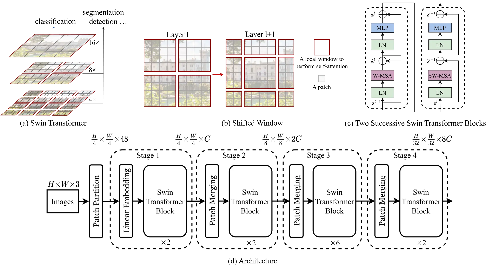

# Swin Transformer

## Swin Transformer 從哪裡來：發展脈絡

1. **Transformer（NLP 起家，2017）**
   Transformer 用「自注意力」取代 RNN/CNN 的序列建模方式，帶來高度平行化與長距依賴建模能力。 ([arXiv][1])

2. **Vision Transformer, ViT（把 Transformer 直接搬到影像，2020）**
   ViT 把影像切成 patch（像單字一樣的 token），用**全域 self-attention**做分類，在大規模預訓練後表現很好。 ([arXiv][2])
   但它也暴露出幾個在「高解析度影像／密集預測任務」特別痛的問題：

   * **全域注意力計算量隨 token 數平方成長**（影像越大越吃算力）
   * 缺少 CNN 那種天然的**多尺度金字塔特徵**（對偵測/分割不友善）
   * 影像世界的物體尺度差異大、解析度高，直接套用 NLP 的設定不順 ([arXiv][3])

3. **Swin Transformer（把 Transformer 改造成「通用視覺骨幹」，2021）**
   Swin 的目標很明確：**既要 Transformer 的表達力，又要像 CNN backbone 一樣能做分類、偵測、分割等各式任務**，並且在高解析度下仍有效率。 ([arXiv][3])

---

## Swin Transformer 的核心創新（它到底改了什麼）

* **Window-based Self-Attention（局部視窗注意力）**：只在不重疊的局部視窗內做 attention，顯著降低計算量。 ([arXiv][3])
* **Shifted Window（移位視窗）**：下一層把視窗「平移」，讓不同視窗之間能交換資訊，避免完全侷限在固定區塊。 ([arXiv][3])
* **Hierarchical / Pyramid（階層式特徵金字塔）**：逐步降採樣（類 CNN 的金字塔），讓 backbone 天生適配偵測/分割等多尺度需求。 ([arXiv][3])

---

## Swin Transformer 解決的痛點（對比 ViT/全域注意力常見問題）

1. **高解析度下的計算爆炸**

   * 痛點：全域 attention 對影像 token 做兩兩互看，解析度一上去成本就暴增
   * Swin：改成視窗內 attention，使計算量對影像大小更可控，並透過 shifted window 保留跨區域互動能力。 ([arXiv][3])

2. **缺乏多尺度特徵，難當通用 backbone**

   * 痛點：很多 dense prediction（偵測/分割）需要金字塔特徵
   * Swin：階層式設計自然形成多尺度表示，可直接當作通用視覺骨幹，支援分類、偵測、分割。 ([arXiv][3])

3. **從分類遷移到偵測/分割的「架構落差」**

   * 痛點：一些 ViT-like 架構做分類很強，但換任務要大改
   * Swin：設計時就把「通用 backbone」當目標，讓下游接常見框架更順。 ([arXiv][3])

---

## Swin 之後的演進與變體（重要里程碑）

* **Video Swin Transformer（把 Swin 擴到影片，2021/2022）**
  把 Swin 的「局部性 inductive bias」延伸到時空維度，在效率/準確度取得更好權衡，並可利用影像預訓練模型。 ([arXiv][4])

* **Swin Transformer V2（可擴到更大模型與更高解析度，CVPR 2022）**
  針對「訓練穩定性、跨解析度轉移」等 scaling 痛點提出改動（例如 residual-post-norm + cosine attention、連續/對數座標的位置偏置等），讓模型能在更大容量與更高輸入解析度下訓練/遷移。 ([arXiv][5])

> 直觀理解：Swin（2021）先把「視覺 backbone 需要的形狀」補齊；Swin V2（2022）再把「大模型/高解析度訓練與轉移的坑」補起來；Video Swin 則把這套思路推到影片。

---

## Swin Transformer Block

[1]: https://arxiv.org/abs/1706.03762?utm_source=chatgpt.com "Attention Is All You Need"
[2]: https://arxiv.org/abs/2010.11929?utm_source=chatgpt.com "Transformers for Image Recognition at Scale"
[3]: https://arxiv.org/abs/2103.14030?utm_source=chatgpt.com "Swin Transformer: Hierarchical Vision Transformer using Shifted Windows"
[4]: https://arxiv.org/abs/2106.13230?utm_source=chatgpt.com "Video Swin Transformer"
[5]: https://arxiv.org/abs/2111.09883?utm_source=chatgpt.com "Swin Transformer V2: Scaling Up Capacity and Resolution"
[6]: https://arxiv.org/abs/1810.04805?utm_source=chatgpt.com "BERT: Pre-training of Deep Bidirectional Transformers for Language Understanding"
[7]: https://arxiv.org/abs/2005.12872?utm_source=chatgpt.com "End-to-End Object Detection with Transformers"
[8]: https://arxiv.org/abs/2103.00020?utm_source=chatgpt.com "Learning Transferable Visual Models From Natural Language Supervision"
