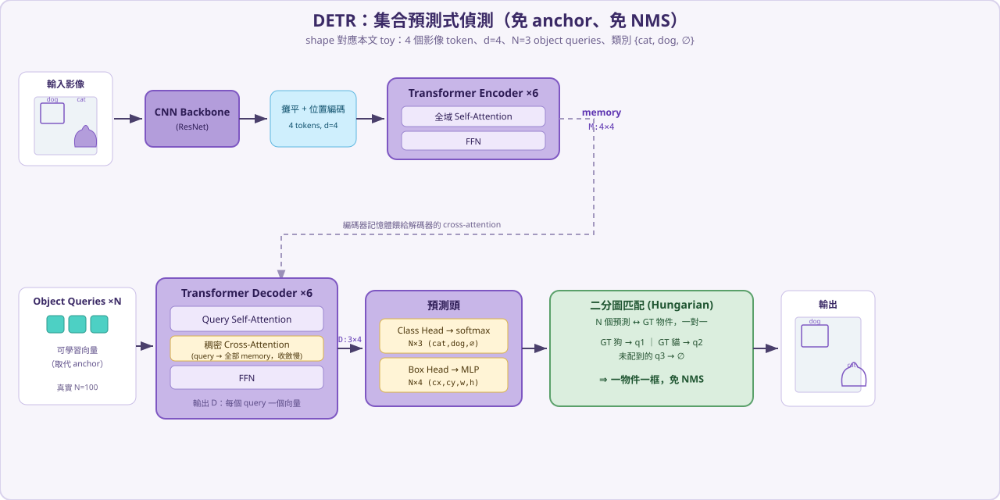

# DETR

DETR（**DE**tection **TR**ansformer，Carion et al., 2020）是第一個把物件偵測寫成**集合預測（set prediction）**的端到端模型。它把「偵測」想成：給模型固定數量的「點名額度」（object queries），每個額度直接吐出「一個物件的類別 + 框」，再用**二分圖匹配（Hungarian matching）**把預測和真實物件一對一配對——**完全不需要 anchor、不需要 NMS**。它是 Deformable DETR、DINO、RF-DETR 這整個 DETR 家族的起點。

> 這份筆記先講 DETR 為什麼革命、又留下哪些痛點（催生了後續的 Deformable/RF-DETR），再用一個能手算的 toy 範例把整條前向傳播算給你看，最後示範 Hungarian 匹配怎麼挑出「一物件一框」。

---

## 1) 故事背景：從「貼便利貼」到「集合預測」

2020 年以前，主流偵測器（Faster R-CNN、YOLO、SSD）都是「貼便利貼派」：先在影像上貼滿成千上萬張**候選框（anchor）**，每張問一次「有沒有東西？是什麼？框要修多少？」。這套很強，但有兩個惱人的工程包袱：

- **大量手工設計**：anchor 的尺寸、長寬比、密度，全靠人調。
- **NMS 後處理**：同一個物件會被很多框命中，必須用**非極大值抑制（NMS）**事後刪重複——這一步不可微、要調閾值、還會在密集場景出錯。

DETR 的洞見是：**偵測其實是「預測一個集合」**——影像裡有哪些物件，就是一個無序集合。於是它讓 Transformer 直接輸出固定 \(N\) 個預測（例如 100 個），訓練時用**二分圖匹配**把這 \(N\) 個預測和真實物件一對一配對，配到的算物件、配不到的算「背景 \(\varnothing\)」。因為匹配本身保證一對一，**天生就不會有重複框，於是不需要 NMS**；也因為 query 自己學會去哪裡找，**不需要 anchor**。

---

## 2) DETR 解決的痛點

**痛點①：手工 anchor。**
用 \(N\) 個可學習的 **object query** 取代成千上萬的 anchor，模型自己學每個 query 該負責什麼樣的位置/物件。

**痛點②：NMS 後處理。**
**set prediction + 二分圖匹配**讓一個 query 對一個真實物件，預測天生不重複，**移除 NMS**，整條管線端到端可微。

但 DETR 自己也留下三個痛點，正是後續模型要解決的：

- **痛點 A：收斂超慢。** 解碼器的 **cross-attention 是稠密的**——每個 query 一開始要看遍整張特徵圖的**所有**位置，訊號很發散，要訓練約 **500 個 epoch** 才收斂。 → Deformable DETR 用「可變形注意力」只採樣少數點來修正。
- **痛點 B：小物件差。** 只用**單尺度**特徵。 → Deformable DETR / DINO 引入多尺度。
- **痛點 C：高解析度貴。** 編碼器自注意力是 \(O(N^2)\)。 → RF-DETR 用 windowed attention 等手段壓成本。

> 一句話：**DETR 用「集合預測」把偵測變乾淨（免 anchor、免 NMS），但代價是收斂慢、對小物件弱。** 後面的 [RF-DETR](rf-detr.md) 就是把這些痛點一一補上的即時版本。

---

## 3) 架構總覽

對照上面的流程圖，由左到右：

| 模組 | 做的事 |
| --- | --- |
| **CNN Backbone（ResNet）** | 抽影像特徵圖，再用 1×1 卷積壓到 \(d\) 維。 |
| **攤平 + 位置編碼** | 把 \(H\times W\) 特徵圖攤成序列，加上 2D 位置編碼。 |
| **Transformer Encoder** | 多層自注意力，讓每個位置看全圖 → 記憶體特徵 \(M\)。 |
| **Transformer Decoder** | \(N\) 個 object query；每層 = query 自注意力 + **對 \(M\) 的稠密 cross-attention** + FFN。 |
| **預測頭** | Class Head（linear → **softmax**，含 \(\varnothing\) 類）+ Box Head（MLP → sigmoid → cx,cy,w,h）。 |
| **二分圖匹配（訓練）** | Hungarian：用「類別 + 框」成本把 \(N\) 個預測和 GT 一對一配對，免 NMS。 |

---

## 4) 一步一步的數值前向傳播（toy 範例）

我們用同一張「貓狗照片」（和 [RF-DETR](rf-detr.md) 一致，方便對照），把 DETR 整條 forward 算給你看。**真實超參數**放對照表，實際運算用可手算的小尺度。

> 規則：矩陣乘法只寫 \(A\cdot B=C\)（不展開元素內積），每個矩陣都標 **shape** 與數值（四捨五入兩位）。

### 假設的輸入與超參數

| 參數 | 真實 DETR（Carion 2020） | 本文 toy |
| --- | --- | --- |
| 輸入 | 影像 → ResNet-50 → 特徵圖（約 \(H/32\times W/32\)） | 2×2 = 4 個 token |
| \(d_{\text{model}}\) | 256 | 4 |
| encoder / decoder 層 | 6 / 6 | 1 / 1 |
| heads | 8 | 1 |
| object queries \(N\) | 100 | 3 |
| FFN hidden | 2048 | 8 |
| 類別 | COCO 91 類 + \(\varnothing\) | cat、dog + \(\varnothing\) |
| class head | linear → **softmax**（含 \(\varnothing\)） | 同 |
| box head | 3 層 MLP → sigmoid (cx,cy,w,h) | 1 層（示意） |
| 匹配成本 | class + L1 + GIoU | class + L1 |
| 訓練 | ~500 epochs | — |

**場景**：影像切成 2×2 網格，左上是狗、右上是天空、左下是地板、右下是貓。\(d=4\) 個維度想成 \([\text{紋理},\ \text{顏色},\ \text{邊緣},\ \text{平滑}]\)，四個 token 接近正交。

### Part A — CNN Backbone + 位置編碼

真實流程是 ResNet 抽特徵圖再壓到 \(d\) 維；這裡直接從 token 層級開始，加上位置編碼得到編碼器輸入 \(Z_0\)：

$$
Z_0=\begin{bmatrix} 0.90 & 0.15 & 0.10 & 0.15 \\ 0.15 & 0.10 & 0.95 & 0.10 \\ 0.10 & 0.15 & 0.15 & 0.90 \\ 0.15 & 0.90 & 0.10 & 0.15 \end{bmatrix}\quad (\mathbb{R}^{4\times4})
$$

### Part B — Transformer Encoder

編碼器是**全域自注意力**（令 \(W_Q=W_K=I\)，\(1/\sqrt d=0.5\)，\(W_V\) 為接近單位的混合矩陣）。它讓每個位置都看到全圖：

$$
A_{\text{enc}}=\mathrm{softmax}\!\left(\tfrac{QK^\top}{\sqrt d}\right)=\begin{bmatrix} 0.31 & 0.23 & 0.23 & 0.23 \\ 0.23 & 0.32 & 0.23 & 0.22 \\ 0.23 & 0.23 & 0.31 & 0.23 \\ 0.23 & 0.22 & 0.23 & 0.31 \end{bmatrix}
$$

經殘差 / LayerNorm / FFN 後得到**記憶體特徵 \(M\)**（每個位置仍保有自己的主特徵，對角線最大）：

$$
M=\begin{bmatrix} 1.73 & -0.53 & -0.67 & -0.53 \\ -0.47 & -0.63 & 1.73 & -0.63 \\ -0.68 & -0.51 & -0.54 & 1.73 \\ -0.51 & 1.73 & -0.70 & -0.52 \end{bmatrix}\quad (\mathbb{R}^{4\times4})
$$

### Part C — Transformer Decoder（object queries）

DETR 的 query 是**可學習的向量**（不是從影像挑的）。toy 用 3 個：\(q_1\) 偏好狗、\(q_2\) 偏好貓、\(q_3\) 偏好背景：

$$
Q_{\text{obj}}=\begin{bmatrix} 0.80 & 0.00 & 0.20 & 0.00 \\ 0.00 & 0.80 & 0.00 & 0.20 \\ 0.05 & 0.05 & 0.55 & 0.35 \end{bmatrix}\quad (\mathbb{R}^{3\times4})
$$

**Step C-1：query 自注意力**（讓 3 個 query 互相協調、去重）：

$$
A_{\text{self}}=\begin{bmatrix} 0.40 & 0.29 & 0.31 \\ 0.29 & 0.41 & 0.31 \\ 0.32 & 0.31 & 0.37 \end{bmatrix},\qquad
Q_{\text{sa}}=\begin{bmatrix} 1.67 & -0.67 & -0.13 & -0.86 \\ -0.68 & 1.70 & -0.75 & -0.28 \\ -0.87 & -0.91 & 1.54 & 0.24 \end{bmatrix}
$$

**Step C-2：稠密 Cross-Attention**（每個 query 對**全部 4 個記憶體位置**算注意力——這就是 DETR 的招牌，也是它收斂慢的原因）：

$$
A_{\text{cross}}=\mathrm{softmax}\!\left(\tfrac{Q_{\text{sa}}M^\top}{\sqrt d}\right)=
\begin{bmatrix} \mathbf{0.79} & 0.12 & 0.04 & 0.06 \\ 0.06 & 0.04 & 0.09 & \mathbf{0.81} \\ 0.04 & \mathbf{0.74} & 0.18 & 0.04 \end{bmatrix}\quad (\mathbb{R}^{3\times4})
$$

看這個 \(3\times4\) 矩陣：\(q_1\) 把 0.79 的注意力放在記憶體位置 0（狗），\(q_2\) 把 0.81 放在位置 3（貓），\(q_3\) 偏向位置 1（天空）。每個 query 都要掃過**所有位置**才學會聚焦——這就是「稠密」。殘差 / LN / FFN 後得到解碼器輸出 \(D\)：

$$
D=\begin{bmatrix} 1.70 & -0.58 & -0.30 & -0.82 \\ -0.57 & 1.71 & -0.80 & -0.34 \\ -0.77 & -0.89 & 1.61 & 0.05 \end{bmatrix}\quad (\mathbb{R}^{3\times4})
$$

> **痛點 A 對應**：因為一開始 \(A_{\text{cross}}\) 幾乎是亂猜，要很多 epoch 才會把注意力「收斂」到正確位置。Deformable DETR 改成只採樣少數點，就快很多。

### Part D — 預測頭（Class + Box）

**Class Head（DETR 用 softmax，含 \(\varnothing\) 類）：**

$$
\text{logits}=D\cdot W_{\text{cls}}+b=\begin{bmatrix} -0.82 & 2.38 & 0.48 \\ 2.39 & -0.80 & 0.47 \\ -1.25 & -1.08 & 1.03 \end{bmatrix}\ (\text{欄=cat,dog,}\varnothing)
$$

$$
\text{probs}=\mathrm{softmax}(\text{logits})=\begin{bmatrix} 0.03 & \mathbf{0.84} & 0.13 \\ \mathbf{0.84} & 0.03 & 0.12 \\ 0.08 & 0.10 & \mathbf{0.82} \end{bmatrix}
\;\Rightarrow\;
\begin{cases} q_1 \to \textbf{dog} \\ q_2 \to \textbf{cat} \\ q_3 \to \boldsymbol{\varnothing}\ (\text{no object}) \end{cases}
$$

注意 DETR 用**跨類 softmax**（含一個「無物件 \(\varnothing\)」類），這和 RF-DETR 的 per-class sigmoid+focal 不同。

**Box Head**（DETR 直接從 query 輸出**絕對**座標，無參考點；權重為示意）：

$$
\text{box}=\sigma(D\cdot W_{\text{box}})=\begin{bmatrix} 0.68 & 0.37 & 0.61 & 0.42 \\ 0.37 & 0.68 & 0.42 & 0.61 \\ 0.52 & 0.39 & 0.52 & 0.44 \end{bmatrix}\ (cx,cy,w,h)
$$

### Part E — 二分圖匹配（Hungarian）

訓練時，我們有 2 個真實物件：**狗**（在左上）、**貓**（在右下）。把 3 個預測和 2 個 GT 配對，成本用「\(-\) 對應類別機率 \(+\) 框的 L1 距離」：

$$
\text{Cost}=\begin{bmatrix} \mathbf{-0.06} & 0.64 \\ 0.74 & \mathbf{-0.17} \\ 0.48 & 0.66 \end{bmatrix}\quad (\text{列}=q_1,q_2,q_3;\ \text{欄}=\text{GT 狗, GT 貓})
$$

Hungarian 演算法找**總成本最小的一對一配對**：

- **GT 狗 → \(q_1\)**（成本 \(-0.06\) 最低）
- **GT 貓 → \(q_2\)**（成本 \(-0.17\) 最低）
- **\(q_3\) 沒被配到 → 標為 \(\varnothing\)**（它本來也預測 \(\varnothing\)）

> **痛點②對應**：因為是**一對一**匹配，一個物件只會有一個 query 負責，**天生不重複、不需要 NMS**。被配到的 query 算分類 + 框 loss，沒被配到的只算「要預測 \(\varnothing\)」的 loss。

### 總結流程（shape 一路追蹤）

| 階段 | 運算 | 輸出 shape |
| --- | --- | --- |
| Backbone + Pos | 特徵圖攤平 + 位置編碼 | \(4\times4\) |
| Encoder | 全域 self-attn + FFN → \(M\) | \(4\times4\) |
| Decoder self-attn | query 互相協調 | \(3\times4\) |
| Decoder cross-attn | query 對 \(M\) 稠密注意 | \(3\times4\)（\(A\) 為 \(3\times4\)） |
| Class Head | \(D\cdot W_{cls}\) → softmax | \(3\times3\) |
| Box Head | \(\sigma(D\cdot W_{box})\) | \(3\times4\) |
| Hungarian | 成本矩陣一對一配對 | \(3\times2\) |

一句話：**DETR 把偵測變成「\(N\) 個 query 各認領一個物件，二分圖匹配確保一物件一框」——優雅地拿掉 anchor 與 NMS，代價是稠密 cross-attention 帶來的慢收斂。**

---

## 5) 限制與後續發展

| 模型 | 相對 DETR 的改進 |
| --- | --- |
| **Deformable DETR** | 可變形注意力（只採樣少數點）+ 多尺度特徵 → 收斂快 10×、小物件更好。 |
| **DAB-DETR / DN-DETR** | 把 query 設計成「動態 anchor box」、加入去噪訓練，進一步加速收斂。 |
| **DINO** | 集大成：對比去噪、混合 query 選擇、look-forward-twice，成為 SOTA 偵測骨架。 |
| **[RF-DETR](rf-detr.md)** | DINOv2 骨幹 + windowed attention + 權重共享 NAS，把 DETR 家族做成**即時**可部署。 |

---

## 6) 參考資料

- DETR 論文：[End-to-End Object Detection with Transformers (arXiv:2005.12872)](https://arxiv.org/abs/2005.12872)
- 官方程式碼：[facebookresearch/detr](https://github.com/facebookresearch/detr)
- 後續：[Deformable DETR (arXiv:2010.04159)](https://arxiv.org/abs/2010.04159)、[DN-DETR (arXiv:2203.01305)](https://arxiv.org/abs/2203.01305)、[DINO (arXiv:2203.03605)](https://arxiv.org/abs/2203.03605)
- 延伸閱讀：[RF-DETR](rf-detr.md)、[Grounding DINO](grounding-dino.md)
