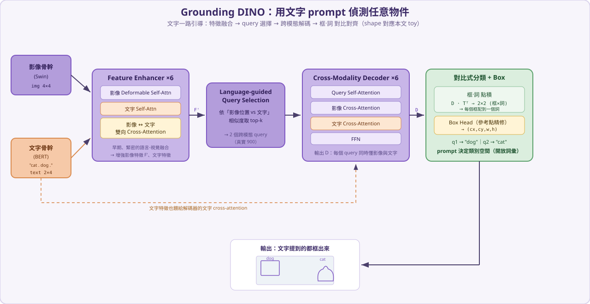

# Grounding DINO

Grounding DINO（Liu et al., 2023）是一個**開放詞彙（open-vocabulary / open-set）偵測器**：你給它一張影像**加一段文字 prompt**（例如 `"cat . dog ."` 或 `"the person holding an umbrella"`），它就把文字裡提到的東西全部框出來——**不限於訓練時看過的固定類別**。它把 **DINO 偵測器**和 **GLIP 的語言-視覺對齊**結合起來，在偵測流程的多個階段把文字「融」進視覺特徵。

> 這份筆記先講為什麼需要「用文字找物件」，再用一個能手算的 toy 範例，把**影像 + 文字 prompt** 一步一步餵進模型，看文字怎麼一路引導，最後用**對比式（contrastive）框-詞對齊**把每個框配到對應的詞。

---

## 1) 故事背景：從「固定類別」到「用文字找任何東西」

傳統偵測器（[DETR](detr.md)、YOLO、RF-DETR specialist 版）都是**閉集合（closed-set）**：訓練時定好 80 個 COCO 類別，模型就只會吐這 80 類。想偵測新類別？得重新標註、重新訓練分類頭。

但人類找東西是**用語言**的：「幫我找畫面裡的**安全帽**和**反光背心**」。Grounding DINO 的目標就是這個——把**任意文字**當成查詢條件。它的關鍵差別在於：

- 不再有「固定的分類頭」。**類別空間 = 你當下給的 prompt**。
- 它把文字特徵**深度融合**進偵測的每一步（特徵增強、query 選擇、解碼、分類），不像 CLIP 只在最後算一次圖文相似度。

可以這樣記：**CLIP 是「整張圖 ↔ 整句話」的對齊；Grounding DINO 是「每個框 ↔ 每個詞」的對齊**，而且是在一個偵測器內端到端完成。

---

## 2) Grounding DINO 解決的痛點

**痛點①：閉集合、換類別要重訓。**
把偵測重寫成**語言條件**問題：prompt 決定要找什麼。要找新東西，改 prompt 即可，**零樣本（zero-shot）**就能偵測。

**痛點②：語言與視覺融合太淺。**
GLIP 等早期方法融合有限。Grounding DINO 在三個地方做**緊密融合（tight fusion）**：

- **Feature Enhancer**：影像特徵與文字特徵做**雙向 cross-attention**，互相注入資訊。
- **Language-guided Query Selection**：用「和文字最相關」的影像位置當作解碼器 query 的起點。
- **Cross-Modality Decoder**：每個 query 同時對**影像**和**文字**做 cross-attention。

**痛點③：怎麼判斷一個框是哪個詞？**
不用固定分類頭，而用**對比式對齊**：把 query 輸出和每個文字 token 做**點積**，分數最高的詞就是這個框的標籤。這天然支援任意長度、任意內容的 prompt。

> 一句話：**Grounding DINO = DINO（強偵測器）+ 把語言融進每一步 + 用「框-詞點積」當分類器**，於是能用文字找任何東西。

---

## 3) 架構總覽

對照上面的流程圖：

| 模組 | 做的事 |
| --- | --- |
| **影像骨幹（Swin）** | 抽多尺度影像特徵。 |
| **文字骨幹（BERT）** | 把 prompt 編碼成一串文字 token 特徵。 |
| **Feature Enhancer** | 影像 deformable self-attn + 文字 self-attn + **影像↔文字雙向 cross-attn**，輸出增強後的影像/文字特徵。 |
| **Language-guided Query Selection** | 依「影像位置 vs 文字」的相似度，挑出最相關的位置當 query。 |
| **Cross-Modality Decoder** | 每層 = query self-attn + **影像** cross-attn + **文字** cross-attn + FFN。 |
| **對比式分類頭 + Box Head** | query·文字tokenᵀ → 對齊分數（哪個詞）；Box Head → (cx,cy,w,h)（DINO 式參考點精修）。 |

---

## 4) 一步一步的數值前向傳播（toy 範例）

我們用同一張「貓狗照片」（和 [DETR](detr.md) / [RF-DETR](rf-detr.md) 一致），prompt 給 `"cat . dog ."`，看**文字怎麼一路引導偵測**。真實超參數放對照表，運算用可手算的小尺度。

### 假設的輸入與超參數

| 參數 | 真實 Grounding DINO（Liu 2023） | 本文 toy |
| --- | --- | --- |
| 影像骨幹 | Swin-T / Swin-L → 多尺度特徵 | 2×2 = 4 個 token，\(d=4\) |
| 文字骨幹 | BERT-base | prompt `"cat . dog ."` → 2 個 token，\(d=4\) |
| Feature Enhancer | 6 層（影像 deformable self-attn＋文字 self-attn＋雙向 cross-attn） | 1 步影像↔文字 cross-attn |
| query 數 | 900 | 2 |
| query 選擇 | language-guided，取 top-900 | 取 top-2 |
| decoder | 6 層（self＋影像 cross(deformable)＋文字 cross＋FFN） | 1 層 |
| 分類頭 | **對比式**（query·文字 token） | 同 |
| box head | MLP，DINO 式參考點精修 | 1 層＋參考點精修 |
| 訓練資料 | O365、GoldG、Cap4M…（偵測＋接地） | — |

**場景**：影像 2×2 網格（左上狗、右上天空、左下地板、右下貓）。文字兩個詞 \(t_{\text{cat}},t_{\text{dog}}\)，我們讓「cat」這個詞向量落在影像的「顏色」維（dim1，貓的主維），「dog」落在「紋理」維（dim0，狗的主維）——這就是 BERT 學到的「詞 ↔ 視覺概念」對齊。

$$
T=\begin{bmatrix} 0.10 & 0.90 & 0.10 & 0.10 \\ 0.90 & 0.10 & 0.10 & 0.10 \end{bmatrix}\ \begin{smallmatrix}\leftarrow t_{\text{cat}}\\ \leftarrow t_{\text{dog}}\end{smallmatrix}\quad(\mathbb{R}^{2\times4}),\qquad
F_{\text{img}}=\begin{bmatrix} 0.90 & 0.15 & 0.10 & 0.15 \\ 0.15 & 0.10 & 0.95 & 0.10 \\ 0.10 & 0.15 & 0.15 & 0.90 \\ 0.15 & 0.90 & 0.10 & 0.15 \end{bmatrix}\quad(\mathbb{R}^{4\times4})
$$

### Part A — Feature Enhancer（影像↔文字融合）

讓**每個影像 token 對文字做 cross-attention**（影像當 query、文字當 key/value），把「和你相關的詞」的資訊注入影像特徵：

$$
A_{\text{img}\to\text{txt}}=\mathrm{softmax}\!\left(\tfrac{F_{\text{img}}T^\top}{\sqrt d}\right)=\begin{bmatrix} 0.43 & 0.57 \\ 0.50 & 0.50 \\ 0.50 & 0.50 \\ 0.57 & 0.43 \end{bmatrix}\quad(\mathbb{R}^{4\times2})
$$

殘差 + LN 後得到**文字增強的影像特徵 \(F'\)**：

$$
F'=\mathrm{LN}(F_{\text{img}}+A_{\text{img}\to\text{txt}}\,T)=\begin{bmatrix} 1.65 & -0.07 & -0.84 & -0.74 \\ 0.10 & -0.10 & 1.41 & -1.41 \\ -0.11 & 0.11 & -1.41 & 1.41 \\ -0.07 & 1.65 & -0.84 & -0.74 \end{bmatrix}
$$

（真實模型還會做反方向的「文字 ← 影像」cross-attention，這裡為精簡只示範一個方向。）

> **痛點②對應**：融合發生在**偵測器內部、很早期**，不是事後才算一次圖文相似度。

### Part B — Language-guided Query Selection

對每個影像位置，算它和文字的相似度，取「對某個詞最像」的分數當作 objectness：

$$
S_{\text{sel}}=F'T^\top=\begin{bmatrix} -0.05 & 1.32 \\ -0.08 & 0.08 \\ 0.09 & -0.09 \\ 1.32 & -0.05 \end{bmatrix},\qquad
\text{score}=\sigma\!\big(\max_{\text{詞}}S_{\text{sel}}\big)=\begin{bmatrix} 0.79 \\ 0.52 \\ 0.52 \\ 0.79 \end{bmatrix}
$$

位置 0（狗）和位置 3（貓）分數最高（各 0.79）——因為它們分別和「dog」「cat」很像。選這 **top-2** 當 query，並記下它們的格子中心當參考點：

$$
Q_0=F'[\{0,3\}]=\begin{bmatrix} 1.65 & -0.07 & -0.84 & -0.74 \\ -0.07 & 1.65 & -0.84 & -0.74 \end{bmatrix},\qquad \text{ref}=\begin{bmatrix} 0.25 & 0.25 \\ 0.75 & 0.75 \end{bmatrix}
$$

> **痛點①對應**：query 從哪裡出發，是**文字決定的**。prompt 沒提到的東西，相似度低、不會被選成 query。

### Part C — Cross-Modality Decoder

每層讓 query 同時吸收影像與文字資訊：**self-attn → 影像 cross-attn → 文字 cross-attn → FFN**。

影像 cross-attention（query 對 4 個影像位置）：

$$
A_{\text{q}\to\text{img}}=\begin{bmatrix} 0.65 & 0.09 & 0.09 & 0.18 \\ 0.18 & 0.07 & 0.10 & 0.64 \end{bmatrix}\quad(\mathbb{R}^{2\times4})
$$

文字 cross-attention（query 對 2 個文字 token）：

$$
A_{\text{q}\to\text{txt}}=\begin{bmatrix} 0.37 & 0.63 \\ 0.63 & 0.37 \end{bmatrix}\quad(\mathbb{R}^{2\times2})
$$

經 FFN / 殘差 / LN 後得到解碼器輸出 \(D\)：

$$
D=\begin{bmatrix} 1.53 & 0.26 & -0.91 & -0.87 \\ 0.26 & 1.53 & -0.98 & -0.81 \end{bmatrix}\quad(\mathbb{R}^{2\times4})
$$

### Part D — 對比式框-詞對齊 + Box Head

**這是 Grounding DINO 取代「固定分類頭」的關鍵**：把每個 query 和每個文字 token 做**點積**，分數最高的詞就是這個框的標籤：

$$
\text{align}=D\cdot T^\top=\begin{bmatrix} 0.21 & \mathbf{1.22} \\ \mathbf{1.22} & 0.21 \end{bmatrix}\ \begin{smallmatrix}(\text{欄}=t_{\text{cat}},\,t_{\text{dog}})\end{smallmatrix},\qquad
\sigma(\text{align})=\begin{bmatrix} 0.55 & \mathbf{0.77} \\ \mathbf{0.77} & 0.55 \end{bmatrix}
$$

$$
\Rightarrow\ \text{query 1（左上那塊）} \to \textbf{“dog”}\ (0.77),\qquad \text{query 2（右下那塊）} \to \textbf{“cat”}\ (0.77)
$$

**Box Head**（DINO 式：相對參考點精修，\(\text{中心}=\sigma(\mathrm{logit}(\text{ref})+\Delta)\)）：

$$
\text{box}=\begin{bmatrix} 0.35 & 0.23 & 0.57 & 0.48 \\ 0.72 & 0.83 & 0.47 & 0.57 \end{bmatrix}\ (cx,cy,w,h)
$$

狗框中心 \((0.35,0.23)\) 落在左上、貓框 \((0.72,0.83)\) 落在右下——和它們在影像中的位置吻合。

> **痛點③對應**：分類器就是「框向量 · 詞向量」。換 prompt（例如只給 `"cat ."`），整個類別空間就跟著變——這就是開放詞彙。

### 總結流程（shape 一路追蹤）

| 階段 | 運算 | 輸出 shape |
| --- | --- | --- |
| 影像 / 文字編碼 | Swin / BERT | 影像 \(4\times4\)、文字 \(2\times4\) |
| Feature Enhancer | 影像↔文字 cross-attn → \(F'\) | \(4\times4\) |
| Query Selection | 文字相似度取 top-2 → \(Q_0\) | \(2\times4\) |
| Cross-Modality Decoder | self ＋ 影像 cross ＋ 文字 cross ＋ FFN → \(D\) | \(2\times4\) |
| 對比式分類 | \(D\cdot T^\top\) → sigmoid | \(2\times2\)（框 × 詞） |
| Box Head | 參考點 + \(\Delta\) | \(2\times4\) |

一句話：**Grounding DINO 讓文字一路引導偵測——從特徵融合、query 挑選到最後的「框·詞」對比分類——於是你給什麼詞，它就找什麼物件。**

---

## 5) 與 CLIP / DETR / RF-DETR 的關係

| 模型 | 一句話 | 和 Grounding DINO 的關係 |
| --- | --- | --- |
| **CLIP** | 整張圖 ↔ 整句話的對比對齊 | Grounding DINO 把「對比對齊」下放到**框 ↔ 詞** 的細粒度 |
| **[DETR](detr.md)** | 集合預測、免 anchor/NMS | Grounding DINO 的偵測骨架（經 DINO 強化）源自 DETR |
| **[RF-DETR](rf-detr.md)** | 即時、固定類別 specialist | 互補：固定類別要快選 RF-DETR；要用文字找任意物件選 Grounding DINO |

選型直覺：**類別固定、要快** → RF-DETR；**要用文字 prompt 找任意/新類別、可接受較慢** → Grounding DINO。兩者常搭配（例如先用 Grounding DINO 自動標註，再 fine-tune RF-DETR）。

---

## 6) 參考資料

- Grounding DINO 論文：[Grounding DINO: Marrying DINO with Grounded Pre-Training for Open-Set Object Detection (arXiv:2303.05499)](https://arxiv.org/abs/2303.05499)
- 官方程式碼：[IDEA-Research/GroundingDINO](https://github.com/IDEA-Research/GroundingDINO)
- 基礎：[DINO (arXiv:2203.03605)](https://arxiv.org/abs/2203.03605)、[GLIP (arXiv:2112.03857)](https://arxiv.org/abs/2112.03857)、[CLIP (arXiv:2103.00020)](https://arxiv.org/abs/2103.00020)
- 延伸：[DETR](detr.md)、[RF-DETR](rf-detr.md)、Grounded-SAM（接 SAM 出遮罩）
