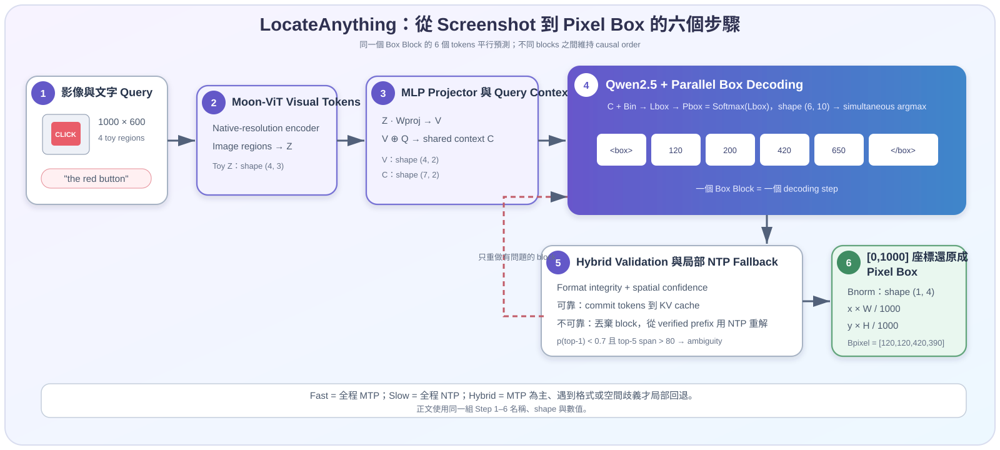

# LocateAnything

LocateAnything（Wang et al., 2026）是一個專門做**視覺定位（Visual Grounding）**的視覺語言模型（Vision-Language Model, VLM）。你給它一張影像和一句話，例如 `"the red button"`，它會用座標指出紅色按鈕在哪裡。它也能處理一般物件偵測、密集物件偵測、GUI 元件定位、文字定位（OCR localization）、文件版面定位與 point-based localization。

它最重要的設計叫做 **Parallel Box Decoding (PBD)**：不再把一個框的四個座標拆開、逐 token 慢慢生成，而是把完整 bounding box 視為一個不可拆的 **atomic unit**，在同一個 decoding step 內平行預測。



> 先記住一句話：**LocateAnything 不是讓所有 bounding boxes 一次全部出現，而是讓「同一個框裡的 6 個 token」在一個 step 內一起預測；不同 block 之間仍維持 causal 順序。**

---

## 1) 故事背景：GUI agent 卡在「一個座標一個座標念」

想像一個 GUI agent 正在操作購物網站。使用者說：

> Click the red button.

模型先看懂畫面，也知道紅色按鈕在哪裡，但它仍要把位置轉成文字序列。如果按鈕的框是 \((120,200,420,650)\)，傳統 generative VLM 常用 **Next-Token Prediction (NTP)** 依序輸出：

```text
<box> → <120> → <200> → <420> → <650> → </box>
```

這就像導航員明明已經知道完整地址，卻每次只能說一個字，還要等上一個字說完才能說下一個字。它帶來三個問題：

1. **慢**：一個框需要多個 sequential decoding steps；畫面裡有幾百個物件時，延遲會一直累積。
2. **幾何關係被拆散**：\(x_1,y_1,x_2,y_2\) 共同描述同一個矩形，但 NTP 把它們當成先後出現的獨立 token。
3. **錯誤會往後傳**：前面座標選錯，後面只能在錯誤 prefix 上繼續生成。

一般的 **Multi-Token Prediction (MTP)** 雖然能一次猜多個 token，卻常按照固定長度任意切塊，可能把上一個框的結尾、下一個類別名稱和另一個框的座標塞進同一塊。LocateAnything 的回答是：**既然四個座標天生屬於同一個框，就讓 block 邊界和 box 邊界對齊。**

---

## 2) 四種座標 decoding 方法有什麼差別？

| 方法 | 如何輸出 `(120, 200, 420, 650)` | 主要問題或優點 |
| --- | --- | --- |
| **Textual Digit Decoding** | 逐字生成 `1`、`2`、`0`、`,`…… | token 最多，速度最慢，還可能出現格式錯誤。 |
| **Quantized Coordinate Decoding + NTP** | 依序生成 `<120>`、`<200>`、`<420>`、`<650>` | 比逐 digit 短，但四個 coordinate tokens 仍是 sequential。 |
| 一般 **MTP** | 固定每次猜 \(k\) 個 token | 加速但 block 可能跨越 box 或 category 邊界，結構沒有對齊。 |
| **Parallel Box Decoding (PBD)** | 一個長度固定的 box block 同步預測完整座標 | block 就是一個幾何單位，兼顧 parallelism 與 geometric coherence。 |

PBD 的「平行」發生在**同一個 block 內**。第 \(i\) 個 block 仍會依賴先前已確認的 blocks：

$$
P(B\mid Z,E)=\prod_{i=1}^{N}P(b_i\mid b_{<i},Z,E)
$$

- \(Z\)：影像經 vision encoder 得到的 visual tokens。
- \(E\)：文字 query。
- \(b_i\)：第 \(i\) 個 box-aligned block。
- \(b_{<i}\)：已經確認並寫進 KV cache 的先前 blocks。

---

## 3) 真實架構：Moon-ViT → MLP projector → Qwen2.5

LocateAnything-3B 建立在 native-resolution VLM 上，主要資料流如下：

| 階段 | 模組 | 做的事 |
| --- | --- | --- |
| 1 | **Moon-ViT vision encoder** | 依原生解析度抽取 visual tokens，保留細小文字、GUI icon 和密集物件需要的空間細節。 |
| 2 | **MLP projector** | 把 vision encoder 的特徵維度轉成 language decoder 能接收的維度。 |
| 3 | **Qwen2.5 language decoder** | 同時讀取 visual tokens、文字 query 與先前輸出，產生下一個 structured block。 |
| 4 | **Parallel Box Decoding (PBD)** | 在一個 decoding step 內解析長度為 6 的 block。 |
| 5 | **Hybrid validator** | 檢查 format 與 spatial confidence；不可靠時只重解碼有問題的 block。 |

Qwen2.5 decoder 內部仍是 Transformer：反覆經過 masked self-attention、FFN 與 LM head。PBD 改變的重點不是 vision encoder，也不是把 Transformer 換掉，而是**輸出單位、attention mask、訓練目標與 inference loop**。若要先複習 decoder 的基本運算，可參考 [Transformer](../../llm/core/transformer.md) 與 [Attention](../../llm/core/attention.md)。

---

## 4) Box-aligned block：每一塊固定長度 \(L=6\)

LocateAnything 先把連續座標正規化到 \([0,1000]\)，再量化為 coordinate tokens。所有 block 都固定為 6 個位置；用不到的位置填 `<null>`，以維持一致的 tensor shape。

以 query `"the red button"` 為例：

| Block type | 長度為 6 的示意內容 | 用途 |
| --- | --- | --- |
| **Semantic Block** | `<ref>`, `red`, `button`, `</ref>`, `<null>`, `<null>` | 說明接下來定位的是哪個語意實體；太長的名稱可拆成多個連續 blocks。 |
| **Box Block** | `<box>`, `<120>`, `<200>`, `<420>`, `<650>`, `</box>` | 四個座標與兩個 structural tokens 恰好組成一個 atomic box。 |
| **Negative Block** | `<box>`, `none`, `</box>`, `<null>`, `<null>`, `<null>` | 明確表示 query 對應的物件不存在。 |
| **End Block** | `<eos>`, `<null>`, `<null>`, `<null>`, `<null>`, `<null>` | 宣告整段生成結束。 |

`Semantic Block → Box Block → End Block` 串起來後，對外可還原成：

```text
<ref>red button</ref><box><120><200><420><650></box>
```

`<null>` 只用來補齊 block，不會保留在最後答案。

---

## 5) 聯合訓練：同一份答案，同時練 NTP 與 MTP

只訓練平行輸出，可能破壞原本 language decoder 擅長的 causal reasoning；只訓練 NTP，又學不會一次完成整個 box。LocateAnything 因此把同一份 ground truth 做成兩種表示：

$$
x_{\text{all}}=x_{\text{vis}}\oplus x_q\oplus x_{\text{ntp}}\oplus x_{\text{blk}}
$$

- \(x_{\text{vis}}\)：影像 visual tokens。
- \(x_q\)：query tokens。
- \(x_{\text{ntp}}\)：標準 token-by-token 序列。
- \(x_{\text{blk}}\)：依 Semantic / Box / Negative / End 規則切好的 block-wise MTP 序列。
- \(\oplus\)：sequence concatenation，不是矩陣加法。

建立 \(x_{\text{blk}}\) 時，每個 block 保留第一個 token 當 prediction context，其餘位置換成 `[mask]`，讓模型一起還原該 block 的內容。三個 target blocks 可寫成：

```text
Semantic target: [<ref>, red, button, </ref>, <null>, <null>]
Box target:      [<box>, <120>, <200>, <420>, <650>, </box>]
End target:      [<eos>, <null>, <null>, <null>, <null>, <null>]
```

### 5.1 三種 attention 可見範圍

以下矩陣都用 `1` 表示「可以 attend」，`0` 表示「不可 attend」。

**NTP token-level causal visibility \(M_{\text{ntp}}\)，shape \(6\times6\)**：每個位置只能看自己與前面的位置。

$$
M_{\text{ntp}}=
\begin{bmatrix}
1&0&0&0&0&0\\
1&1&0&0&0&0\\
1&1&1&0&0&0\\
1&1&1&1&0&0\\
1&1&1&1&1&0\\
1&1&1&1&1&1
\end{bmatrix}
\quad\text{shape}=(6,6)
$$

**Segment visibility \(M_{\text{segment}}\)，shape \(4\times4\)**：欄與列依序為 shared context \(C\)、NTP stream \(N\)、第一個 MTP block \(B_1\)、第二個 MTP block \(B_2\)。NTP 與 MTP streams 彼此隔離，兩者都能看 shared context；後面的 block 可以看前面的 committed block。

$$
M_{\text{segment}}=
\begin{array}{c|cccc}
 & C&N&B_1&B_2\\\hline
C   &1&0&0&0\\
N   &1&1&0&0\\
B_1 &1&0&1&0\\
B_2 &1&0&1&1
\end{array}
\quad\text{shape}=(4,4)
$$

**Block 內雙向可見矩陣 \(M_{\text{intra}}\)，shape \(6\times6\)**：同一個 block 的六個位置彼此都能溝通，這就是 **bidirectional intra-block attention**。

$$
M_{\text{intra}}=
\begin{bmatrix}
1&1&1&1&1&1\\
1&1&1&1&1&1\\
1&1&1&1&1&1\\
1&1&1&1&1&1\\
1&1&1&1&1&1\\
1&1&1&1&1&1
\end{bmatrix}
\quad\text{shape}=(6,6)
$$

這三個規則合起來就是 **block-causal attention**：block 之間維持 causal，block 內部則可以雙向互看。最後同時最小化兩份 cross-entropy loss：

$$
\mathcal{L}=\mathcal{L}_{\text{ntp}}+\mathcal{L}_{\text{mtp}}
$$

例如 toy batch 得到 \(\mathcal{L}_{\text{ntp}}=0.42\)、\(\mathcal{L}_{\text{mtp}}=0.31\)，總 loss 就是 \(0.42+0.31=0.73\)。


---

## 6) 完整數值範例：從 GUI screenshot 到 pixel box

我們用一張寬 \(W_{\text{img}}=1000\)、高 \(H_{\text{img}}=600\) 的 GUI screenshot，query 是 `"the red button"`。為了能手算，以下把真實模型縮成 4 個 visual tokens、hidden dimension 2 的 toy model。

> **重要：**以下所有 feature、embedding 與 probability 都是教學用 toy values，只為追蹤資料如何流動，不是 `nvidia/LocateAnything-3B` 的真實 hidden values 或輸出機率。真實 Transformer 維度和 vocabulary 都大得多。

### Step 1 — Moon-ViT 產生 visual tokens

把 screenshot 簡化成 \(2\times2\) 四個區域。Moon-ViT 的 toy 輸出為 **visual tokens \(Z\)**，shape \(4\times3\)：

$$
Z=
\begin{bmatrix}
1.0&0.0&1.0\\
0.0&1.0&1.0\\
1.0&1.0&0.0\\
0.0&1.0&0.0
\end{bmatrix}
\quad\text{shape}=(4,3)
$$

每一列是一個 image region，每一欄可想成 toy 視覺屬性。真實 feature 不是人工指定的「紅色欄」或「按鈕欄」，而是訓練學到的 dense representation。

### Step 2 — MLP projector 對齊維度

為了示範，toy MLP projector 簡化成一個線性矩陣 **projector weight \(W_{\text{proj}}\)**，shape \(3\times2\)：

$$
W_{\text{proj}}=
\begin{bmatrix}
0.5&0.2\\
0.1&0.7\\
0.4&0.1
\end{bmatrix}
\quad\text{shape}=(3,2)
$$

矩陣關係只需寫成：

$$
\underbrace{Z}_{(4,3)}\cdot
\underbrace{W_{\text{proj}}}_{(3,2)}=
\underbrace{V}_{(4,2)}
$$

得到 **projected visual tokens \(V\)**：

$$
V=
\begin{bmatrix}
0.9&0.3\\
0.5&0.8\\
0.6&0.9\\
0.1&0.7
\end{bmatrix}
\quad\text{shape}=(4,2)
$$

### Step 3 — 加入 query embeddings

`the`、`red`、`button` 三個 token 的 toy **query embeddings \(Q\)** 為：

$$
Q=
\begin{bmatrix}
0.2&0.1\\
0.9&0.2\\
0.3&0.8
\end{bmatrix}
\quad\text{shape}=(3,2)
$$

把四個 projected visual tokens 與三個 query tokens 串接，得到 language decoder 的 **shared context \(C=V\oplus Q\)**：

$$
C=
\begin{bmatrix}
0.9&0.3\\
0.5&0.8\\
0.6&0.9\\
0.1&0.7\\
0.2&0.1\\
0.9&0.2\\
0.3&0.8
\end{bmatrix}
\quad\text{shape}=(7,2)
$$

前四列來自 image，後三列來自 query。Qwen2.5 decoder 會以 attention 讓文字和視覺資訊互相作用，再根據 shared context、先前 committed blocks 與目前的 masked block 產生六個位置的 token probabilities。

### Step 4 — 一個 step 產生完整 Box Block

為了完整列出所有值，toy vocabulary 只保留本例需要的 10 個 tokens，欄順序是：

```text
[<box>, <120>, <200>, <390>, <405>, <420>, <470>, <501>, <650>, </box>]
```

Qwen2.5 decoder 經 LM head 與 softmax 後，得到 **box token probability matrix \(P_{\text{box}}\)**，shape \(6\times10\)。每一列對應 block 的一個位置，每列總和皆為 1：

$$
P_{\text{box}}=
\begin{bmatrix}
0.91&0.01&0.01&0.01&0.01&0.01&0.01&0.01&0.01&0.01\\
0.01&0.90&0.02&0.01&0.01&0.01&0.01&0.01&0.01&0.01\\
0.01&0.02&0.89&0.01&0.01&0.01&0.01&0.01&0.02&0.01\\
0.01&0.01&0.01&0.08&0.12&0.61&0.09&0.05&0.01&0.01\\
0.01&0.01&0.01&0.01&0.01&0.02&0.01&0.01&0.90&0.01\\
0.01&0.01&0.01&0.01&0.01&0.01&0.01&0.01&0.01&0.91
\end{bmatrix}
\quad\text{shape}=(6,10)
$$

六列同時取 argmax，得到：

```text
[<box>, <120>, <200>, <420>, <650>, </box>]
```

這正是一個完整 box。若用 NTP，要依序走 6 個 decoding steps；PBD 在這個 box block 內只用 1 個 parallel step。

### Step 5 — Hybrid Mode 檢查 spatial ambiguity

雖然第 4 列的 argmax 是 `<420>`，但它的 top-1 probability 只有：

$$
p_{\text{top-1}}=0.61<0.7
$$

前五名 coordinate candidates 依序涵蓋 `420、405、470、390、501`。它們在 \([0,1000]\) 座標空間的跨度是：

$$
\max(420,405,470,390,501)-\min(420,405,470,390,501)
=501-390=111>80
$$

兩個條件同時成立，因此觸發 **spatial ambiguity**。Hybrid Mode 會：

1. 丟棄整個未確認的 Box Block，不把它寫入 KV cache。
2. 回到上一個 verified prefix，也就是已確認的 Semantic Block。
3. 暫時切換成 **NTP**，逐 token 重解碼這一個 block。
4. 得到格式正確、信心較穩定的 `<box><120><200><420><650></box>`。
5. 把確認過的 tokens 寫入 KV cache，下一個 block 再切回 **MTP**。

另一種 fallback 原因叫 **format irregularity**，例如 block 內混入 `</ref>`：

```text
<box><120></ref><420><650></box>
```

這種輸出即使 coordinate confidence 很高也不能構成合法 Box Block，因此同樣直接回退到 NTP。

### Step 6 — 從 `[0,1000]` 換成 pixel coordinates

確認後的 **normalized box \(B_{\text{norm}}\)** 為：

$$
B_{\text{norm}}=
\begin{bmatrix}
120&200&420&650
\end{bmatrix}
\quad\text{shape}=(1,4)
$$

轉換公式是：

$$
x_{\text{pixel}}=\frac{x}{1000}W_{\text{img}},\qquad
y_{\text{pixel}}=\frac{y}{1000}H_{\text{img}}
$$

所以 **pixel box \(B_{\text{pixel}}\)** 為：

$$
B_{\text{pixel}}=
\begin{bmatrix}
120&120&420&390
\end{bmatrix}
\quad\text{shape}=(1,4)
$$

也就是左上角 \((120,120)\)、右下角 \((420,390)\)。至此，資料已依序走完 screenshot → visual tokens → projector → query fusion → parallel box probabilities → Hybrid validation → pixel box。

---

## 7) 三種 inference mode 怎麼選？

| Mode | Decoding 行為 | 論文報告的 throughput | 適合情境 |
| --- | --- | ---: | --- |
| **Slow Mode (NTP)** | 每個 token autoregressive decoding | 4.3 BPS | 離線高精度標註、final-pass data curation。 |
| **Fast Mode (MTP)** | 每個 box-aligned block 內平行預測 | 15.3 BPS | 即時性優先、場景相對單純。 |
| **Hybrid Mode** | 預設 MTP，遇到 format / spatial ambiguity 才局部回退 NTP | 12.7 BPS | production pipeline 的預設折衷。 |

這些 BPS（Boxes Per Second）數字不是跨硬體都固定的速度。論文的 throughput benchmark 使用單張 NVIDIA H100、COCO、BF16、batch size 1；因此比較其他部署時，必須同時看 GPU、輸入解析度、batch size、attention backend 和輸出 box 數量。

論文也說明，每次 MTP step 後只保留真正 committed tokens 的 KV cache；`[mask]` 與重複的 anchor token 會被移除，確保下一步看到的 prefix 和 causal training history 一致。

---

## 8) LocateAnything-Data：不只看一般照片

PBD 解決「怎麼輸出」，大量且多樣的資料則解決「模型看過哪些定位問題」。作者整理的 LocateAnything-Data 包含約：

- **12M unique images**
- **138M language queries**
- **785M bounding boxes**

| 任務 | Query 比例 | 學到的能力 |
| --- | ---: | --- |
| General Object Detection | 66.9% | 一般與密集物件的 box localization。 |
| GUI Element Grounding | 16.5% | 找按鈕、icon、輸入框，支援 embodied / GUI agents。 |
| Referring Comprehension | 7.3% | 理解「穿紅衣服的人」這類自然語言描述。 |
| Text Localization (OCR) | 3.6% | 找到影像中文字的位置。 |
| Layout Grounding | 3.5% | 文件、表格與版面區塊定位。 |
| Point-Based Localization | 2.2% | 只需回傳一個 point 的細粒度定位。 |

在作者報告的 **Hybrid Mode** 結果中，LocateAnything-3B 達到 12.7 BPS；同一份結果摘要也列出 LVIS mean F1 50.7、COCO mean F1 54.7、M6Doc mean F1 70.1，以及 ScreenSpot-Pro 平均 60.3。這些數字應解讀為特定 benchmark 與 evaluation protocol 下的論文結果，不等於每個自有資料集都會得到相同表現。


---

## 9) 官方 `LocateAnythingWorker` Quick Start

官方程式碼位於 Eagle repository 的 `Embodied` 目錄：

```bash
git clone https://github.com/NVlabs/Eagle.git eagle
cd eagle/Embodied
pip install -e .
```

最小 Python 範例：

```python
from PIL import Image
from locateanything_worker import LocateAnythingWorker

worker = LocateAnythingWorker("nvidia/LocateAnything-3B")
image = Image.open("example.jpg").convert("RGB")

# Object Detection
print(worker.detect(image, ["person", "car", "bicycle"])["answer"])

# Phrase Grounding
print(worker.ground_multi(image, "people wearing red shirts")["answer"])

# Scene Text Detection
print(worker.detect_text(image)["answer"])

# GUI Grounding：輸出 point
print(worker.ground_gui(image, "the search button", output_type="point")["answer"])

# Pointing
print(worker.point(image, "the traffic light")["answer"])
```

### 官方輸出格式

| 類型 | 格式 |
| --- | --- |
| Bounding box | `<ref>label</ref><box><x1><y1><x2><y2></box>` |
| Point | `<box><x><y></box>` |
| No object | `<box>none</box>` |

座標是 \([0,1000]\) 的整數。Bounding box 轉回原圖時，\(x\) 乘上 `image_width / 1000`，\(y\) 乘上 `image_height / 1000`；point 也使用相同規則。

> 截至 **2026-07-22**，官方 README 註明公開的 `nvidia/LocateAnything-3B` 權重尚未直接支援 **visual prompt inference**。repository 已提供 visual prompt 與 LoRA fine-tuning 程式，但能直接做 visual prompt inference 的官方權重仍待後續發布。

---

## 10) 和 Grounding DINO、一般 generative VLM 有什麼不同？

| 面向 | LocateAnything | [Grounding DINO](grounding-dino.md) | 一般 generative VLM grounding |
| --- | --- | --- | --- |
| 核心骨架 | Moon-ViT + Qwen2.5 generative VLM | Swin/BERT + DETR/DINO-style detector | Vision encoder + language decoder |
| Box 產生方式 | `PBD` 生成 structured coordinate blocks | Detection queries 經 Box Head 直接回歸 boxes | 常用 NTP 逐 coordinate token 生成 |
| 語言能力 | 保留 instruction-following 與多任務介面 | 強項是 open-vocabulary detection / grounding | 通用問答強，但定位速度與幾何一致性不一定最佳 |
| 速度策略 | Fast / Slow / Hybrid on-demand decoding | detector forward pass | 通常只能調 generation 參數或換 runtime |
| 典型優勢 | GUI、OCR、layout、dense detection、pointing 統一在一個模型 | 純偵測 pipeline 成熟，能接 SAM 等模組 | 任務彈性高、自然語言輸出方便 |

選型直覺：

- 需要統一處理 GUI、文件、OCR、自然語言 referring 與 dense detection，而且希望 generative VLM 更快輸出座標：考慮 **LocateAnything**。
- 主要需求是 open-vocabulary object detection，或要接既有 DETR / SAM pipeline：比較 **Grounding DINO**。
- 只要固定類別、極低 latency 的 production detector：也應比較 [RF-DETR](rf-detr.md)、YOLO 等 specialist。

---

## 11) 限制與容易誤解的地方

1. **PBD 不是所有 boxes 一次平行完成。**它平行的是一個 atomic block 內的 tokens；blocks 之間仍遵守 causal order。
2. **Fast Mode 不是永遠和 Slow Mode 一樣準。**密集排列或 category transition 複雜時仍可能出現 spatial ambiguity / format irregularity。
3. **Hybrid Mode 的速度依 fallback 比例而變。**難例越多，越常切回 NTP，實際 throughput 就越接近 Slow Mode。
4. **座標是量化值。**從 \([0,1000]\) 映射回高解析度影像時仍有 quantization；實際邊界品質也受 vision encoder 與訓練資料影響。
5. **目前主要依賴 Supervised Fine-Tuning (SFT)。**論文把用 Reinforcement Learning 改善 block policy、降低 fallback frequency 列為後續方向。
6. **部署成本不只看參數量。**原生解析度、長 context、KV cache、attention backend 與密集輸出都會影響 VRAM 和 latency。

---

## 12) 參考資料

- NVIDIA 專案頁：[LocateAnything: Fast and High-Quality Vision-Language Grounding with Parallel Box Decoding](https://research.nvidia.com/labs/lpr/locate-anything/)
- 原始論文：[LocateAnything.pdf](https://research.nvidia.com/labs/lpr/locate-anything/LocateAnything.pdf)
- 官方程式碼與使用說明：[NVlabs/Eagle — Embodied](https://github.com/NVlabs/Eagle/tree/main/Embodied)
- 模型：[nvidia/LocateAnything-3B](https://huggingface.co/nvidia/LocateAnything-3B)
- 論文索引：[arXiv:2605.27365](https://arxiv.org/abs/2605.27365)

