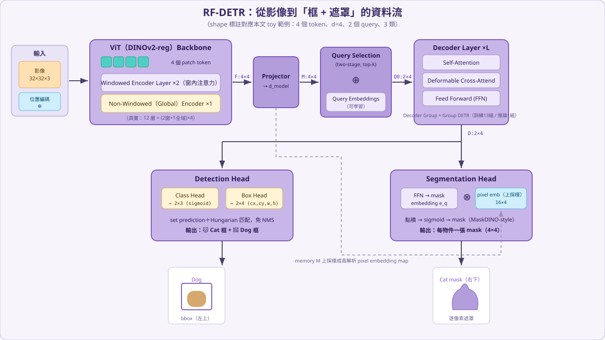
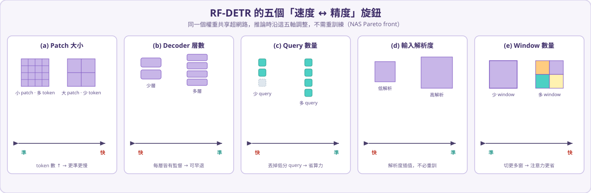

# RF-DETR

RF-DETR 是 Roboflow 推出的**即時（real-time）Detection Transformer**。它延續 DETR 家族「把偵測當成集合預測（set prediction）」的思路，但把目標明確放在**實務部署**：用一個**權重共享的 NAS 超網路**，一次訓練、處處部署，在速度與精度之間提供一整條 Pareto 曲線（Nano / Small / Medium / Large / XL / 2XL，外加 Seg 變體）。

> 這份筆記分兩段：先用生活化的方式講**為什麼會有 RF-DETR、它解決了哪些痛點**；再用一個**可以手算的 toy 範例**，把一張小圖一步一步餵進模型，每個矩陣都寫出實際數值與 shape，最後真的「看到」一隻貓被框出來、被切出遮罩。

---

## 1) 故事背景：物件偵測器的演進

想像你要請人幫你「在照片裡找出所有的貓和狗」。歷史上有兩種找法：

- **貼便利貼派（anchor-based，如 Faster R-CNN、YOLO 早期）**：先在照片上密密麻麻貼滿幾萬張「候選便利貼」（anchor box），每張都問一次「這裡有沒有東西？是什麼？框要修多少？」。最後同一隻貓會被好幾張便利貼同時框到，再用 **NMS（非極大值抑制）** 把重複的擦掉。這套很有效，但有大量**手工設計**（anchor 尺寸、比例、NMS 閾值），而且後處理瑣碎。

- **直接點名派（DETR，2020）**：乾脆給模型固定數量的「點名額度」（object queries，例如 300 個），每個 query 自己去圖裡看一看，直接回答「我負責的這個位置是什麼物件、框在哪」。訓練時用**二分圖匹配（Hungarian matching）**把「query 的預測」和「真實物件」一對一配對。**不需要 anchor、不需要 NMS**，整條管線端到端。

DETR 很優雅，但剛問世時有三個現實痛點：

1. **收斂超慢**：原始 DETR 的 cross-attention 讓每個 query 去看圖上**所有**像素，訊號太發散，要訓練 500 個 epoch 才收斂。
2. **高解析度很貴**：Transformer 的自注意力是 \(O(N^2)\)，token 一多（高解析度）計算量爆炸。
3. **速度／精度難一次調好**：想要更快還是更準，往往得改架構、重新訓練一輪，調參成本高。

**RF-DETR 就是來把 DETR 變成「能上線」的版本**。它的做法可以濃縮成四件事：用 **DINOv2 自監督預訓練的 ViT** 當骨幹、用 **windowed 注意力**壓低高解析度成本、用 **deformable（可變形）cross-attention + two-stage query** 讓收斂變快，再用**權重共享 NAS** 一次搜出一整排速度／精度配置。

---

## 2) RF-DETR 解決的痛點

> 對照解法一個一個看。

**痛點①：DETR 收斂慢。**
RF-DETR 把「每個 query 看全圖」改成 **Deformable Cross-Attention**——每個 query 只從自己的**參考點（reference point）**附近採樣少數幾個點來看（例如 4 個點），不用掃全圖。再加上 **two-stage query selection**：不再隨機初始化 query，而是先用 encoder 特徵挑出「最像有物件」的位置當作 query 的起點。兩招合起來，收斂從幾百個 epoch 降到數十個。

**痛點②：高解析度自注意力 \(O(N^2)\) 太貴。**
骨幹採 **ViTDet 式的 windowed 注意力**：大部分層只在**小窗格內**算注意力（便宜），每隔幾層插入一個**全域（non-windowed）層**把跨窗資訊接回來。真實設定是 12 層 ViT 中 `{0,1,3,4,6,7,9,10}` 為窗化層、`{2,5,8,11}` 為全域層，正好是「(2 窗 + 1 全域) × 4」。

**痛點③：速度／精度難一次調好。**
RF-DETR 訓練的是一個**權重共享的超網路（super-network）**，訓練完後**不需重訓**，就能沿著五個旋鈕調出不同配置，描出整條 accuracy–latency Pareto front（評估了 6000+ 種組合）。釋出的尺寸有 **Nano / Small / Medium / Large / XL / 2XL**（2XL 是史上第一個在 COCO 上 >60 AP 的即時偵測器）。

**痛點④：偵測之外還想要分割（mask）。**
RF-DETR-Seg 共用同一套 backbone + decoder，只在後面接一個輕量的 **Segmentation Head**：把每個 query 經 FFN 變成一個「mask 向量」，和上採樣後的「逐像素特徵圖」做**點積**，就動態生成任意形狀的 mask（MaskDINO 風格的 dynamic mask，屬 CondInst / Mask2Former 家族）。為了省延遲，它刻意**不用**多尺度骨幹特徵，只把單尺度特徵雙線性上採樣。

---

## 3) 架構總覽

對照最上面那張流程圖，由左到右：

| 模組 | 做的事 |
| --- | --- |
| **ViT(DINOv2-reg) Backbone** | 把影像切 patch、加位置編碼，經 windowed + global 編碼層抽出視覺特徵。DINOv2 是自監督預訓練，跨 domain 特徵穩、好 fine-tune。 |
| **Projector** | 用 C2f 式投影把骨幹特徵壓到 decoder 維度 `d_model`（真實 256）。RF-DETR 多半只送**單一尺度**（`num_feature_levels=1`）給 decoder。 |
| **Query Selection（⊕ Query Embeddings）** | two-stage：對 encoder 特徵評分，挑 top-k 當初始參考框，再加上可學習的 query embedding。 |
| **Decoder Layer ×L** | 每層 = **Self-Attention → Deformable Cross-Attend → FFN**。層數 L 可調（真實 2–6）。 |
| **Detection Head** | Class Head（sigmoid + focal）+ Box Head（MLP → cx,cy,w,h，相對參考點精修）。 |
| **Segmentation Head** | 每層 query 經 FFN 得 mask 向量，與上採樣像素特徵做點積 → mask。 |

> ⚠️ **兩個容易誤解的名詞**：
>
> - 圖中 **「Decoder Group」是 Group DETR**（真實 `group_detr=13`）：**訓練時**用 13 組平行 query 做一對多標籤分配以加速收斂，**推論時只用 1 組**，架構不變。它**不是** 13 層 decoder。
> - 真正可調「深度」的是 **「Layer 1..6」**（decoder 層數，也是早退/NAS 軸；因為每層都有監督）。
> - Seg head 圖上的「×6」是「**每個 decoder 層各輸出一張 mask**」的深監督，不是六個多尺度卷積。

---

## 4) 一步一步的數值前向傳播（toy 範例）

我們用一個**故意縮到能手算**的迷你 RF-DETR 跑一遍 forward。**真實場景**的數字（釘在 RF-DETR-Small @ 512）放在對照表，實際運算用小尺度，這樣每個矩陣都寫得出來。

> 運算規則：矩陣相乘只寫 \(A \cdot B = C\)（不展開每個元素的內積），但每個矩陣都標 **shape** 與**實際數值**（四捨五入到小數兩位）。只算前向傳播。

### 假設的輸入與超參數

| 參數 | 真實場景（RF-DETR-Small，已查證） | 本文 toy |
| --- | --- | --- |
| 輸入影像 | 512×512×3（Nano384/Small512/Medium576/Large704） | 32×32×3 |
| patch size | 16（Nano–Large；原始 base=14、XL/2XL=20） | 16 → 2×2 = 4 個 token，特徵圖 2×2 |
| backbone | DINOv2-with-registers ViT-S，hidden 384，12 層 | hidden \(d=4\)，示意 1 個 Block |
| windowed / global | (2 窗 + 1 全域) × 4 | (2 窗 + 1 全域) × 1 |
| window 數量 | 4（可調 1/2/4） | 2（4 個 token 切上排、下排兩窗） |
| projector / d_model | C2f-style，256，單尺度 | 沿用 \(d=4\) |
| object queries | 300 + 可學習 embedding | 2 |
| decoder 層數 | 2–6（每層皆有監督，可早退） | 1 |
| attention heads | self 8 / cross 16 | 1 |
| deformable 取樣點 | 每 head 每 level 4 點，level=1 | 2 點 |
| 類別 / class head | 80（COCO）；**sigmoid + focal**（非 softmax） | 3：cat、dog、bg |
| FFN hidden | 2048，ReLU | 8 |
| 匹配 | Hungarian 二分圖、**免 NMS** | 同（僅說明） |
| seg 像素特徵 | 單尺度雙線性上採樣至 ~1/4 解析度 | 2×2 → 4×4 上採樣 |

**場景設定**：影像切成 4 個 patch，排成 2×2 網格：

$$
\text{格子位置}=\begin{bmatrix} t_0\ (\text{左上 TL}) & t_1\ (\text{右上 TR}) \\ t_2\ (\text{左下 BL}) & t_3\ (\text{右下 BR}) \end{bmatrix}
$$

我們設計四個 patch 的語意是：**左上是玩具狗、右上是牆、左下是地板、右下是貓**。\(d=4\) 個特徵維度可想成 \([\text{紋理},\ \text{顏色},\ \text{邊緣},\ \text{貓感}]\)，四個 token 彼此接近正交（每個 patch 在不同維度最強）。

---

### Part A — DINOv2 Backbone

#### Step 1：Patch Embedding + Positional Embedding

真實流程是：每個 \(16\times16\times3\) 的 patch 攤平成 768 維，再用投影矩陣 \(W_E \in \mathbb{R}^{768\times d}\) 投到 \(d\) 維。為了能手算，我們直接從「已嵌入」的 token 矩陣 \(X_0 \in \mathbb{R}^{4\times4}\) 開始（這和站內 ViT、CLIP 筆記的寫法一致）。再加上位置編碼 \(P_{pos}\)：

$$
X_0=\begin{bmatrix} 0.90 & 0.10 & 0.10 & 0.10 \\ 0.10 & 0.10 & 0.90 & 0.10 \\ 0.10 & 0.10 & 0.10 & 0.90 \\ 0.10 & 0.90 & 0.10 & 0.10 \end{bmatrix},\quad
P_{pos}=\begin{bmatrix} 0.00 & 0.05 & 0.00 & 0.05 \\ 0.05 & 0.00 & 0.05 & 0.00 \\ 0.00 & 0.05 & 0.05 & 0.00 \\ 0.05 & 0.00 & 0.00 & 0.05 \end{bmatrix}
$$

$$
Z_0 = X_0 + P_{pos}=\begin{bmatrix} 0.90 & 0.15 & 0.10 & 0.15 \\ 0.15 & 0.10 & 0.95 & 0.10 \\ 0.10 & 0.15 & 0.15 & 0.90 \\ 0.15 & 0.90 & 0.10 & 0.15 \end{bmatrix}\quad (\mathbb{R}^{4\times4})
$$

> **痛點對應**：位置編碼讓「序列化的 patch」記得自己原本在影像哪個位置——這是把影像當 token 序列的代價，必須補回空間資訊。

#### Step 2：Windowed Encoder Layer ×2

把 4 個 token 切成兩個窗：**上排窗 \(\{t_0,t_1\}\)**、**下排窗 \(\{t_2,t_3\}\)**，注意力**只在窗內**算。為了讓「注意力＝相似度」一目了然，這裡令 \(W_Q=W_K=I\)（所以 \(Q=K=Z\)），\(W_V\) 是一個接近單位矩陣的混合矩陣，縮放係數 \(1/\sqrt{d}=0.5\)。

**上排窗 \(\{t_0,t_1\}\)：**

$$
Q=K=\begin{bmatrix} 0.90 & 0.15 & 0.10 & 0.15 \\ 0.15 & 0.10 & 0.95 & 0.10 \end{bmatrix},\quad
V=Z_w\cdot W_V=\begin{bmatrix} 0.82 & 0.19 & 0.14 & 0.15 \\ 0.19 & 0.10 & 0.87 & 0.14 \end{bmatrix}\ (\mathbb{R}^{2\times4})
$$

$$
A=\mathrm{softmax}\!\left(\tfrac{QK^\top}{\sqrt d}\right)=\begin{bmatrix} 0.58 & 0.42 \\ 0.42 & 0.58 \end{bmatrix}\ (\mathbb{R}^{2\times2}),\qquad
O=(A\cdot V)\cdot W_O=\begin{bmatrix} 0.55 & 0.15 & 0.45 & 0.15 \\ 0.45 & 0.14 & 0.57 & 0.14 \end{bmatrix}
$$

**下排窗 \(\{t_2,t_3\}\)（同理）：**

$$
A=\begin{bmatrix} 0.57 & 0.43 \\ 0.43 & 0.57 \end{bmatrix},\qquad
O=\begin{bmatrix} 0.14 & 0.46 & 0.15 & 0.55 \\ 0.15 & 0.55 & 0.14 & 0.46 \end{bmatrix}
$$

接著做**殘差 + LayerNorm**，再過 FFN（\(W_1\in\mathbb{R}^{4\times8},\ W_2\in\mathbb{R}^{8\times4}\)）再一次殘差 + LN，得到第一層輸出 \(Z_1\)；**同樣的層再做一次（×2，權重不同）**得到 \(Z_2\)：

$$
Z_{1a}=\mathrm{LN}(Z_0+O)=\begin{bmatrix} 1.69 & -0.73 & -0.21 & -0.75 \\ -0.09 & -0.79 & 1.66 & -0.78 \\ -0.85 & -0.08 & -0.72 & 1.66 \\ -0.72 & 1.66 & -0.85 & -0.08 \end{bmatrix}
\;\xrightarrow{\text{FFN, ×2}}\;
Z_2=\begin{bmatrix} 1.66 & -0.69 & -0.12 & -0.86 \\ 0.14 & -0.80 & 1.58 & -0.92 \\ -0.85 & 0.18 & -0.89 & 1.57 \\ -0.66 & 1.62 & -0.97 & -0.00 \end{bmatrix}
$$

> **痛點②對應**：注意力只在 2 個 token 的小窗內算（\(2\times2\) 矩陣），而不是全部 4 個 token（\(4\times4\)）。窗越小越省，但代價是**跨窗看不到彼此**——所以需要下一步。

#### Step 3：Non-Windowed（Global）Encoder Layer ×1

這一層拿掉窗的限制，對**全部 4 個 token**做完整注意力（\(Q=K=Z_2\)）：

$$
A=\mathrm{softmax}\!\left(\tfrac{QK^\top}{\sqrt d}\right)=
\begin{bmatrix}
0.74 & 0.20 & 0.02 & 0.04 \\
0.20 & 0.75 & 0.02 & 0.02 \\
0.02 & 0.02 & 0.73 & 0.23 \\
0.03 & 0.02 & 0.23 & 0.72
\end{bmatrix}\ (\mathbb{R}^{4\times4})
$$

看這個注意力矩陣很有意思：每個 token 大部分注意自己，並分一點給特徵相近的鄰居（\(t_0\) 給 \(t_1\)、\(t_2\) 給 \(t_3\)），跨語意的格子幾乎不看（0.02）。再經殘差/LN/FFN 得到 **backbone 輸出 \(F\)**：

$$
F=\begin{bmatrix} 1.63 & -0.65 & -0.01 & -0.97 \\ 0.38 & -0.80 & 1.46 & -1.04 \\ -0.84 & 0.43 & -1.03 & 1.44 \\ -0.62 & 1.57 & -1.06 & 0.11 \end{bmatrix}\quad (\mathbb{R}^{4\times4})
$$

> **痛點②對應**：每隔幾個窗化層插一個全域層，就能在「便宜的窗內注意力」和「必要的全域感受野」之間取得平衡。

---

### Part B — Projector + Query Selection

#### Step 4：Projector

把骨幹特徵投影到 decoder 維度（toy 維持 \(d=4\)），得到記憶體特徵 \(M\)（即 encoder memory，對應 2×2 空間網格）：

$$
M = F\cdot W_P=\begin{bmatrix} 1.40 & -0.42 & -0.11 & -0.87 \\ 0.26 & -0.68 & 1.21 & -0.79 \\ -0.71 & 0.30 & -0.78 & 1.19 \\ -0.40 & 1.36 & -0.95 & -0.01 \end{bmatrix}\quad (\mathbb{R}^{4\times4})
$$

#### Step 5：Query Selection（two-stage）+ Query Embeddings

用一個小小的 objectness 評分頭 \(w=[1.2,1.2,0,0]^\top\)（偏好「高紋理＝狗」或「高顏色＝貓」的前景）對 4 個 token 評分：

$$
\text{scores}=\sigma(M\cdot w)=\begin{bmatrix} 0.76 \\ 0.38 \\ 0.38 \\ 0.76 \end{bmatrix}
\;\Rightarrow\; \text{選 top-2}=\{t_0,\ t_3\}\ (\text{狗 TL、貓 BR})
$$

取這兩個 token 的特徵當作 query 內容，加上可學習的 query embedding \(QE\)，並把它們的格子中心當作**參考點**：

$$
Q_0 = M[\{t_0,t_3\}] + QE=\begin{bmatrix} 1.50 & -0.42 & -0.01 & -0.87 \\ -0.40 & 1.46 & -0.95 & 0.09 \end{bmatrix}\ (\mathbb{R}^{2\times4}),\quad
\text{ref}=\begin{bmatrix} 0.25 & 0.25 \\ 0.75 & 0.75 \end{bmatrix}
$$

> **痛點①對應**：query 不再從隨機向量開始，而是從「最像有物件」的 encoder 位置出發（query1 落在狗、query2 落在貓），收斂自然快很多。

---

### Part C — Decoder Layer（Self-Attn → Deformable Cross → FFN）

#### Step 6：Self-Attention（2 個 query 互相溝通）

$$
A_{\text{self}}=\mathrm{softmax}\!\left(\tfrac{QK^\top}{\sqrt d}\right)=\begin{bmatrix} 0.90 & 0.10 \\ 0.10 & 0.90 \end{bmatrix},\qquad
Q_{\text{sa}}=\mathrm{LN}(Q_0+O_{\text{self}})=\begin{bmatrix} 1.63 & -0.45 & -0.11 & -1.07 \\ -0.42 & 1.58 & -1.16 & 0.00 \end{bmatrix}
$$

兩個 query 各自顧好自己（對角線 0.90），因為它們指向不同物件、不需互相讓位。

> **痛點對應**：query 間的 self-attention 是用來**去重**——當多個 query 擠到同一物件時，讓它們協調，配合 Hungarian 匹配做到「一物件一框、免 NMS」。

#### Step 7：Deformable Cross-Attention（單尺度、2 個取樣點）

把記憶體 \(M\) 看成 2×2 的特徵網格。每個 query 從自己的參考點出發，用線性層預測 **2 個取樣偏移 \(\Delta p\)**，在網格上做**雙線性取樣**，再用 softmax 後的**注意力權重**加權求和。

**query 1（狗，ref \((0.25,0.25)\)）：**

$$
\Delta p=\begin{bmatrix} 0.31 & -0.20 \\ -0.20 & 0.31 \end{bmatrix},\quad
p=\text{ref}+\Delta p=\begin{bmatrix} 0.56 & 0.05 \\ 0.05 & 0.56 \end{bmatrix},\quad
\text{權重}=\begin{bmatrix} 0.84 & 0.16 \end{bmatrix}
$$

$$
\text{取樣值}=\begin{bmatrix} 0.69 & -0.49 & 0.56 & -0.75 \\ 0.19 & 0.01 & -0.46 & 0.26 \end{bmatrix}
\;\Rightarrow\;\text{cross out}=\begin{bmatrix} 0.61 & -0.41 & 0.39 & -0.59 \end{bmatrix}
$$

**query 2（貓，ref \((0.75,0.75)\)）：**

$$
p=\begin{bmatrix} 0.55 & 1.07 \\ 1.07 & 0.55 \end{bmatrix},\quad
\text{權重}=\begin{bmatrix} 0.16 & 0.84 \end{bmatrix}
\;\Rightarrow\;\text{cross out}=\begin{bmatrix} -0.17 & 0.51 & -0.12 & -0.22 \end{bmatrix}
$$

殘差 + LN 後：

$$
Q_{\text{ca}}=\mathrm{LN}(Q_{\text{sa}}+\text{cross})=\begin{bmatrix} 1.53 & -0.59 & 0.20 & -1.13 \\ -0.47 & 1.65 & -1.01 & -0.17 \end{bmatrix}
$$

> **痛點①對應**：這就是 RF-DETR 收斂快的關鍵。比起原始 DETR 讓 query 去看**全部**像素，deformable 只在參考點附近**採樣少數幾個點**，訊號集中、計算少。

#### Step 8：Feed-Forward（FFN）

$$
H=\mathrm{ReLU}(Q_{\text{ca}}\cdot W_1)=\begin{bmatrix} 0.86 & 0.00 & 0.20 & 0.00 & 0.00 & 0.86 & 0.00 & 0.20 \\ 0.00 & 0.74 & 0.00 & 0.32 & 0.74 & 0.00 & 0.32 & 0.00 \end{bmatrix}\ (\mathbb{R}^{2\times8})
$$

$$
\text{FFN}=H\cdot W_2=\begin{bmatrix} 0.17 & 0.17 & 0.04 & 0.04 \\ 0.15 & 0.15 & 0.06 & 0.06 \end{bmatrix},\qquad
D=\mathrm{LN}(Q_{\text{ca}}+\text{FFN})=\begin{bmatrix} 1.54 & -0.51 & 0.13 & -1.16 \\ -0.42 & 1.65 & -1.02 & -0.21 \end{bmatrix}
$$

\(D \in \mathbb{R}^{2\times4}\) 就是 **decoder 輸出**（2 個 query 各一個 \(d=4\) 向量），接下來送進兩個頭。

---

### Part D — Detection Head

#### Step 9：Class Head（sigmoid + focal，非 softmax）

$$
\text{logits}=D\cdot W_{\text{cls}}=\begin{bmatrix} -0.61 & 1.85 & -1.04 \\ 1.98 & -0.50 & -1.23 \end{bmatrix}\ (\mathbb{R}^{2\times3},\ \text{欄=cat,dog,bg})
$$

$$
\text{probs}=\sigma(\text{logits})=\begin{bmatrix} 0.35 & \mathbf{0.86} & 0.26 \\ \mathbf{0.88} & 0.38 & 0.23 \end{bmatrix}
\;\Rightarrow\;
\begin{cases} \text{query 1} \to \textbf{dog}\ (0.86) \\ \text{query 2} \to \textbf{cat}\ (0.88) \end{cases}
$$

> RF-DETR 的分類頭用**每類獨立的 sigmoid + focal loss**（不是跨類 softmax），所以每個 query 對每個類別給一個獨立分數。這裡兩個 query 漂亮地分成狗與貓。

#### Step 10：Box Head（相對參考點精修）

box 不是憑空預測，而是對**參考點**做精修：中心 \(=\sigma(\mathrm{logit}(\text{ref})+\Delta_{cxcy})\)，寬高 \(=\sigma(\Delta_{wh})\)。

$$
\Delta=D\cdot W_{\text{box}}=\begin{bmatrix} 0.81 & -0.60 & 0.49 & -0.38 \\ -0.52 & 0.76 & -0.33 & 0.45 \end{bmatrix}
\;\Rightarrow\;
\text{box}=\begin{bmatrix} 0.43 & 0.15 & 0.62 & 0.41 \\ 0.64 & 0.87 & 0.42 & 0.61 \end{bmatrix}\ (cx,cy,w,h)
$$

狗框中心 \((0.43,0.15)\) 落在**上方**、貓框中心 \((0.64,0.87)\) 落在**右下**——正好對上它們的參考點位置。

> **痛點對應**：set prediction + Hungarian 二分圖匹配把每個 query 一對一配到一個真實物件，**完全不需要 NMS**。

---

### Part E — Segmentation Head（MaskDINO-style 動態點積）

#### Step 11：Mask Embedding + 像素特徵圖

每個 query 的 decoder 輸出經一個 FFN（\(W_{\text{mask}}\)）得到 **mask 向量 \(E_{\text{mask}}\)**：

$$
E_{\text{mask}}=D\cdot W_{\text{mask}}=\begin{bmatrix} 1.20 & -0.37 & 0.14 & -0.97 \\ -0.27 & 1.26 & -0.88 & -0.10 \end{bmatrix}\ (\mathbb{R}^{2\times4})
$$

像素特徵圖則由記憶體 \(M\)（2×2）**雙線性上採樣**成 4×4（共 16 個像素，每個 \(d=4\)）：

$$
P_{\text{pix}}=\begin{bmatrix}
1.40 & -0.42 & -0.11 & -0.87 \\
1.02 & -0.51 & 0.33 & -0.84 \\
0.64 & -0.60 & 0.77 & -0.82 \\
0.26 & -0.68 & 1.21 & -0.79 \\
0.70 & -0.18 & -0.33 & -0.18 \\
0.48 & -0.12 & -0.06 & -0.30 \\
0.26 & -0.06 & 0.22 & -0.41 \\
0.04 & -0.00 & 0.49 & -0.53 \\
-0.01 & 0.06 & -0.56 & 0.50 \\
-0.06 & 0.27 & -0.45 & 0.25 \\
-0.12 & 0.47 & -0.34 & -0.01 \\
-0.18 & 0.68 & -0.23 & -0.27 \\
-0.71 & 0.30 & -0.78 & 1.19 \\
-0.61 & 0.65 & -0.84 & 0.79 \\
-0.50 & 1.00 & -0.89 & 0.39 \\
-0.40 & 1.36 & -0.95 & -0.01
\end{bmatrix}\ (\mathbb{R}^{16\times4})
$$

#### Step 12：Mask = query ⊗ pixel 點積 → sigmoid

拿**貓 query** 的 mask 向量和每個像素做點積（再加一個 mask 偏置 \(-0.30\)），得到 16 個 mask logit，reshape 回 4×4：

$$
\text{mask logits}=E_{\text{mask}}^{(\text{cat})}\cdot P_{\text{pix}}^\top + b
=\begin{bmatrix} -1.03 & -1.43 & -1.82 & -2.22 \\ -0.41 & -0.50 & -0.60 & -0.69 \\ 0.22 & 0.42 & 0.62 & 0.83 \\ 0.84 & 1.34 & 1.85 & 2.35 \end{bmatrix}
$$

$$
\sigma(\cdot)=\begin{bmatrix} 0.26 & 0.19 & 0.14 & 0.10 \\ 0.40 & 0.38 & 0.35 & 0.33 \\ 0.55 & 0.60 & 0.65 & 0.70 \\ 0.70 & 0.79 & 0.86 & \mathbf{0.91} \end{bmatrix}
\;\xrightarrow{\ge 0.5}\;
\text{mask}=\begin{bmatrix} 0 & 0 & 0 & 0 \\ 0 & 0 & 0 & 0 \\ 1 & 1 & 1 & 1 \\ 1 & 1 & 1 & 1 \end{bmatrix}
$$

貓的遮罩亮在**下半部、右下角最強（0.91）**——正好是貓所在的位置。作為對照，**狗 query** 的遮罩剛好相反，亮在左上角（0.91）：

$$
\sigma(\cdot)^{(\text{dog})}=\begin{bmatrix} \mathbf{0.91} & 0.88 & 0.83 & 0.77 \\ 0.67 & 0.64 & 0.61 & 0.58 \\ 0.29 & 0.32 & 0.34 & 0.37 \\ 0.07 & 0.10 & 0.15 & 0.20 \end{bmatrix}
$$

> **痛點④對應**：不需要為每個 anchor 預設 mask；只要把 query 的 mask 向量和像素特徵做**點積**，就能動態長出任意形狀的遮罩。每個 decoder 層各輸出一張 mask（深監督），逐層把邊界修細。

---

### 總結流程（shape 一路追蹤）

| 階段 | 運算 | 輸出 shape |
| --- | --- | --- |
| Patch + Pos | \(X_0+P_{pos}\) | \(4\times4\) |
| Windowed ×2 | 窗內 self-attn + FFN | \(4\times4\) |
| Global ×1 | 全域 self-attn + FFN → \(F\) | \(4\times4\) |
| Projector | \(F\cdot W_P \to M\) | \(4\times4\) |
| Query Selection | top-2 + QE → \(Q_0\) | \(2\times4\) |
| Decoder | self-attn → deformable cross → FFN → \(D\) | \(2\times4\) |
| Class Head | \(D\cdot W_{cls}\) → sigmoid | \(2\times3\) |
| Box Head | 參考點 + \(\Delta\) | \(2\times4\) |
| Seg Head | \(E_{mask}\cdot P_{pix}^\top\) → sigmoid | \(2\times16\)（→ 4×4 mask） |

一句話：**RF-DETR 把影像變成少量 token，挑出最像物件的位置當 query，讓每個 query 只在參考點附近採樣、快速定位，最後一個頭吐框、一個頭吐遮罩——全程免 anchor、免 NMS。**

---

## 5) 模型家族與比較

RF-DETR 釋出 **Nano / Small / Medium / Large / XL / 2XL**（外加 Seg 變體）。注意 `base` 是較早期的 checkpoint 名稱，**不屬於** 上述 NAS 尺寸階梯。

| 面向 | RF-DETR | DETR / Deformable DETR | YOLO 系列 | Grounding DINO |
| --- | --- | --- | --- | --- |
| 類型 | 即時 specialist detector | 開創性 query-based detector | 即時 anchor/anchor-free | 開放詞彙 grounding detector |
| 輸入 | 影像 | 影像 | 影像 | 影像 + 文字 prompt |
| 骨幹 | DINOv2-reg ViT | ResNet/ViT | CSP/CNN | 視覺 + 文字 |
| 後處理 | 免 NMS | 免 NMS | 多數需 NMS | 免 NMS |
| 強項 | 速度＋fine-tune＋一次搜出多配置 | 端到端、概念清晰 | 工具鏈成熟、超快 | 文字條件、zero-shot |
| 弱項 | 固定類別、需標註 | 收斂慢、部署重 | 手工設計多 | 較慢、較重 |

選型直覺：類別固定、可標註、要又快又準的 production 偵測 → **RF-DETR**；想用文字找任意物件 → **Grounding DINO**；已有成熟 YOLO pipeline 且滿足需求 → 不一定要換。

---

## 6) 使用情境與限制

**適合 RF-DETR：**

- 需要即時或接近即時的物件偵測（甚至同時要 instance mask）。
- 類別集合固定、可以標註並 fine-tune。
- 想用 transformer detector，但不想承擔原始 DETR 的慢收斂與部署成本。
- 想用一個 checkpoint 沿速度／精度軸彈性部署到不同硬體。

**不一定首選：**

- 沒有標註、只想用文字 prompt 找物件（用 Grounding DINO）。
- 部署在極低算力 MCU。
- 已有滿足需求的 YOLO pipeline。

**注意事項：**

- 即時數字高度依賴硬體、推論 backend（TensorRT/ONNX）、解析度、batch size 與精度（FP16/INT8）。
- XL / 2XL（`rfdetr_plus`）採 PML-1.0 授權，其餘多為 Apache-2.0——採用前先確認 license。
- 自訂資料集若 label noise 高、類別定義不穩，fine-tuning 仍會受影響。
- 上面的 toy 權重是**為了好懂而手設**的；真實模型的權重是訓練學出來的，數值不會這麼乾淨，但**運算結構完全一致**。

---

## 7) 參考資料

- RF-DETR 論文：[RF-DETR: Neural Architecture Search for Real-Time Detection Transformers (arXiv:2511.09554)](https://arxiv.org/abs/2511.09554)
- 官方 GitHub：[roboflow/rf-detr](https://github.com/roboflow/rf-detr)
- 官方文件：[rfdetr.roboflow.com](https://rfdetr.roboflow.com/latest/)
- 分割變體：[RF-DETR Segmentation Preview (Roboflow blog)](https://blog.roboflow.com/rf-detr-segmentation-preview/)
- 參考實作設定：[HuggingFace `transformers` RF-DETR](https://huggingface.co/docs/transformers/model_doc/rf_detr)
- 基礎論文：[Deformable DETR (arXiv:2010.04159)](https://arxiv.org/abs/2010.04159)、[DINO (arXiv:2203.03605)](https://arxiv.org/abs/2203.03605)、[Group DETR (arXiv:2207.13085)](https://arxiv.org/abs/2207.13085)、[DINOv2 (arXiv:2304.07193)](https://arxiv.org/abs/2304.07193)、[Mask DINO (arXiv:2206.02777)](https://arxiv.org/abs/2206.02777)
