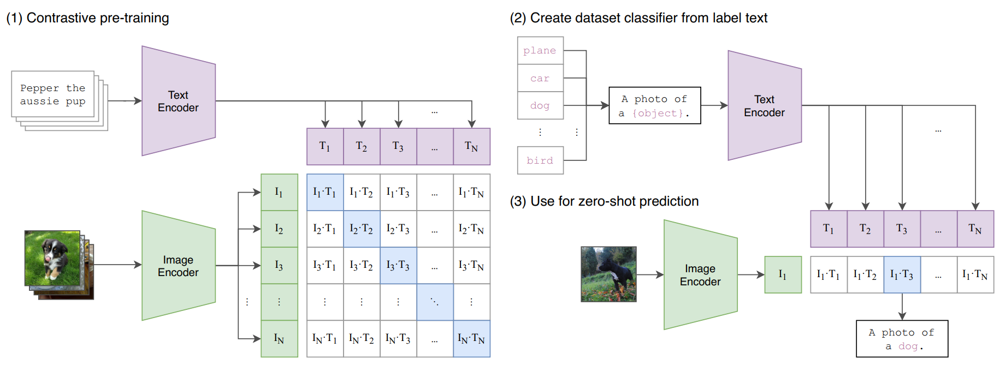

# CLIP

## CLIP 可以用於的任務以及能解決的痛點

CLIP（Contrastive Language–Image Pretraining）是一種多模態模型，其設計目的是結合文字和圖像的模態，實現通用的人工智能能力。以下將詳細解釋 CLIP 可以應用於的任務以及它解決的核心痛點。

---

### CLIP 可以用於的任務

#### 1. **零樣本圖像分類（Zero-shot Image Classification）**

CLIP 能夠直接根據文字描述對圖像進行分類，而無需針對特定類別進行微調。
**例子**：給定一張動物的照片，CLIP 可以根據標籤「一隻狗的照片」或「一隻貓的照片」來進行推斷。

**應用場景**：

- 識別新類別的物體而不需要重新訓練。
- 在多樣化的場景中進行分類（例如醫療影像、衛星照片等領域）。

---

#### 2. **圖像-文字檢索（Image-Text Retrieval）**

CLIP 能夠有效地在大規模數據中進行圖像和文字的匹配。
**例子**：給定文字描述「一隻在草地上奔跑的狗」，CLIP 可以檢索出符合描述的圖像。

**應用場景**：

- 圖像搜索引擎：根據文字描述快速找到相關圖片。
- 多模態內容管理：在大型數據集中進行匹配與索引。

---

#### 3. **圖像生成輔助（Image Generation Assistance）**

CLIP 與生成模型（例如 DALL·E）結合使用時，可以幫助生成符合文字描述的圖像。
**例子**：根據描述「一隻穿著帽子的狗」，CLIP 可以幫助生成模型生成此類圖像。

**應用場景**：

- 藝術創作：生成符合語意的圖像。
- 虛擬世界建模：根據文字設計和生成場景或物件。

---

#### 4. **多模態分析與問答（Multimodal Analysis and Q&A）**

CLIP 能夠在圖像與文字的交互中進行分析，支持多模態問答系統的開發。
**例子**：問題「這張圖片中的主要物體是什麼？」CLIP 可以根據嵌入向量回答正確的物體名稱。

**應用場景**：

- 智能助理：基於圖片回答問題。
- 教育系統：圖像和文字相結合的互動式學習平台。

---

### CLIP 能解決的痛點

#### 1. **標註數據成本高**

- **問題**：傳統的監督學習模型需要大量標註數據，標註成本高且耗時。
- **解決方案**：CLIP 使用來自互聯網的大規模未標註數據（如圖像和文字配對），避免依賴人工標註。

---

#### 2. **缺乏泛化能力**

- **問題**：傳統模型通常只能識別訓練過的類別，對新類別或場景的泛化能力有限。
- **解決方案**：CLIP 能夠在零樣本情境下根據文字描述進行分類，無需重新訓練即可泛化到未見過的類別。

---

#### 3. **單模態模型的局限**

- **問題**：傳統模型通常只處理單一模態（如僅處理圖像或文字），無法同時理解圖像與文字的關聯。
- **解決方案**：CLIP 將圖像和文字嵌入到同一向量空間中，實現跨模態的理解與推理。

---

#### 4. **靈活性不足**

- **問題**：很多模型需要針對特定任務進行微調，限制了它們的靈活性。
- **解決方案**：CLIP 是通用模型，能夠應用於多種任務（如分類、檢索、生成等），不需要針對每個任務進行微調。

---

#### 5. **多模態交互困難**

- **問題**：圖像和文字是兩種不同的模態，如何讓模型在它們之間建立語義聯繫是難題。
- **解決方案**：CLIP 使用對比學習（Contrastive Learning）方法，讓圖像和文字的嵌入向量互相關聯，提高跨模態交互能力。

---

## 詳細數學計算

### **對比式預訓練 (Contrastive Pre-training)**

#### **1️⃣ 輸入資料**

我們假設有 **3 張圖片**（I₁, I₂, I₃）與 **3 段文字**（T₁, T₂, T₃），目標是讓對應的圖片與文字在 embedding 空間中距離最近（相似度最高）。

痛點：
圖片與文字原本是完全不同模態的數據（像素 vs. 字符），我們必須先透過編碼器把它們轉換到**相同的向量空間**，否則後續無法計算相似度。

---

#### **2️⃣ Text Encoder（文字編碼）輸出**

假設經過 Text Encoder（例如 Transformer）後，每段文字被轉換成 **4 維向量**：

$$
T =
\begin{bmatrix}
0.20 & 0.10 & 0.30 & 0.40 \\
0.25 & 0.15 & 0.35 & 0.20 \\
0.10 & 0.30 & 0.25 & 0.35
\end{bmatrix}
$$

Shape: **(3, 4)**
（3 條文字，每條 4 維向量）

---

#### **3️⃣ Image Encoder（圖片編碼）輸出**

假設經過 Image Encoder（例如 ResNet 或 Vision Transformer）後，每張圖片也被轉換成 **4 維向量**：

$$
I =
\begin{bmatrix}
0.22 & 0.12 & 0.28 & 0.38 \\
0.18 & 0.20 & 0.33 & 0.29 \\
0.12 & 0.28 & 0.20 & 0.40
\end{bmatrix}
$$

Shape: **(3, 4)**
（3 張圖片，每張 4 維向量）

---

#### **4️⃣ 計算相似度矩陣**

痛點：
這一步的核心是**對齊跨模態的表示（alignment）**，確保對應的圖片-文字配對相似度高，錯配的相似度低。

我們使用 **點積（dot product）** 來計算圖片與文字之間的相似度：

$$
S = I \cdot T^T
$$

其中：

- \( I \) shape: **(3, 4)**
- \( T^T \) shape: **(4, 3)**
- \( S \) shape: **(3, 3)**

---

計算：

$$
S =
\begin{bmatrix}
0.22 & 0.12 & 0.28 & 0.38 \\
0.18 & 0.20 & 0.33 & 0.29 \\
0.12 & 0.28 & 0.20 & 0.40
\end{bmatrix}
\cdot
\begin{bmatrix}
0.20 & 0.25 & 0.10 \\
0.10 & 0.15 & 0.30 \\
0.30 & 0.35 & 0.25 \\
0.40 & 0.20 & 0.35
\end{bmatrix}
=
\begin{bmatrix}
0.292 & 0.302 & 0.318 \\
0.289 & 0.307 & 0.311 \\
0.298 & 0.300 & 0.330
\end{bmatrix}
$$

---

#### **5️⃣ 解讀相似度矩陣**

- \( S_{11} = 0.292 \)：圖片 I₁ 與文字 T₁ 的相似度
- \( S_{12} = 0.302 \)：圖片 I₁ 與文字 T₂ 的相似度
- \( S_{33} = 0.330 \)：圖片 I₃ 與文字 T₃ 的相似度（較高，表示模型認為它們很相關）

---

#### **6️⃣ （可選）Softmax 步驟**

在真實 Contrastive Pre-training（例如 CLIP）中，我們會對每一行做 Softmax，轉換成機率分佈，用於計算 InfoNCE Loss。

$$
P_{ij} = \frac{\exp(S_{ij} / \tau)}{\sum_{k=1}^3 \exp(S_{ik} / \tau)}
$$

其中 \(\tau\) 是溫度參數（例如 0.07），控制分佈鋒利程度。

---

#### **痛點總結**

1. **跨模態對齊**：圖片和文字特徵原本不在同一空間，必須通過編碼器映射到同一空間。
2. **相似度矩陣計算**：點積是最常用的相似度計算方式，但需要確保向量已經經過歸一化，否則長度不同會影響結果。
3. **對比學習目標**：讓正樣本對的相似度最大，負樣本對的相似度最小。

---

#### **7️⃣ 已知相似度矩陣 S（由 I ⋅ Tᵀ 得到）**

$$
S =
\begin{bmatrix}
0.292 & 0.302 & 0.318 \\
0.289 & 0.307 & 0.311 \\
0.298 & 0.300 & 0.330
\end{bmatrix}
$$

Shape: **(3, 3)**

這裡 \( S_{ij} \) 代表圖片 \( I_i \) 與文字 \( T_j \) 的相似度。

---

#### **8️⃣ 引入溫度參數 τ**

痛點：在對比學習中，溫度參數 \( \tau \) 控制 Softmax 的「鋒利程度」。

- 小的 \( \tau \) → 分佈更極端，更容易讓正樣本機率明顯高於負樣本
- 大的 \( \tau \) → 分佈更平滑

我們假設 \( \tau = 0.07 \)。

---

#### **9️⃣ Softmax（圖片到文字的方向）**

我們先計算 **圖片作為 query，文字作為 key** 的機率分佈：

公式：

$$
P^{(i \rightarrow t)}_{ij} = \frac{\exp(S_{ij} / \tau)}{\sum_{k=1}^3 \exp(S_{ik} / \tau)}
$$

矩陣形式（先除以 τ）：

$$
Z = \frac{S}{\tau} =
\begin{bmatrix}
4.171 & 4.314 & 4.543 \\
4.129 & 4.386 & 4.443 \\
4.257 & 4.286 & 4.714
\end{bmatrix}
$$

Shape: **(3, 3)**

---

計算 Softmax：

$$
P^{(i \rightarrow t)} =
\begin{bmatrix}
\frac{e^{4.171}}{e^{4.171}+e^{4.314}+e^{4.543}} &
\frac{e^{4.314}}{e^{4.171}+e^{4.314}+e^{4.543}} &
\frac{e^{4.543}}{e^{4.171}+e^{4.314}+e^{4.543}} \\
\frac{e^{4.129}}{e^{4.129}+e^{4.386}+e^{4.443}} &
\frac{e^{4.386}}{e^{4.129}+e^{4.386}+e^{4.443}} &
\frac{e^{4.443}}{e^{4.129}+e^{4.386}+e^{4.443}} \\
\frac{e^{4.257}}{e^{4.257}+e^{4.286}+e^{4.714}} &
\frac{e^{4.286}}{e^{4.257}+e^{4.286}+e^{4.714}} &
\frac{e^{4.714}}{e^{4.257}+e^{4.286}+e^{4.714}}
\end{bmatrix}
$$

數值計算（四捨五入到小數點 3 位）：

$$
P^{(i \rightarrow t)} \approx
\begin{bmatrix}
0.300 & 0.344 & 0.356 \\
0.296 & 0.351 & 0.353 \\
0.286 & 0.294 & 0.420
\end{bmatrix}
$$

---

#### **🔟 Softmax（文字到圖片的方向）**

同理，文字作為 query，圖片作為 key：

$$
P^{(t \rightarrow i)}_{ji} = \frac{\exp(S_{ij} / \tau)}{\sum_{k=1}^3 \exp(S_{kj} / \tau)}
$$

數值計算結果（四捨五入到小數點 3 位）：

$$
P^{(t \rightarrow i)} \approx
\begin{bmatrix}
0.338 & 0.330 & 0.332 \\
0.331 & 0.339 & 0.330 \\
0.325 & 0.327 & 0.348
\end{bmatrix}
$$

---

#### **1️⃣1️⃣ InfoNCE Loss 計算**

痛點：
InfoNCE Loss 的目標是**最大化正樣本的機率**，讓對應的圖片-文字對（I₁-T₁, I₂-T₂, I₃-T₃）在 Softmax 後的概率變大。

對於圖片到文字的方向：

$$
\mathcal{L}_{i \rightarrow t} = -\frac{1}{N} \sum_{i=1}^N \log P^{(i \rightarrow t)}_{ii}
$$

對於文字到圖片的方向：

$$
\mathcal{L}_{t \rightarrow i} = -\frac{1}{N} \sum_{i=1}^N \log P^{(t \rightarrow i)}_{ii}
$$

---

數值代入（N=3）：

圖片 → 文字：

$$
\mathcal{L}_{i \rightarrow t} = -\frac{1}{3} \left[ \log 0.300 + \log 0.351 + \log 0.420 \right]
$$

$$
\mathcal{L}_{i \rightarrow t} \approx -\frac{1}{3} \left[ -1.204 - 1.046 - 0.868 \right] \approx 1.039
$$

文字 → 圖片：

$$
\mathcal{L}_{t \rightarrow i} = -\frac{1}{3} \left[ \log 0.338 + \log 0.339 + \log 0.348 \right]
$$

$$
\mathcal{L}_{t \rightarrow i} \approx -\frac{1}{3} \left[ -1.086 - 1.082 - 1.056 \right] \approx 1.075
$$

---

#### **1️⃣2️⃣ 最終對比損失（CLIP 常用做法）**

$$
\mathcal{L} = \frac{\mathcal{L}_{i \rightarrow t} + \mathcal{L}_{t \rightarrow i}}{2}
$$

代入：

$$
\mathcal{L} \approx \frac{1.039 + 1.075}{2} \approx 1.057
$$

---

#### **痛點總結**

1. **Softmax 計算中數值可能過大** → 必須在實作中使用 log-sum-exp trick 防止溢出。
2. **τ 的選擇影響學習效果** → τ 太小可能過度強調極端概率，τ 太大則降低對比效果。
3. **對稱損失**（i→t 和 t→i）可以讓模型雙向對齊，這是 CLIP 相對於單向檢索更穩定的原因。

---

### **推論**

#### 場景與詞彙嵌入（toy，但符合實務邏輯）

資料集四個類別：`plane / car / dog / bird`
模板：`"A photo of a {object}."`（6 個 token：A, photo, of, a, ., 以及類別詞）

> 痛點①：**不再需要為每個新資料集重新訓練分類器**。我們只要把「類別文字」丟進**同一個 Text Encoder**，就能得到該類別在多模態共同空間的**原型向量**。

為了可手算，我用 4 維空間（d=4）。給定下列**詞向量表**（就是 Text Encoder 的最前面的 embedding lookup；模板詞向量相同，類別詞不同）：

模板 token 的嵌入（shape $5\times 4$，每個模板詞都相同）：

$$
E_{\text{tmpl}}=
\begin{bmatrix}
0.2 & 0.1 & 0.0 & 0.1\\
0.2 & 0.1 & 0.0 & 0.1\\
0.2 & 0.1 & 0.0 & 0.1\\
0.2 & 0.1 & 0.0 & 0.1\\
0.2 & 0.1 & 0.0 & 0.1
\end{bmatrix}
\quad (\text{shape }5\times 4)
$$

四個「類別詞」的嵌入（shape $4\times 4$，按 plane/car/dog/bird 排列）：

$$
E_{\text{label}}=
\begin{bmatrix}
 1.40 & 0.10 & -1.20 & 4.72\\
 2.72 & -1.40 &  1.80 & 3.58\\
 0.20 & 4.00 &  0.72 & 2.86\\
-3.10 & 2.14 &  0.66 & 3.70
\end{bmatrix}
\quad (\text{shape }4\times 4)
$$

> 痛點②：**形狀（shape）常出錯**。我會在每一步都標 shape，避免在實作時維度對不上。

---

#### (2) Create dataset classifier from label text

##### 2-1 把每個類別的模板句嵌入並平均（Bag-of-Embeddings → 句向量）

平均是用一個 $\frac{1}{6}\mathbf{1}_{1\times6}$ 左乘，把 6 個 token 的向量做均值；等效於「Text Encoder 最後的句向量輸出」（此處用簡化版平均來示範）。

**plane** 的 6×4 token 矩陣：

$$
X_{\text{plane}}=
\begin{bmatrix}
0.2 & 0.1 & 0.0 & 0.1\\
0.2 & 0.1 & 0.0 & 0.1\\
0.2 & 0.1 & 0.0 & 0.1\\
0.2 & 0.1 & 0.0 & 0.1\\
0.2 & 0.1 & 0.0 & 0.1\\
1.40 & 0.10 & -1.20 & 4.72
\end{bmatrix}
\quad (\text{shape }6\times4)
$$

平均權重向量：

$$
W_{\text{avg}}=\frac{1}{6}
\begin{bmatrix}
1 & 1 & 1 & 1 & 1 & 1
\end{bmatrix}
\quad(\text{shape }1\times6)
$$

做平均（只寫乘法）：

$$
W_{\text{avg}}\cdot X_{\text{plane}}=T^{(\text{raw})}_{\text{plane}}=
\begin{bmatrix}
0.40 & 0.10 & -0.20 & 0.87
\end{bmatrix}
\quad(\text{shape }1\times4)
$$

同理可得另外三類的句向量（我直接給結果）：

$$
\begin{aligned}
W_{\text{avg}}\cdot X_{\text{car}} &= 
\begin{bmatrix}
0.62 & -0.15 & 0.30 & 0.68
\end{bmatrix}\\[2mm]
W_{\text{avg}}\cdot X_{\text{dog}} &= 
\begin{bmatrix}
0.20 & 0.75 & 0.12 & 0.56
\end{bmatrix}\\[2mm]
W_{\text{avg}}\cdot X_{\text{bird}} &= 
\begin{bmatrix}
-0.35 & 0.44 & 0.11 & 0.70
\end{bmatrix}
\end{aligned}
\quad(\text{每個都是 }1\times4)
$$

> 痛點③：CLIP 在相似度前會做 **L2 正規化**，讓比較變成「餘弦相似度」，避免尺度影響。

##### 2-2 L2 正規化得到「類別原型」(Text features)

把四個 1×4 向量堆疊成 $4\times4$ 矩陣，再逐列做 L2 normalize：

未正規化的矩陣（按 plane/car/dog/bird）：

$$
T_{\text{raw}}=
\begin{bmatrix}
0.40 & 0.10 & -0.20 & 0.87\\
0.62 & -0.15 & 0.30 & 0.68\\
0.20 & 0.75 & 0.12 & 0.56\\
-0.35 & 0.44 & 0.11 & 0.70
\end{bmatrix}
\quad(\text{shape }4\times4)
$$

其 L2 範數（逐列）：
$\| \cdot \|_2=[0.9833,\;0.9794,\;0.9646,\;0.9045]$

正規化後（每列除以各自範數）得到 **文字原型矩陣** $T$：

$$
T=
\begin{bmatrix}
 0.407 &  0.102 & -0.203 &  0.885\\
 0.633 & -0.153 &  0.306 &  0.694\\
 0.207 &  0.778 &  0.124 &  0.581\\
-0.387 &  0.486 &  0.122 &  0.774
\end{bmatrix}
\quad(\text{shape }4\times4)
$$

> 痛點④：**這個 T 就是「資料集分類器」**。之後換任何圖片，只要編碼成同一空間的向量，就能直接跟這四個原型比相似度做 zero-shot。

---

#### (3) Use for zero-shot prediction

假設我們有一張「黑狗在草叢」的圖片。示範一個極簡 Image Encoder：把圖切成 3 個 patch，各自 4 維向量，最後平均並做 L2 正規化。

##### 3-1 圖片 patch 特徵與平均

三個 patch 特徵堆成矩陣 $P$：

$$
P=
\begin{bmatrix}
0.24 & 0.78 & 0.09 & 0.57\\
0.20 & 0.80 & 0.06 & 0.59\\
0.19 & 0.82 & 0.09 & 0.55
\end{bmatrix}
\quad(\text{shape }3\times4)
$$

平均權重（與前面概念相同）：

$$
W_{\text{avg(img)}}=\frac{1}{3}
\begin{bmatrix}
1 & 1 & 1
\end{bmatrix}
\quad(\text{shape }1\times3)
$$

做平均：

$$
W_{\text{avg(img)}}\cdot P = I_{\text{raw}}=
\begin{bmatrix}
0.21 & 0.80 & 0.08 & 0.57
\end{bmatrix}
\quad(\text{shape }1\times4)
$$

做 L2 正規化（$\|I_{\text{raw}}\|_2=1.0077$）得到 **影像特徵**：

$$
I_1=
\begin{bmatrix}
0.208 & 0.794 & 0.079 & 0.566
\end{bmatrix}
\quad(\text{shape }1\times4)
$$

> 痛點⑤：**文字/影像向量都在同一個單位球面**，可以直接做內積比較相似度（即餘弦相似度）。

##### 3-2 相似度（logits）與機率（softmax）

先算相似度（對四個類別）：

$$
S \;=\; I_1 \cdot T^\top \;=\;
\begin{bmatrix}
0.650 & 0.427 & 0.999 & 0.753
\end{bmatrix}
\quad(\text{shape }1\times4)
$$

CLIP 會乘上一個 **溫度（logit scale）**。示範用 $s=4.0$：

$$
\text{logits} = s \cdot S =
\begin{bmatrix}
2.599 & 1.710 & 3.995 & 3.012
\end{bmatrix}
\quad(\text{shape }1\times4)
$$

做 softmax 得到各類別機率：

$$
p=\text{softmax}(\text{logits})=
\begin{bmatrix}
0.144 & 0.059 & 0.580 & 0.217
\end{bmatrix}
\quad(\text{plane, car, \;dog,\; bird})
$$

**預測：dog（0.580）**

> 痛點⑥：溫度 $s$ 讓 logit 的對比度更清楚；若分數太接近，可調高 $s$ 得到更尖銳的分佈。
